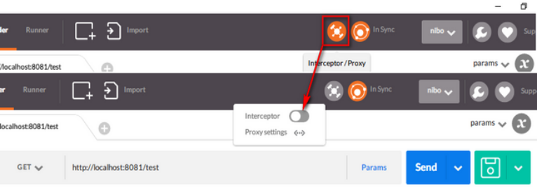

# 第一章   POSTMAN开发工具安装
## 1.1第一步安装：谷歌助手安装

## 1.2.安装Postman Interceptor插件
    Interceptor主要就是用来做请求的拦截。
    
### 1.2.1  进入谷歌商店

## 1.3 登录系统
    Interceptor配置完后，在浏览器中正常登录被测试的系统(这很重要)。只需要按正常  
    的流程登录即可。
    
## 1.4 拦截器配置

   
    在Postman中启用Interceptor，如下图:  

    

    