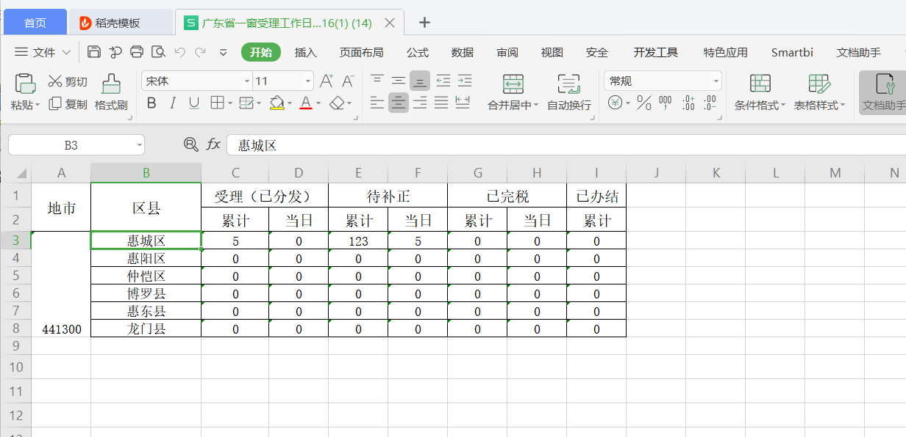

# 概述
#  第一章 时间
##    1.1.时间戳转日期(String)格式
    DateFormat bf = new SimpleDateFormat("yyyy-MM-dd");
    long startTime=Long.parseLong(startTimeStr);//时间戳
        startDateFormat = bf.format(new Date(startTime*1000));
        System.out.println("开始时间：startDate="+startDate);
    备注：在sql中通过to_date来转化
    sql=sql+ " and  to_date('"+startDateFormat+"','yyyy-mm-dd') <=a.mdate ";
    1.2.String转日期格式
    long startTime=Long.parseLong(sendTime);//senTime=”1569027011”
    String sendDateFormat = bf.format(new Date(startTime*1000));
    shortMessage.setMDATE(new SimpleDateFormat("yyyy-MM-dd").parse(sendDateFormat));
    
#   第二章 代码复用
## 1.1.第一种解决方案：添加参数
    在原方法的基础上增加一个参数sign，此参数用来判断是否进行方法的改进
    备注：也可以在原方法的基础上新增一个方法，将原代码重复的代码提取出来，进行复用

### 1.1.1.添加colltoller

### 1.1.2.不能改接口的结构：可以新增接口

### 1.1.3.实现该接口：

### 1.1.4.通过传入参数判断是否改进方法

# 第三章 Jpa使用
## 1.1.批量更新，删除，插入
### 1.1.1.插入
    先将实体用list集合保存起来，然后调用Save()方法进行插入
### 1.1.2.删除和更新
    先将要删除或者要插入的先查出来然后在删除或者更新

    Save方法是根据:id,若实体存在则更新，否则就插入，测试结果如下图：

# 第三章 Excel导出(.xlsx)

### 3.1.1示例如下：
    package com.southgis.ibase.gdbdc.webservice;
    
    
    import com.southgis.ibase.codedict.dao.ICodeDictDao;
    import com.southgis.ibase.codedict.entity.CodeDict;
    import com.southgis.ibase.extend.service.SqlBatchInfo;
    import com.southgis.ibase.extend.service.SqlService;
    import com.southgis.ibase.systemConfigure.data.SystemConfigureNames;
    import com.southgis.ibase.systemConfigure.entity.SysConfigure;
    import com.southgis.ibase.systemConfigure.service.ISystemConfigureService;
    import com.southgis.ibase.utils.CheckUtil;
    import com.southgis.ibase.utils.DateUtil;
    import com.southgis.ibase.utils.PageQueryData;
    import com.southgis.ibase.utils.ReturnResult;
    
    import org.apache.poi.ss.usermodel.BorderStyle;
    import org.apache.poi.ss.usermodel.CellStyle;
    import org.apache.poi.ss.usermodel.HorizontalAlignment;
    import org.apache.poi.ss.usermodel.Sheet;
    import org.apache.poi.ss.usermodel.VerticalAlignment;
    import org.apache.poi.ss.util.CellRangeAddress;
    import org.apache.poi.xssf.usermodel.XSSFCell;
    import org.apache.poi.xssf.usermodel.XSSFCellStyle;
    import org.apache.poi.xssf.usermodel.XSSFRow;
    import org.apache.poi.xssf.usermodel.XSSFSheet;
    import org.apache.poi.xssf.usermodel.XSSFWorkbook;
    import org.springframework.beans.factory.annotation.Autowired;
    import org.springframework.stereotype.Controller;
    import org.springframework.web.bind.annotation.RequestMapping;
    import org.springframework.web.bind.annotation.ResponseBody;
    
    import javax.inject.Inject;
    import javax.inject.Named;
    import javax.persistence.EntityManager;
    import javax.persistence.PersistenceContext;
    import javax.persistence.Query;
    import javax.servlet.ServletOutputStream;
    import javax.servlet.http.HttpServletRequest;
    import javax.servlet.http.HttpServletResponse;
    import java.io.BufferedInputStream;
    import java.io.BufferedOutputStream;
    import java.io.File;
    import java.io.FileInputStream;
    import java.io.FileOutputStream;
    import java.io.InputStream;
    import java.io.OutputStream;
    import java.io.UnsupportedEncodingException;
    import java.net.URLEncoder;
    import java.text.DateFormat;
    import java.text.SimpleDateFormat;
    import java.util.ArrayList;
    import java.util.Calendar;
    import java.util.Date;
    import java.util.HashMap;
    import java.util.List;
    import java.util.Map;
    
    import static org.apache.poi.ss.usermodel.CellType.STRING;
    
    @Controller
    @RequestMapping("/analysis")
    public class StatisticAnalysisController {
    
    //导出全省数据
    public static final  String EXPORT_All_DATA="ALL";
    //导出地市数据
    public static final  String EXPORT_PART_DATA="PART";
    //是否分页
    public static final  boolean IS_LAYPAGE=true;
    
    @Inject
    @Named(ISystemConfigureService.SERVICE_BEAN_NAME)
    private ISystemConfigureService cfgService;

    @Autowired
    private ICodeDictDao iCodeDictDao;
    //    @PersistenceContext(unitName = "entityManager")
    //    private EntityManager entMngr;

    @Inject
    @Named(ISystemConfigureService.SERVICE_BEAN_NAME)
    private ISystemConfigureService systemConfigureService;
    
    /*
    全省数据  type:"ALL";
    默认返回部分
    导出地市数据   type:PART
     */
    
    @RequestMapping("/public/getStatisticAnalysisData")
    @ResponseBody
    public Map<String,Object> getStatisticAnalysisData(PageQueryData pageQueryData){
        Map<String,Object>map=new HashMap<>();
        Map<String,Object>mapOut=new HashMap<>();
        int total=0;
        //外面一层
        Map<String,Object>jsonMap=new HashMap<>();
        //根据catalogid=QXDM2
    //        List<CodeDict>codeDictList= iCodeDictDao.findByCatalogIdOrderBySortValue("QXDM2");
            List<Map<String,Object>> list=new ArrayList();
        
        list=to_transformData(IS_LAYPAGE,pageQueryData);
        map.put("data",list);
        if (list!=null){
            total=list.size();
        }
        map.put("total",total);
        return map;        
     }

    List<Map<String,Object>> to_transformData(boolean is_payPage,PageQueryData pageQueryData){
        //获取所有的区县信息
        List<Map<String,Object>> list=getFinshedData(pageQueryData);
        List<Map<String,Object>> Templist=new ArrayList();

        List<Map<String,Object>> transformList=new ArrayList();
        //获取CODE值
        SysConfigure sysConfigure= cfgService.getConfigureByKey("单位信息","所属行政区");
        if (sysConfigure==null){
            
            return null;
        }
        String sysCode=sysConfigure.getValue();
        for (int i = 0; i < list.size(); i++) {
    //            String key=list.get(i).keySet().toArray()[0].toString();
                String code = (list.get(i)).get("code").toString();
                //根据code的前四位去筛选同一地市下的信息
                if (sysCode.substring(0,4).equals(code.substring(0,4))) {
                    transformList.add(list.get(i));
                }
                //获取省市名称
        }
            //默认为true，进行分页
            if (is_payPage){
                //分页处理
                int page=pageQueryData.getPage();
                int rows=pageQueryData.getRows();
                if (page*rows<transformList.size()){
                    for (int j=(page-1)*rows;j<page*rows;j++){
                        Templist.add(transformList.get(j));
                    }
                }else{

                for (int j=(page-1)*rows;j<transformList.size();j++){
                    Templist.add(transformList.get(j));
                }

            }
            list=Templist;
        }else {

            list=transformList;
        }
    
    return list;
    }
    
    
    
    

    //    //jdistrict区县代码
      public List<Map<String,Object>> getFinshedData(PageQueryData pageQueryData){
       //jdistrict：区县代码
      List<Map<String,Object>> list=new ArrayList();
      String conmmConditon=" datastate<10 and datastate>=0 "  ;
    //    SimpleDateFormat simpleDateFormat=new SimpleDateFormat("yyyy-mm-dd");
          String accdate= DateUtil.dateToString(new Date(),"yyyy-MM-dd");
          //为了优化查询条件，将所有的数据查询出来之后在做一个筛选
            //统计所有已受理数量  优化：避免使用*
          String sql="select code,catalogid,showvalue,JDISTRICT,(case when JDISTRICT =code then  count(*)  else count(*)-1  end)total from (select REGTYPE,JDISTRICT,ACCDATE,datastate,code,catalogid,showvalue from  codedict c  left join job_base a on c.code = a.jdistrict and  a.regtype='已受理' and datastate<10 and datastate>=0 )b  group by code,catalogid,showvalue,JDISTRICT\n" +
                    "having  catalogid='QXDM2' order by code ";

        String sql1="select code,catalogid,showvalue,(case when JDISTRICT =code then  count(*)  else count(*)-1  end)total from (select REGTYPE,JDISTRICT,ACCDATE,datastate,code,catalogid,showvalue from job_base a full join codedict c  on c.code = a.jdistrict and  a.regtype='已受理' and to_char(accdate,'yyyy-mm-dd')='"+accdate+"' and datastate<10 and datastate>=0 )b  group by code,catalogid,showvalue,JDISTRICT\n" +
                "having  catalogid='QXDM2' order by code ";
       
        
        String sql2="select code,catalogid,showvalue,JDISTRICT,(case when JDISTRICT =code then  count(*)  else count(*)-1  end)total from (select REGTYPE,JDISTRICT,ACCDATE,datastate,code,catalogid,showvalue\n" +
                " from  codedict c  left join job_base a on c.code = a.jdistrict and  a.regtype='已办结' and datastate<10 and datastate>=0 )b  group by code,catalogid,showvalue,JDISTRICT\n" +
                "having  catalogid='QXDM2' order by code ";
        
        
    //        String sql3="select code,catalogid,showvalue,(case when JDISTRICT =code then  count(*)  else count(*)-1  end)total from (select REGTYPE,JDISTRICT,ACCDATE,datastate,code,catalogid,showvalue from job_base a full join codedict c  on c.code = a.jdistrict and  a.regtype='已办结'\n" +
    //                "and to_char(accdate,'yyyy-mm-dd')='"+accdate+"' and datastate<10 and datastate>=0 )b  group by code,catalogid,showvalue,JDISTRICT\n" +
    //                "having  catalogid='QXDM2'";
            //已完税
            String sql4="select code,catalogid,showvalue,JDISTRICT,(case when JDISTRICT =code then  count(*)  else count(*)-1  end)total from codedict c\n" +
                    "left join job_base a on a.JDISTRICT=c.code and a.datastate<10 and a.datastate>=0 and a.wszt='已完税'\n" +
                    "     group by code,catalogid,showvalue,JDISTRICT\n" +
                    "having  catalogid='QXDM2' order by code ";
            
        String sql5="select code,catalogid,showvalue,JDISTRICT,(case when JDISTRICT =code then  count(*)  else count(*)-1  end)total from codedict c\n" +
                "left join job_base a on a.JDISTRICT=c.code and to_char(accdate,'yyyy-mm-dd')='"+accdate+"' and a.datastate<10 and a.datastate>=0 and a.wszt='已完税'\n" +
                "     group by code,catalogid,showvalue,JDISTRICT\n" +
                "having  catalogid='QXDM2' order by code ";
        
        //bzzt:0 为待补正
        String sql6="select code,catalogid,showvalue,JDISTRICT,(case when JDISTRICT =code then  count(*)  else count(*)-1  end)total from codedict c left join  \n" +
                "job_base a on a.JDISTRICT=c.code   \n" +
                " and a.datastate<10 and a.datastate>=0  left join JOBA_PAYMATERIALS b on b.sblsh=a.jid and  b.bzzt='0'\n" +
                "group by code,catalogid,showvalue,JDISTRICT\n" +
                "having  catalogid='QXDM2' order by code ";
        String sql7="select code,catalogid,showvalue,JDISTRICT,(case when JDISTRICT =code then  count(*)  else count(*)-1  end)total from codedict c left join  \n" +
                "job_base a on a.JDISTRICT=c.code   \n" +
                " and a.datastate<10 and a.datastate>=0 and to_char(accdate,'yyyy-mm-dd')='"+accdate+"' left join JOBA_PAYMATERIALS b on b.sblsh=a.jid and  b.bzzt='0'\n" +
                "group by code,catalogid,showvalue,JDISTRICT\n" +
                "having  catalogid='QXDM2' order by code ";
        
        //bzzt:0 为待补正
                
        //        Query querySlCount= entMngr.createNativeQuery();
        //        DateUtil
        //        List SLList=querySlCount.getResultList();
                List<Map<String,Object>>mapList=  (List<Map<String, Object>>) SqlService.querySql(sql,null,1,null);
                List<Map<String,Object>>mapList1= (List<Map<String, Object>>) SqlService.querySql(sql1,null,1,null);
                List<Map<String,Object>>mapList2= (List<Map<String, Object>>) SqlService.querySql(sql2,null,1,null);
        //        List<Map<String,Object>>mapList3= (List<Map<String, Object>>) SqlService.querySql(sql3,null,1,null);
                List<Map<String,Object>>mapList4= (List<Map<String, Object>>) SqlService.querySql(sql4,null,1,null);
                List<Map<String,Object>>mapList5= (List<Map<String, Object>>) SqlService.querySql(sql5,null,1,null);
                List<Map<String,Object>>mapList6= (List<Map<String, Object>>) SqlService.querySql(sql6,null,1,null);
                List<Map<String,Object>>mapList7= (List<Map<String, Object>>) SqlService.querySql(sql7,null,1,null);
                
        //        List<Map<String,Object>>mapList= (List<Map<String, Object>>) SqlService.querySql(sql,null,1,null);
                for (int i=0;i<mapList.size();i++){
                    Map<String,Object>mapIn=new HashMap<String,Object>();
                    
            int index1= mapList1.get(i).get("SHOWVALUE").toString().indexOf("（");
            int index2= mapList1.get(i).get("SHOWVALUE").toString().indexOf("）");
            String showValue=mapList1.get(i).get("SHOWVALUE").toString().substring(index1+1,index2);
            String city=showValue;
            String code=mapList1.get(i).get("CODE").toString();
            //code用于根据省市code，划分市区
            mapIn.put("code",code);
            mapIn.put("city",city);
           
            mapIn.put("slCount",mapList.get(i).get("TOTAL"));
            mapIn.put("slNowDayCount",mapList1.get(i).get("TOTAL"));

            mapIn.put("ybjCount",mapList2.get(i).get("TOTAL"));
            
            mapIn.put("ywsCount",mapList4.get(i).get("TOTAL"));
            mapIn.put("ywsnowDayCount",mapList5.get(i).get("TOTAL"));
            
            mapIn.put("dbzCount",mapList6.get(i).get("TOTAL"));
            mapIn.put("dbznowDayCount",mapList7.get(i).get("TOTAL"));
            list.add(mapIn);
            
        }
          List<Map<String,Object>> Templist=new ArrayList();
          //判断返回的值的类型
        return  list;
        
    }
    

    
    /*导出execl 数据
     *
     * Type 为All，则将全省数据输出
    */
    public Map<String,ArrayList<Map<String,Object>>> ExportStatisticAnalysisData(String type){
        PageQueryData pageQueryData=new PageQueryData();
        Map<String,ArrayList<Map<String,Object>>>ArraylistMap=new HashMap<String,ArrayList<Map<String,Object>>>();

        if (EXPORT_All_DATA.equals(type)){
        List<CodeDict>codeDictList= iCodeDictDao.findByCatalogIdOrderBySortValue("QXDM");
        
        List<Map<String,Map<String,Object>>> list2=null;
        PageQueryData page=new PageQueryData();
        List<Map<String,Object>> list =getFinshedData(page);

        for (int j=0;j<codeDictList.size();j++) {
            ArrayList<Map<String,Object>> arrayList = new ArrayList<>();

            for (int i = 0; i < list.size(); i++) {
                String code = (list.get(i)).get("code").toString();
                if (codeDictList.get(j).getCode().equals(code.substring(0,4))) {
                    arrayList.add((list.get(i)));
                }
                int index1= codeDictList.get(j).getShowValue().toString().indexOf("（");
                int index2= codeDictList.get(j).getShowValue().toString().indexOf("）");
                //获取省市名称
                String showValue=codeDictList.get(j).getShowValue().toString().substring(index1+1,index2);
                ArraylistMap.put(showValue,arrayList);

            }

        }    

       }else{
            
          if (EXPORT_PART_DATA.equals(type)){
                  //获取CODE值
    //              SysConfigure sysConfigure= cfgService.getConfigureByKey("单位信息","所属行政区");
    //              String sysCode=sysConfigure.getValue();
                  //获取地市名称
                  SysConfigure sysConfigure= cfgService.getConfigureByKey("单位信息","单位名");
                  String showValue=sysConfigure.getValue();
                  List<Map<String,Object>> list= to_transformData(!IS_LAYPAGE,pageQueryData);
    //              List<Map<String,Object>> list =(List<Map<String,Object>>)map.get("data");
              
                  ArrayList<Map<String,Object>> arrayList = new ArrayList<>();
                  for (int i=0;i<list.size();i++){

                      arrayList.add(list.get(i));
                  }
                      //获取省市名称
                  ArraylistMap.put(showValue,arrayList);
          }
            
       }
       return  ArraylistMap;
    }
    
    
    

    /**
     *tempPath 模板文件路径
     *path 文件路径
     *list 集合数据
     */
    @RequestMapping("/public/exportExcel")
        @ResponseBody
        public void exportExcel(HttpServletRequest request,HttpServletResponse response) {
            Map<String,ArrayList<Map<String,Object>>> map =new HashMap();
            SysConfigure cfg = systemConfigureService.getConfigureByKey(SystemConfigureNames.CATALOG_SERVICE, "%%stackfiles%");
    //        String templatePath ="D:/"+cfg.getValue() + "/ExcelTemplate/Business_day/";
            String templatePath =cfg.getValue() + "/ExcelTemplate/Business_day/";
            //获取导出的数据
            map=ExportStatisticAnalysisData("PART");
            
            
            OutputStream out = null;
            File file=new File(templatePath);
            // 模板文件
            File templateFile = null;
            if (file.isDirectory())
            {
                File[] files = file.listFiles();
                if (files.length > 0)
                {
                    templateFile = files[0];
                }
            }
    //        InputStream inputStream1 = new FileInputStream(templateFile);
            String fileName="广东省一窗受理工作报表";
            if(templateFile!=null){
                fileName =(templateFile.getName()).toString().split(".xlsx")[0];
            }
    //                
    //        File newFile = createNewFile(templatePath, cfg.getValue() + "\\ExcelTemplate\\ "+"\\Business_dayCopy\\");
            InputStream inputStream = null;
            // 模板工作簿
            XSSFWorkbook  wb = null;
    
            // 导出文件工作簿
            XSSFWorkbook workbook = null;
            XSSFSheet sheet = null;
            try {
                inputStream = new FileInputStream(templateFile);// 将excel文件转为输入流
                wb= new XSSFWorkbook(inputStream);
                workbook = new XSSFWorkbook();// 创建个workbook，
                // 获取第一个sheet
                // 把模板复制到新建的Excel
                workbook = wb;
                sheet = workbook.getSheetAt(0);
            } catch (Exception e1) {
                e1.printStackTrace();
            }
            if (sheet != null) {
                try {
                    
                    int firstRow = 2;
                    int lastRow = 0;
                    int firstCol = 0;
                    int lastCol = 0;
                    int rowNum = 2;
                    int index=0;
     
    //                int startIndex=3;
    //                cell.setCellValue(fileName);
                    //Map<String,ArrayList<Map<String,Object>>>map
    //                for (int i = 0; i < map.size(); i++) {
                    //设置列的格式
                    CellStyle cellStyle=workbook.createCellStyle();
                    cellStyle.setVerticalAlignment(VerticalAlignment.CENTER);
                    cellStyle.setAlignment(HorizontalAlignment.CENTER);
                    for (int j = 0; j < map.size(); j++) {//行数据
                        XSSFRow row = sheet.createRow(rowNum); //从第三行开始
                        XSSFCell cell = row.createCell(0);
                        ArrayList<Map<String, Object>> temMap = new ArrayList<>();
                        int count = 0;
                            String key = map.keySet().toArray()[j].toString();
                            //获取ArrayList<Map<String,Object>>
                            temMap = map.get(key);
    
                        if (temMap.size()>1){
    
                            lastRow = firstRow + temMap.size()-1;
                            //poi做多行合并，一定需要先绘制单元格，然后写入数据，最后合并，不然各种坑啊
                            //https://blog.csdn.net/chendu500qiang/article/details/91520001
                            mergeRegion(sheet, firstRow, lastRow, 0, 0);
                            firstRow = lastRow + 1;
                        }
    
                        row =sheet.getRow(rowNum);
                        cell =row.getCell(0);
                        cell.setCellValue(key);
                        cell.setCellStyle(cellStyle);
                            //根据excel模板格式写入数据....
                            for (int k = 0; k < temMap.size(); k++) {//列数据
                                if (sheet.getRow(rowNum+k)==null){
                                   row = sheet.createRow(rowNum+k); //从第三行开始
                                }
                                createRowAndCell(temMap.get(k).get("city").toString(), row, cell, index+1);
                                createRowAndCell(temMap.get(k).get("slCount").toString(), row, cell, index+2);
                                createRowAndCell(temMap.get(k).get("slNowDayCount").toString(), row, cell, index+3);
                                createRowAndCell(temMap.get(k).get("dbzCount").toString(), row, cell, index+4);
                                createRowAndCell(temMap.get(k).get("dbznowDayCount").toString(), row, cell, index+5);
                                createRowAndCell(temMap.get(k).get("ywsCount").toString(), row, cell, index+6);
                                createRowAndCell(temMap.get(k).get("ywsnowDayCount").toString(), row, cell, index+7);
                                createRowAndCell(temMap.get(k).get("ybjCount".toString()), row, cell, index+8);
    //                        }
    
                        }
    
                        rowNum = rowNum +temMap.size();
                    }
                    
    //                sheet.createRow(rowNum);
                   
                    out = response.getOutputStream();
                    this.setResponseHeader(response,templateFile.getName());
                    // 填充数据
                    workbook.write(out);
    
                } catch (Exception e) {
                    e.printStackTrace();
                } finally {
                    try {
                        if (null != inputStream) {
                            inputStream.close();
                        }
                    } catch (Exception e) {
                        e.printStackTrace();
                    }
                }
            }
            // 删除创建的新文件
          //  this.deleteFile(newFile);
        }
    
        /**
         * 合并单元格
         * @param sheet
         * @param firstRow 开始行
         * @param lastRow 结束行
         * @param firstCol 开始列
         * @param lastCol 结束列
         */
        private void mergeRegion(Sheet sheet, int firstRow, int lastRow, int firstCol, int lastCol) {
            sheet.addMergedRegion(new CellRangeAddress(firstRow, lastRow, firstCol, lastCol));
        }
    
    
    
        /**
         *根据当前row行，来创建index标记的列数,并赋值数据
         */
        private void createRowAndCell(Object obj, XSSFRow row, XSSFCell cell, int index) {
            cell = row.getCell(index);
            if (cell == null) {
                cell = row.createCell(index,STRING);
                //设置字体的显示是否居中
                cell.getCellStyle().setAlignment(HorizontalAlignment.CENTER);
                cell.getCellStyle().setBorderBottom(BorderStyle.THIN);           
                cell.getCellStyle().setBorderLeft(BorderStyle.THIN);
                cell.getCellStyle().setBorderRight(BorderStyle.THIN);
                cell.getCellStyle().setBorderTop(BorderStyle.THIN);
    //            cell.se
            }else{
                //设置字体的显示是否居中
                cell.getCellStyle().setAlignment(HorizontalAlignment.CENTER);
                cell.getCellStyle().setBorderBottom(BorderStyle.THIN);
                cell.getCellStyle().setBorderLeft(BorderStyle.THIN);
                cell.getCellStyle().setBorderRight(BorderStyle.THIN);
                cell.getCellStyle().setBorderTop(BorderStyle.THIN);
                
            }
    
            if (obj != null)
                cell.setCellValue(obj.toString());
            else
                cell.setCellValue("");
        }
    
        /**
         * 复制文件
         *
         * @param s
         *            源文件
         * @param t
         *            复制到的新文件
         */
    
        public void fileChannelCopy(File s, File t) {
            try {
                InputStream in = null;
                OutputStream out = null;
                try {
                    in = new BufferedInputStream(new FileInputStream(s), 1024);
                    out = new BufferedOutputStream(new FileOutputStream(t), 1024);
                    byte[] buffer = new byte[1024];
                    int len;
                    while ((len = in.read(buffer)) != -1) {
                        out.write(buffer, 0, len);
                    }
                } finally {
                    if (null != in) {
                        in.close();
                    }
                    if (null != out) {
                        out.close();
                    }
                }
            } catch (Exception e) {
                e.printStackTrace();
            }
        }
    
    
        //发送响应流方法
        public void setResponseHeader(HttpServletResponse response, String fileName) {
            try {
                try {
                    fileName = new String(fileName.getBytes(),"ISO8859-1");
                } catch (UnsupportedEncodingException e) {
                    // TODO Auto-generated catch block
                    e.printStackTrace();
                }
                response.setContentType("application/octet-stream;charset=ISO8859-1");
                response.setHeader("Content-Disposition", "attachment;filename="+ fileName);
                response.addHeader("Pargam", "no-cache");
                response.addHeader("Cache-Control", "no-cache");
            } catch (Exception ex) {
                ex.printStackTrace();
            }
        }
    }

### 效果入下

