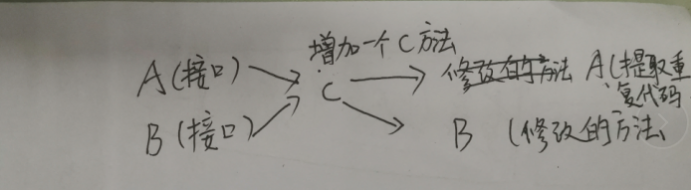
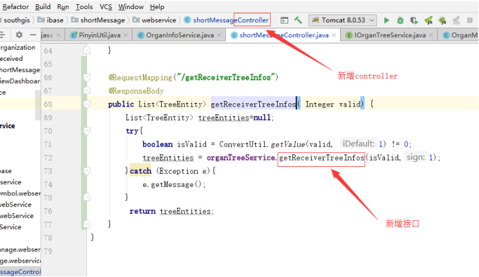
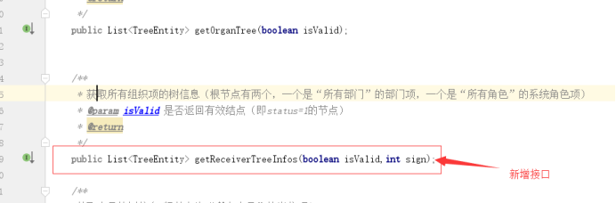
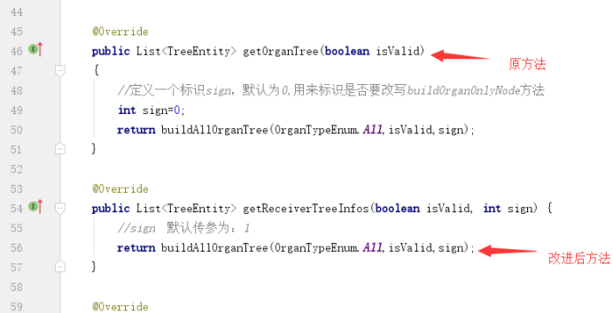
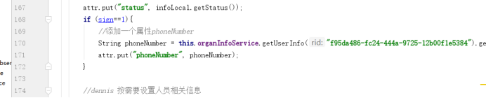
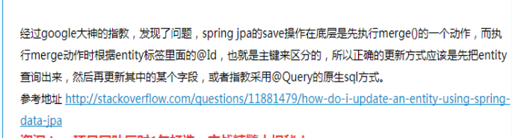
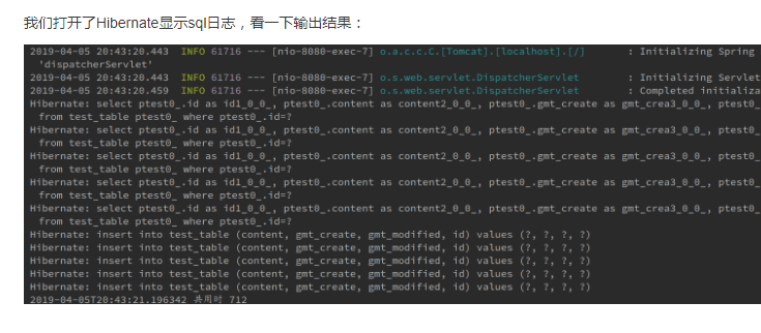

# 概述
#  第一章 时间
##    1.1.时间戳转日期(String)格式
    DateFormat bf = new SimpleDateFormat("yyyy-MM-dd");
    long startTime=Long.parseLong(startTimeStr);//时间戳
        startDateFormat = bf.format(new Date(startTime*1000));
        System.out.println("开始时间：startDate="+startDate);
    备注：在sql中通过to_date来转化
    sql=sql+ " and  to_date('"+startDateFormat+"','yyyy-mm-dd') <=a.mdate ";
    1.2.String转日期格式
    long startTime=Long.parseLong(sendTime);//senTime=”1569027011”
    String sendDateFormat = bf.format(new Date(startTime*1000));
    shortMessage.setMDATE(new SimpleDateFormat("yyyy-MM-dd").parse(sendDateFormat));
    
#   第二章 代码复用
## 1.1.第一种解决方案：添加参数
    在原方法的基础上增加一个参数sign，此参数用来判断是否进行方法的改进
    备注：也可以在原方法的基础上新增一个方法，将原代码重复的代码提取出来，进行复用

### 1.1.1.添加colltoller

### 1.1.2.不能改接口的结构：可以新增接口

### 1.1.3.实现该接口：

### 1.1.4.通过传入参数判断是否改进方法

# 第三章 Jpa使用
## 1.1.批量更新，删除，插入
### 1.1.1.插入
    先将实体用list集合保存起来，然后调用Save()方法进行插入
### 1.1.2.删除和更新
    先将要删除或者要插入的先查出来然后在删除或者更新

    Save方法是根据:id,若实体存在则更新，否则就插入，测试结果如下图：
