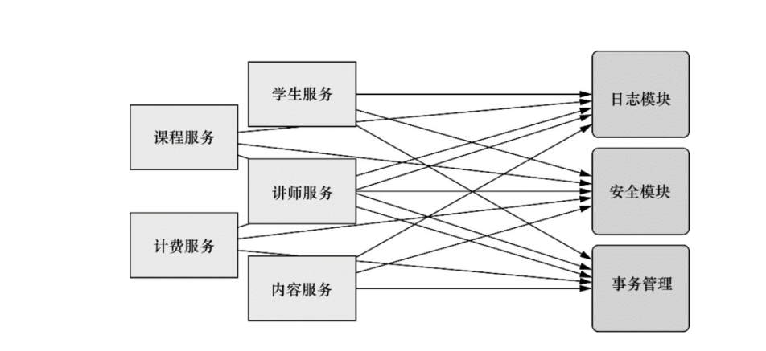
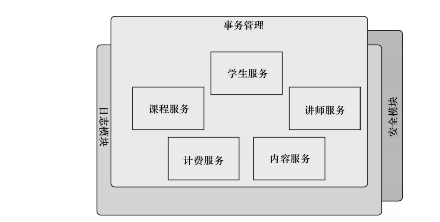

# 概述
# 第一章 Spring注解的认识
## 1.1.注解的初步认识
### 1.1.1.@controller
    标注控制层

### 1.1.2.@service
    标注服务层，进行业务的逻辑处理
### 1.1.3.@repository
    标注数据访问层，也可以说用于标注数据访问组件，即DAO组件
### 1.1.4.@component 
    把普通pojo实例化到spring容器中，相当于配置文件中的 
    <bean id="" class=""/>
### 1.1.5.@Transactional
    使用位置：
    1、用在接口或接口方法上，AOP必须是接口代理方式。不推荐	
    2、可以使用在类以及类方法上。推荐
    3、注解应该只被应用到 public 方法上。其它级别（ protected ，private无效）
    4、只有来自外部的方法调用，事务才生效。（不能由本地方法直接调用）
    回滚控制：
    1、默认配置下，方法体只有在抛出RuntimeException或其子类时，才回滚事务。
    2、可以指定哪些异常回滚： @Transactional(rollbackFor=XxxException.class)
    3、可以指定哪些异常不回滚： @Transactional(noRollbackFor=XxxException.class)

# 第二章 简化java开发
### 2.2.1 spring采取的四种策略
    基于POJO的轻量级和最小侵入性编程
    通过依赖注入和面向接口实现松耦合
    基于切面和惯例进行申明式编程
    通过切面和模板减少样板式代码
    耦合：
    "打地鼠"式的bug特 性（修复一个bug，将会出现一个或者更多新的bug
### 2.2.2概念
####  2.2.2.1 依赖注入
    装配:创建应用组件之间协作的行为通常称为装配（wiring）,XML是很常见的一种装配方式
    面向切面编程：促使软件系统实现关注点的分离一项技术。系统由许多不同的组件组成，每一个组件负责一块特定功能。
 
 
#### 2.2.2.2 AOP面向切面编程
    借助AOP,可以使用各种功能层去包裹核心业务层。这些层采用声明的方式灵活的应用到系统中，你的核心应用根本不知道他们的存在。这是一个非常强大的理念，可以讲安全，事务和日志关注点与核心业务逻辑相分离
 

#### 2.2.2.3
    braveKnight中方法执行前调用Minstrel的singBeforeQuest()方法。这种方式被称为前置通 知（before advice）。同时声明（使用<aop:after>） 在embarkOnQuest()方法执行后调用singAfter Quest()方 法。这种方式被称为后置通知（after advice）
    
#### 2.2.2.4 JNDI
    JNDI:全称（java命名与目录接口）
    
#### 2.2.2.5 ORM （ObjectRelationalMapping）
    即对象关系映射
    常见的ORM框架有hibernate,半自动orm框架有mybatis,还有新的简单易用的bee框架。
    ORM解决的主要问题是对象关系的映射。域模型和关系模型分别是建立在概念模型的基础上的。域模型是面向对象的，而关系模型是面向关系的。一般情况下，一个持久化类和一个表对应，类的每个实例对应表中的一条记录，类的每个属性对应表的每个字段。 
    ORM技术特点： 
     1.提高了开发效率。由于ORM可以自动对Entity对象与数据库中的Table进行字段与属性的映射，所以我们实际可能已经不需要一个专用的、庞大的数据访问层。 
     2.ORM提供了对数据库的映射，不用sql直接编码，能够像操作对象一样从数据库获取数据。 
        
    ORM的优缺点： 
    ORM的缺点是会牺牲程序的执行效率和会固定思维模式。 
    从系统结构上来看,采用ORM的系统一般都是多层系统，系统的层次多了，效率就会降低。ORM是一种完全的面向对象的做法，而面向对象的做法也会对性能产生一定的影响。 

        在我们开发系统时，一般都有性能问题。性能问题主要产生在算法不正确和与数据库不正确的使用上。ORM所生成的代码一般不太可能写出很高效的算法，在数据库应用上更有可能会被误用，主要体现在对持久对象的提取和和数据的加工处理上，如果用上了ORM,程序员很有可能将全部的数据提取到内存对象中，然后再进行过滤和加工处理，这样就容易产生性能问题。 
        在对对象做持久化时，ORM一般会持久化所有的属性，有时，这是不希望的。 
        但ORM是一种工具，工具确实能解决一些重复，简单的劳动。这是不可否认的。但我们不能指望工具能一劳永逸的解决所有问题，有些问题还是需要特殊处理的，但需要特殊处理的部分对绝大多数的系统，应该是很少的。

    

    