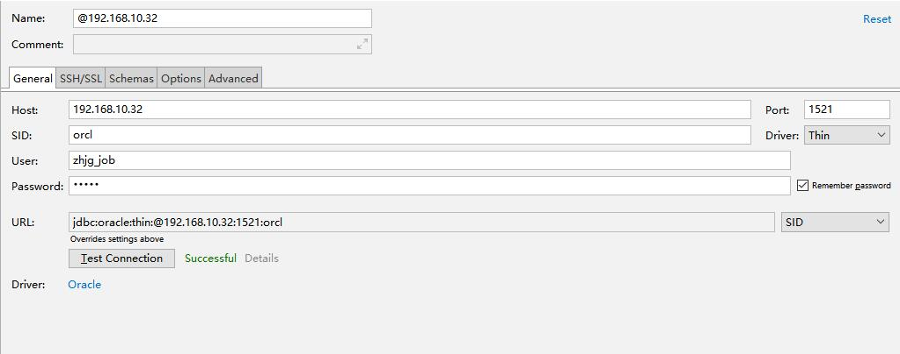

#### 惠东县涉税平台配置参考
  
| 修改人 | 修改内容   |      修改日期      |
|:----------:|:----------|:-------------:|
| 吴云龙| 添加配置说明| 2019年2月28日|


#### 数据库配置参考


| 参数名称 | 内容说明|参数值
|:----------:|:----------|:----------|
|host|目标主机IP地址|192.168.10.32|
|Port|目标主机数据库端口|1521|
|SID|数据库唯一标识符|orcl|
|User|用户名|zhjg_job|
|Password|密码|sa123|
|URL|链接地址，链接地址由配置生成，本文配置生成为|jdbc:oracle:thin:@192.168.10.32:1521:orcl|
|服务类型|选SID| SID|

#### mongodb数据库配置参考

!> coming soon


#### mainWeb/pubWeb配置文件参考

```yaml
# ==oracle==
jdbc.driverClassName=oracle.jdbc.driver.OracleDriver
jdbc.url=jdbc:oracle:thin:@//192.168.10.32:1521/orcl
jdbc.urlParam=
jdbc.validationQuery=select 1 from dual
hibernate.dialect=org.hibernate.dialect.Oracle10gDialect
hibernate.schema=ZHJG_JOB

jdbc.user=zhjg_job
jdbc.pass=sa123


#最大活动连接数，一般是可能的并发数2倍
jdbc.maxActive=1000
#最大保留空闲的连接数
jdbc.maxIdle=100
#每个连接最大等待时间，单位ms
jdbc.maxWait=60000
jdbc.defaultAutoCommit=true
jdbc.defaultReadOnly=false
jdbc.testOnBorrow=true
# hibernate是否 SQL语句打印出来
hibernate.show_sql=true
hibernate.hbm2ddl.auto=update

#mongoDB数据库配置
mongo.host=192.168.10.58
mongo.port=27017
mongo.timeout=10000
#
mongo.database=ibase2oracle
mongo.username=
mongo.password=

# activemq.X 消息队列
activemq.url=tcp://127.0.0.1:61616
activemq.user=
activemq.pass=
```
