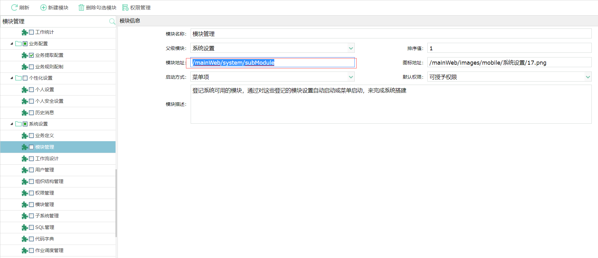
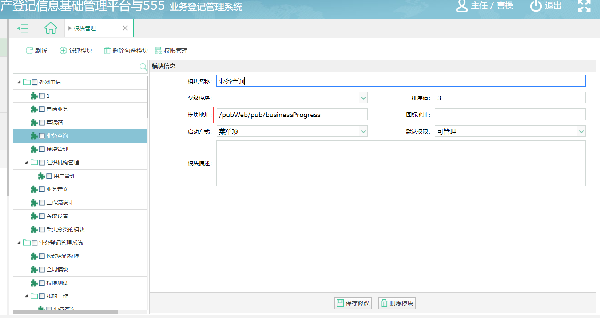

#Ibase2.0惠州模块地址配置

## 模块管理
部署完项目之后发现有很多模块没有，只有一部分，这是需要我们自己配置的，下面做一个例子，后面参照这个配置就行。
例如:访问地址是：http://172.16.50.230:8080/mainWeb/index/1
模块管理的地址：/mainWeb/system/submodule
你需要添加模块到指定目录：需要写上访问地址加模块地址：http://172.16.50.230:8080/mainWeb/system/submodule这时候会加载来你需要的模块
输入模块名称，父块名称，输入模块地址/mainWeb/system/submodule,启动方式，排序值（自定义），图标地址（可以不填），默认权限：下层权限继承上层权限。点击保存修改。
在访问地址http://172.16.50.230:8080/mainWeb/index/1刷新页面就会显示你刚刚添加的模块

添加完模块管理模块直接点击进去，直接在里面添加你需要的模块，输入模块地址就可以了，保存修改，刷新页面，就会显示出来。

## 系统设置

 
| 名称 | 地址|
|:-----|:----|
| 业务定义| 阿萨德|
|业务定义|/mainWeb/system/businessDefManager|
|工作流设计|/editorWebService/index.html|
|用户管理|/pubWeb/system/user|
|组织结构管理|/mainWeb/system/organ|
|权限管理|/mainWeb/system/privilege/manager|
|模块管理|/mainWeb/system/subModule|
|子系统管理|/mainWeb/system/subSystem|
|SQL管理|/mainWeb/system/namedSql/showPage|
|代码字典|/mainWeb/system/codeDictManagement|
|作业调度管理|/mainWeb/system/showJobSchedule|
|常用词设置|/mainWeb/system/mycomword|
|编号公式管理|/mainWeb/system/snbuilder|
|电子印章管理|/mainWeb/system/stampdef|
|操作日志|/mainWeb/system/operationLog|
|性能日志|/mainWeb/system/performanceLog|
|系统异常日志|/mainWeb/system/exceptionLog|
|SQL日志|/mainWeb/system/execsqlLog|
|环境设置|/mainWeb/system/environmentConfigure|
|单位信息|/mainWeb/system/compInformation|
|节假日管理|/mainWeb/system/holidayManagement|
|行政区划管理|/mainWeb/system/adminDivision|
|行政区划列数据|/mainWeb/system/listAdminDivision|

## 个性化设置
 
| 名称 | 地址|
|:-----|:----|
| 个人设置 | /mainWeb/system/personalConfigure |
| 个人安全设置 | /mainWeb/system/personalSecurity |
| 历史消息 | /mainWeb/system/historyMessage |
| 修改密码 | /mainWeb/system/passWordChange |

## 业务配置
 
| 名称 | 地址|
|:-----|:----|
| 业务提取配置 | /workflowWebService/businessConfiguration|
| 业务规则配制 | /workflowWebService/openColmnDetail|

## 统计分析
 
| 名称 | 地址|
|:-----|:----|
| 工作统计 | /mainWeb/system/workCount|

## 地图管理
 
| 名称 | 地址|
|:-----|:----|
| 业务定位配置 | xxx/webgisWebService/locator/index   (这个有点特殊需要加你访问地址，xxx是占位符，代表访问地址)|
| 地图浏览 | /webgisFrame/index.html |
| 地图配置 | /webgisWebService/config/index |
| 图层管理 | /webgisWebService/maplayer/layerlist |
| 专题数据 | /webgisWebService/thematic/index |
| 地图权限 | /webgisWebService/mapauthority/index |
| 功能面板 | /webgisWebService/panel/index |
| 模糊搜索 | /webgisWebService/globalsearch/index |

## 办公管理
 
| 名称 | 地址|
|:-----|:----|
| 公正书管理| /bdcdjWebService/notarialManage/notarialManage.html|
| 照片管理| /bdcdjWebService/photomanage/photomanage.html|

## 收费管理
 
| 名称 | 地址|
|:-----|:----|
| 服务费明细 | /bdcdjWebService/coverCharge/|
| 服务费管理 | /bdcdjWebService/coverChargeManage/coverChargeManage.html|
|  登记费管理 | /bdcdjWebService egistration/|

## 业务辅助

 
| 名称 | 地址|
|:-----|:----|
| 楼盘表管理 | /bdcdjWebService/buildingTable/|
| 删除箱 | /mainWeb/myjob/deletedJob|
| 不动产登记簿管理 | /bdcdjWebService/bdcdjbManage/bdcdjbManage.html|
| 退件箱 | /mainWeb/myjob/returnJob|
| 档案移交 | /bdcdjWebService/archivesTransfer/archivesTransfer.html|
| 移交单管理 | /bdcdjWebService/businessTransferManage/businessTransferManage.html|
| 事项申请 | /pubWeb/pub/businessApply|
| 我的草稿箱 | /pubWeb/pub/businessDraft|
| 进度查询 | /pubWeb/pub/businessProgress|

## 证书管理
 
| 名称 | 地址|
|:-----|:----|
| 批量发证 |/bdcdjWebService/batchIssuing/|
| 证书打印 |/bdcdjWebService/certificate|  
| 证书补打 |/bdcdjWebService/supplement|

## 我的工作
 
| 名称 | 地址|
|:-----|:----|
| 业务查询| /workflowWebService/queryType/businessMainPage|
| 收文管理| /mainWeb/myjob/receiptJob|
| 创建工作| /mainWeb/myjob/createJob|
| 待办工作| /mainWeb/myjob/runJob|
| 已办工作| /mainWeb/myjob/handledJob|
| 已挂起工作| /mainWeb/myjob/suspensionJob|
| 办结工作| /mainWeb/myjob/concludedJob|
| 监控工作| /mainWeb/myjob/monitorJob|

## 业务登记管理系统
 
| 名称 | 地址|
|:-----|:----|
| 修改密码权限| /mainWeb/system/changepwd|
| 全局模块| /mainWeb|
| 权限测试| /mainWeb/testRightCode|
