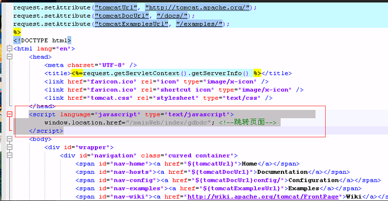

# 域名跳转

## 在tomcat的欢迎页面里设置重定向到系统首页

打开tomcat文件目录的Root/index.jsp，添加以下代码文本：
```javascript
<script language="javascript" type="text/javascript">                    
    window.location.href="/mainWeb/index/gdbdc"; <!--跳转页面-->
</script>
```
如图所示：



