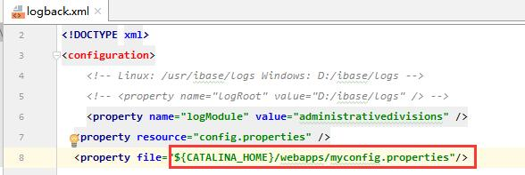
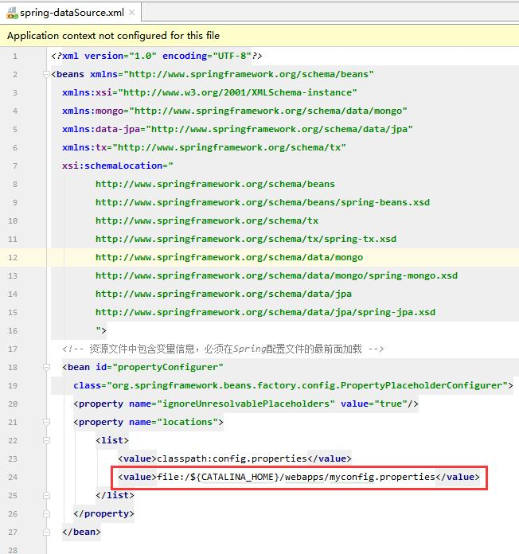

-------------------------------

#### 为什么启动ibase2.0 报错，错误日志提示：myconfig.properties文件找不到？

ibase2.0提出了抽取配置文件的概念，在 `sprint-dataSource.xml`与`logback.xml`中分别添加了两个配置文件。

如图：
logback.xml 配置

sprint-datasource.xml 配置

如何解决？
* 你可以在tomcat对应的目录（错误日志会报出来缺失的文件目录）下，添加对应的文件,空文件即可。
* 你也可以在配置文件中，删除掉对应的配置。
-------------------------------------

