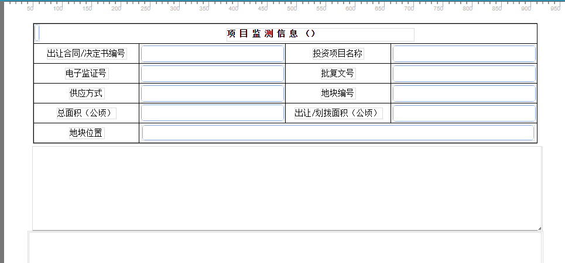

<center><h1>采矿权模块配置</h1></center>

<div style="float:right">
 
|作者|日期|
|----|---|
|陈智超|2019年1月22日|

这个文档主要是记录批后监管模块我个人觉得比较麻烦的功能实现

* 新建批后监管

```javascript
实现思路
    - 批后监管实际上是对土地供应记录进行监管，所以新建批后监管记录时需要先获取土地供应记录
    - 在打开批后监管的表单之后，把获取土地供应的数据渲染到打开的表单中
 
 具体实现
    - 在自定义按钮新建中先弹出土地供应管理页面，当选中要监管的记录后点击确定后，获取选中的数据
    - 点击确定的同时打开批后监管的表单，把获取到的数据渲染到批后监管表单中 
```

```javascript
    try{
    function callBack(result) {
      var _jid=result.JID;
          modRid = 'eb1c90f9-0d4f-4ba4-a20f-57b6f4a6ed15',
      	  _rigthOptid = 'new',//可编辑字段标识名
          //表单必填字段（表名.字段名,表名.字段名,......）
           _requirFiled = 'JOB_PHJGGL.ARGSTARTEDDATE,JOB_PHJGGL.ARGPAIEDDATE,JOB_PHJGGL.ARGCOMPLETEDDATE',
      	  type='new';
      var module = {
        moduleId:"CreateJobForm"+_jid+"edit",
        name:"新建",
        pageUrl: "/formengineWebService/getFormTemolate?rid="+modRid+"&&jid="+_jid+"&&rigthOptid="+_rigthOptid+"&&requirFiled="+_requirFiled+"&&type="+type,
        isParent:false,dadName:"formVue"
      };
      parentWin.addTap(null,module);            
    }
      showDialog("/comprehensiveMonitorWebService/achievement/getJianguanPage", "提取监管信息", true, callBack);
    }catch(e){
    }   
```
* 项目监测

```javascript
功能说明
    项目监测就是对批后监管的记录进行监测，根据不用的监测状态用户看到的项目监测信息页面显示也不相同，同时通过保存项目监测
信息也会更新批后监管记录的数据

实现难点
    - 批后监管模块和项目监测模块的表单不是同一个，所以它们的模块也不是同一个，但是互相又要进行数据的交互。
    - 要根据批后监管的监测状态控制项目监测信息表的显示和只读权限
    - 根据不同的颜色还要改变表单的样式

难点实现思路
    - 各自创建一个模块，它们的数据交互通过传递rid从数据库获取数据进行交互
    - 保存项目监测信息表中的数据，在保存后事件中通过sql管理执行相关sql对批后监管的记录进行修改和新增
    - 在项目监测表单的中添加几个空的面板，通过获取当前监测状态来控制面板的隐藏和透明实现权限的控制

```
参考代码
```javascript
    项目监测模块保存后事件部分代码：
    //添加违约记录
    function insert(WYLX,bz){
       	var insert=[];
        insert["WYLX"]=WYLX; //违约类型
        insert["RID"]=$.nowStr()+WYLX;
        insert["RDSJ"]=$.parseDate($.nowStr());
        insert["RDR"]=$.O.getUserName();
        insert["BZ"]=bz; //备注
        insert["SYS_PARENTNAME"]="JOB_PHJGGL.XMWYJL";
        //批后监管j记录的rid
        insert["SYS_PARENTRID"]=date[0]["RID"];
        insert["SYS_MRID"]=$.nowStr()+WYLX;
        ret = expSql.execute("添加违约记录",insert);
    }
    //交地监测状态表达式
    if(JCLX=="交地监测"){
       BZ=JDBZ;
      var JDBGSJ = $.F.getFieldValue("JOB_JCXX.JDBGSJ"); //交地变更时间
      var SJJDSJ = $.F.getFieldValue("JOB_JCXX.SJJDSJ");  //实际交地时间
      var ZFJDWY = $.F.getFieldValue("JOB_JCXX.ZFJDWY"); //政府交地违约
       var update =[];
      update["BGJDSJ"] =$.parseDate(JDBGSJ);
      update["SJJDSJ"] =$.parseDate(SJJDSJ);
      update["jid"] =JID;
      ret = expSql.execute("更改批后监管内容(交地阶段)",update);
        if("1"==ZFJDWY){
    		insert("政府交地违约",BZ);
         }
      		updateparam1["Jcjdlist"] = "开工监测";
      		if(SJJDSJ!=null){
        	ret = expSql.execute("更改监测状态",updateparam1);
       }
    }
   更改项目监测记录
   update JOB_PHJGGL j set j.BGJDSJ=(:BGJDSJ),j.SJJDSJ=(:SJJDSJ) where j.jid =(:jid)
```

根据监测状态控制显示样式和显示内容代码展示
```javascript
    表单全局变量部分代码：
     if("交地监测"==JCZT){
        var JDtitle = $('[id="f2df71670abaa189cad2"]');
        if(KGdom.length > 0||JGdom.length > 0||JDtitle.length>0||title.length>0){
    	title.html("项 目 监 测 信 息 （交地监测）");
    	JDtitle.css('background','Violet')
        KGdom.css('display', 'none');
    	JGdom.css('display','none');
         JDMB.css('display','none');
        }else{
          window.setTimeout(function(){
            windowTime();
          }, 200);
        }
      
```
* 项目监测表单
    
    挡住的地方就是用来权限控制的面板，通过不同的监测状态，改变它的透明度和隐藏来实现权限的控制
