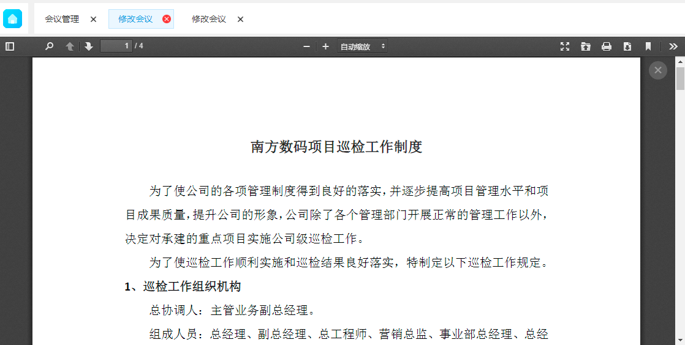

# PDF预览

<div style="float:right">

|作者|日期|
|----|---|
|郑烨锟|2019年1月22日|

</div>

## PDF预览实现

* HTML

```html
<!-- PDF预览：div为关闭PDF×按钮 -->
<div id="previewDiv" class="preview-div">
	<a class="close-btn" onclick="uploadFunc.closePdf()">×</a>
	<iframe src="" frameborder="0" class="pdf-container" id="pdfContainer" name="pdfContainer"></iframe>
</div>
```

* 预览思路
	* 虽然是PDF预览，但预览存储的是PDF文件，并依然存到图片预览一样的路径中
		```
		D:\\opt\\jobfiles\\preview
		```
	* 判断是PDF预览后会将文件（文件路径）作为参数请求到viewer.html文件中
		```
		pubWeb/static/web/viewer.html?file=%2Fview%2Fpreview%2F201901%2Ff782C95A079F93F46A50%2F73d64404-c916-4dd2-af5f-b128c982f112%2F%E9%99%84%E4%BB%B6%EF%BC%9B%E5%8D%97%E6%96%B9%E6%95%B0%E7%A0%81%E9%A1%B9%E7%9B%AE%E5%B7%A1%E6%A3%80%E5%B7%A5%E4%BD%9C%E5%88%B6%E5%BA%A6.pdf
		```
	* 由viewer.html解析并返回一个PDF预览页面置顶覆盖整个页面

		

	* 故需要手动创建一个关闭按钮（×），方便回到原来的页面（预览前）

## 插件

* 参考代码

```javascript
$.ajax({
	url: '/formengineWebService/getImagesByFilePaths',
	type: 'post',
	dataType: 'json',
	data: {macroPaths: imgPaths},
	success: function (data) {
		if (data === undefined) {
			console.log("result 不正确", data);
			return;
		}
		if(sExt === '.pdf'){
			$('#previewDiv')[0].style.display = 'block';
			$('#pdfContainer')[0].src = "/pubWeb/static/web/viewer.html?file=" + encodeURIComponent(data['result'][0]);
		}
	},
	error: function (xhr, stat, exmsg) {
		showAjaxError(xhr, stat, exmsg, "获取预览图片失败");
	}
});
```

* PDF预览
	* HTML代码
	```html
	<!-- PDF预览 -->
	<!-- 用于生成关闭按钮，关闭当前PDF预览 -->
	<div id="previewDiv" class="preview-div">
		<a class="close-btn" onclick="uploadFunc.closePdf()">×</a>
		<iframe src="" frameborder="0" class="pdf-container" id="pdfContainer" name="pdfContainer"></iframe>
	</div>
	```

	* JS代码
	```javascript
	// 显示关闭按钮：$previewDiv
	$('#previewDiv')[0].style.display = 'block';
	// 将文件地址传至viewer.html解析
	$('#pdfContainer')[0].src = "/pubWeb/static/web/viewer.html?file=" + encodeURIComponent(data['result'][0]);
	```

	* CSS代码
		```css
		/*pdf预览样式：让PDF预览置顶*/
		.preview-div{
			display: none;
			position: fixed;
			top: 0;
			bottom: 0;
			right: 0;
			left: 0;
			z-index: 99999;
		}
		.preview-div,.pdf-container{
			width:100%;
			height:100%;
		}
		.close-btn{
			position: fixed;
			right: 30px;
			top: 40px;
			border-radius: 50%;
			display: inline-block;
			width: 30px;
			height: 30px;
			text-align: center;
			line-height: 27px;
			text-decoration: none;
			font-size: 20px;
			color: #fff;
			background-color: gray;
			opacity: 0.5;
			z-index: 999999;
		}
		.close-btn:hover{
			background-color:#000;
			cursor: pointer;
		}
		```

	* 关闭PDF预览
		```javascript
		$('#previewDiv')[0].style.display = 'none';
		```

	* viewer.html
		
		```html
		<!DOCTYPE html>
		<html dir="ltr" mozdisallowselectionprint moznomarginboxes>
		<head>
		<meta charset="utf-8">
		<meta name="viewport" content="width=device-width, initial-scale=1, maximum-scale=1">
		<meta name="google" content="notranslate">
		<meta http-equiv="X-UA-Compatible" content="IE=edge">
		<title>PDF.js viewer</title>
		<link rel="stylesheet" href="viewer.css">
		<link rel="resource" type="application/l10n" href="locale/locale.properties">
		<script src="/public/pdf/pdf.js"></script>
		<script src="viewer.js"></script>
		</head>
		<body tabindex="1" class="loadingInProgress">
		<div id="outerContainer">
		<div id="sidebarContainer">
		<div id="toolbarSidebar">
		<div class="splitToolbarButton toggled">
		<button id="viewThumbnail" class="toolbarButton toggled" title="Show Thumbnails" tabindex="2" data-l10n-id="thumbs">
		<span data-l10n-id="thumbs_label">Thumbnails</span>
		</button>
		<button id="viewOutline" class="toolbarButton" title="Show Document Outline (double-click to expand/collapse all items)" tabindex="3" data-l10n-id="document_outline">
		<span data-l10n-id="document\_outline\_label">Document Outline</span>
		</button>
		<button id="viewAttachments" class="toolbarButton" title="Show Attachments" tabindex="4" data-l10n-id="attachments">
		<span data-l10n-id="attachments_label">Attachments</span>
		</button>
		</div>
		</div>
		<div id="sidebarContent">
		<div id="thumbnailView">
		</div>
		<div id="outlineView" class="hidden">
		</div>
		<div id="attachmentsView" class="hidden">
		</div>
		</div>
		</div> <!-- sidebarContainer -->
		
		<div id="mainContainer">
		<div class="findbar hidden doorHanger" id="findbar">
		<div id="findbarInputContainer">
		<input id="findInput" class="toolbarField" title="Find" placeholder="Find in document…" tabindex="91" data-l10n-id="find_input">
		<div class="splitToolbarButton">
		<button id="findPrevious" class="toolbarButton findPrevious" title="Find the previous occurrence of the phrase" tabindex="92" data-l10n-id="find_previous">
		<span data-l10n-id="find\_previous\_label">Previous</span>
		</button>
		<div class="splitToolbarButtonSeparator"></div>
		<button id="findNext" class="toolbarButton findNext" title="Find the next occurrence of the phrase" tabindex="93" data-l10n-id="find_next">
		<span data-l10n-id="find\_next\_label">Next</span>
		</button>
		</div>
		</div>
		<div id="findbarOptionsContainer">
		<input type="checkbox" id="findHighlightAll" class="toolbarField" tabindex="94">
		<label for="findHighlightAll" class="toolbarLabel" data-l10n-id="find_highlight">Highlight all</label>
		<input type="checkbox" id="findMatchCase" class="toolbarField" tabindex="95">
		<label for="findMatchCase" class="toolbarLabel" data-l10n-id="find\_match\_case_label">Match case</label>
		<span id="findResultsCount" class="toolbarLabel hidden"></span>
		</div>
		<div id="findbarMessageContainer">
		<span id="findMsg" class="toolbarLabel"></span>
		</div>
		</div> <!-- findbar -->
		
		<div id="secondaryToolbar" class="secondaryToolbar hidden doorHangerRight">
		<div id="secondaryToolbarButtonContainer">
		<button id="secondaryPresentationMode" class="secondaryToolbarButton presentationMode visibleLargeView" title="Switch to Presentation Mode" tabindex="51" data-l10n-id="presentation_mode">
		<span data-l10n-id="presentation\_mode\_label">Presentation Mode</span>
		</button>
		<button id="secondaryOpenFile" class="secondaryToolbarButton openFile visibleLargeView" title="Open File" tabindex="52" data-l10n-id="open_file">
		<span data-l10n-id="open\_file\_label">Open</span>
		</button>
		<button id="secondaryPrint" class="secondaryToolbarButton print visibleMediumView" title="Print" tabindex="53" data-l10n-id="print">
		<span data-l10n-id="print_label">Print</span>
		</button>
		<button id="secondaryDownload" class="secondaryToolbarButton download visibleMediumView" title="Download" tabindex="54" data-l10n-id="download">
		<span data-l10n-id="download_label">Download</span>
		</button>
		<a href="#" id="secondaryViewBookmark" class="secondaryToolbarButton bookmark visibleSmallView" title="Current view (copy or open in new window)" tabindex="55" data-l10n-id="bookmark">
		<span data-l10n-id="bookmark_label">Current View</span>
		</a>
		<div class="horizontalToolbarSeparator visibleLargeView"></div>
		<button id="firstPage" class="secondaryToolbarButton firstPage" title="Go to First Page" tabindex="56" data-l10n-id="first_page">
		<span data-l10n-id="first\_page\_label">Go to First Page</span>
		</button>
		<button id="lastPage" class="secondaryToolbarButton lastPage" title="Go to Last Page" tabindex="57" data-l10n-id="last_page">
		<span data-l10n-id="last\_page\_label">Go to Last Page</span>
		</button>
		<div class="horizontalToolbarSeparator"></div>
		<button id="pageRotateCw" class="secondaryToolbarButton rotateCw" title="Rotate Clockwise" tabindex="58" data-l10n-id="page\_rotate\_cw">
		<span data-l10n-id="page\_rotate\_cw_label">Rotate Clockwise</span>
		</button>
		<button id="pageRotateCcw" class="secondaryToolbarButton rotateCcw" title="Rotate Counterclockwise" tabindex="59" data-l10n-id="page\_rotate\_ccw">
		<span data-l10n-id="page\_rotate\_ccw_label">Rotate Counterclockwise</span>
		</button>
		<div class="horizontalToolbarSeparator"></div>
		<button id="cursorSelectTool" class="secondaryToolbarButton selectTool toggled" title="Enable Text Selection Tool" tabindex="60" data-l10n-id="cursor\_text\_select_tool">
		<span data-l10n-id="cursor\_text\_select\_tool\_label">Text Selection Tool</span>
		</button>
		<button id="cursorHandTool" class="secondaryToolbarButton handTool" title="Enable Hand Tool" tabindex="61" data-l10n-id="cursor\_hand\_tool">
		<span data-l10n-id="cursor\_hand\_tool_label">Hand Tool</span>
		</button>
		<div class="horizontalToolbarSeparator"></div>
		<button id="documentProperties" class="secondaryToolbarButton documentProperties" title="Document Properties…" tabindex="62" data-l10n-id="document_properties">
		<span data-l10n-id="document\_properties\_label">Document Properties…</span>
		</button>
		</div>
		</div> <!-- secondaryToolbar -->
		
		<div class="toolbar">
		<div id="toolbarContainer">
		<div id="toolbarViewer">
		<div id="toolbarViewerLeft">
		<button id="sidebarToggle" class="toolbarButton" title="Toggle Sidebar" tabindex="11" data-l10n-id="toggle_sidebar">
		<span data-l10n-id="toggle\_sidebar\_label">Toggle Sidebar</span>
		</button>
		<div class="toolbarButtonSpacer"></div>
		<button id="viewFind" class="toolbarButton" title="Find in Document" tabindex="12" data-l10n-id="findbar">
		<span data-l10n-id="findbar_label">Find</span>
		</button>
		<div class="splitToolbarButton hiddenSmallView">
		<button class="toolbarButton pageUp" title="Previous Page" id="previous" tabindex="13" data-l10n-id="previous">
		<span data-l10n-id="previous_label">Previous</span>
		</button>
		<div class="splitToolbarButtonSeparator"></div>
		<button class="toolbarButton pageDown" title="Next Page" id="next" tabindex="14" data-l10n-id="next">
		<span data-l10n-id="next_label">Next</span>
		</button>
		</div>
		<input type="number" id="pageNumber" class="toolbarField pageNumber" title="Page" value="1" size="4" min="1" tabindex="15" data-l10n-id="page">
		<span id="numPages" class="toolbarLabel"></span>
		</div>
		<div id="toolbarViewerRight">
		<button id="presentationMode" class="toolbarButton presentationMode hiddenLargeView" title="Switch to Presentation Mode" tabindex="31" data-l10n-id="presentation_mode">
		<span data-l10n-id="presentation\_mode\_label">Presentation Mode</span>
		</button>
		<button id="openFile" class="toolbarButton openFile hiddenLargeView" title="Open File" tabindex="32" data-l10n-id="open_file">
		<span data-l10n-id="open\_file\_label">Open</span>
		</button>
		<button id="print" class="toolbarButton print hiddenMediumView" title="Print" tabindex="33" data-l10n-id="print">
		<span data-l10n-id="print_label">Print</span>
		</button>
		<button id="download" class="toolbarButton download hiddenMediumView" title="Download" tabindex="34" data-l10n-id="download">
		<span data-l10n-id="download_label">Download</span>
		</button>
		<a href="#" id="viewBookmark" class="toolbarButton bookmark hiddenSmallView" title="Current view (copy or open in new window)" tabindex="35" data-l10n-id="bookmark">
		<span data-l10n-id="bookmark_label">Current View</span>
		</a>
		<div class="verticalToolbarSeparator hiddenSmallView"></div>
		<button id="secondaryToolbarToggle" class="toolbarButton" title="Tools" tabindex="36" data-l10n-id="tools">
		<span data-l10n-id="tools_label">Tools</span>
		</button>
		</div>
		<div id="toolbarViewerMiddle">
		<div class="splitToolbarButton">
		<button id="zoomOut" class="toolbarButton zoomOut" title="Zoom Out" tabindex="21" data-l10n-id="zoom_out">
		<span data-l10n-id="zoom\_out\_label">Zoom Out</span>
		</button>
		<div class="splitToolbarButtonSeparator"></div>
		<button id="zoomIn" class="toolbarButton zoomIn" title="Zoom In" tabindex="22" data-l10n-id="zoom_in">
		<span data-l10n-id="zoom\_in\_label">Zoom In</span>
		</button>
		</div>
		<span id="scaleSelectContainer" class="dropdownToolbarButton">
		<select id="scaleSelect" title="Zoom" tabindex="23" data-l10n-id="zoom">
		<option id="pageAutoOption" title="" value="auto" selected="selected" data-l10n-id="page\_scale\_auto">Automatic Zoom</option>
		<option id="pageActualOption" title="" value="page-actual" data-l10n-id="page\_scale\_actual">Actual Size</option>
		<option id="pageFitOption" title="" value="page-fit" data-l10n-id="page\_scale\_fit">Page Fit</option>
		<option id="pageWidthOption" title="" value="page-width" data-l10n-id="page\_scale\_width">Page Width</option>
		<option id="customScaleOption" title="" value="custom" disabled="disabled" hidden="true"></option>
		<option title="" value="0.5" data-l10n-id="page\_scale\_percent" data-l10n-args='{ "scale": 50 }'>50%</option>
		<option title="" value="0.75" data-l10n-id="page\_scale\_percent" data-l10n-args='{ "scale": 75 }'>75%</option>
		<option title="" value="1" data-l10n-id="page\_scale\_percent" data-l10n-args='{ "scale": 100 }'>100%</option>
		<option title="" value="1.25" data-l10n-id="page\_scale\_percent" data-l10n-args='{ "scale": 125 }'>125%</option>
		<option title="" value="1.5" data-l10n-id="page\_scale\_percent" data-l10n-args='{ "scale": 150 }'>150%</option>
		<option title="" value="2" data-l10n-id="page\_scale\_percent" data-l10n-args='{ "scale": 200 }'>200%</option>
		<option title="" value="3" data-l10n-id="page\_scale\_percent" data-l10n-args='{ "scale": 300 }'>300%</option>
		<option title="" value="4" data-l10n-id="page\_scale\_percent" data-l10n-args='{ "scale": 400 }'>400%</option>
		</select>
		</span>
		</div>
		</div>
		<div id="loadingBar">
		<div class="progress">
		<div class="glimmer">
		</div>
		</div>
		</div>
		</div>
		</div>
		<menu type="context" id="viewerContextMenu">
		<menuitem id="contextFirstPage" label="First Page" data-l10n-id="first_page"></menuitem>
		<menuitem id="contextLastPage" label="Last Page" data-l10n-id="last_page"></menuitem>
		<menuitem id="contextPageRotateCw" label="Rotate Clockwise" data-l10n-id="page\_rotate\_cw"></menuitem>
		<menuitem id="contextPageRotateCcw" label="Rotate Counter-Clockwise" data-l10n-id="page\_rotate\_ccw"></menuitem>
		</menu>
		<div id="viewerContainer" tabindex="0">
		<div id="viewer" class="pdfViewer"></div>
		</div>
		<div id="errorWrapper" hidden='true'>
		<div id="errorMessageLeft">
		<span id="errorMessage"></span>
		<button id="errorShowMore" data-l10n-id="error\_more\_info">
		More Information
		</button>
		<button id="errorShowLess" data-l10n-id="error\_less\_info" hidden='true'>
		Less Information
		</button>
		</div>
		<div id="errorMessageRight">
		<button id="errorClose" data-l10n-id="error_close">
		Close
		</button>
		</div>
		<div class="clearBoth"></div>
		<textarea id="errorMoreInfo" hidden='true' readonly="readonly"></textarea>
		</div>
		</div> <!-- mainContainer --> <div id="overlayContainer" class="hidden">
		<div id="passwordOverlay" class="container hidden">
		<div class="dialog">
		<div class="row">
		<p id="passwordText" data-l10n-id="password_label">Enter the password to open this PDF file:</p>
		</div>
		<div class="row">
		<input type="password" id="password" class="toolbarField">
		</div>
		<div class="buttonRow">
		<button id="passwordCancel" class="overlayButton"><span data-l10n-id="password_cancel">Cancel</span></button>
		<button id="passwordSubmit" class="overlayButton"><span data-l10n-id="password_ok">OK</span></button>
		</div>
		</div>
		</div>
		<div id="documentPropertiesOverlay" class="container hidden">
		<div class="dialog">
		<div class="row">
		<span data-l10n-id="document\_properties\_file_name">File name:</span> <p id="fileNameField">-</p>
		</div>
		<div class="row">
		<span data-l10n-id="document\_properties\_file_size">File size:</span> <p id="fileSizeField">-</p>
		</div>
		<div class="separator"></div>
		<div class="row">
		<span data-l10n-id="document\_properties\_title">Title:</span> <p id="titleField">-</p>
		</div>
		<div class="row">
		<span data-l10n-id="document\_properties\_author">Author:</span> <p id="authorField">-</p>
		</div>
		<div class="row">
		<span data-l10n-id="document\_properties\_subject">Subject:</span> <p id="subjectField">-</p>
		</div>
		<div class="row">
		<span data-l10n-id="document\_properties\_keywords">Keywords:</span> <p id="keywordsField">-</p>
		</div>
		<div class="row">
		<span data-l10n-id="document\_properties\_creation_date">Creation Date:</span> <p id="creationDateField">-</p>
		</div>
		<div class="row">
		<span data-l10n-id="document\_properties\_modification_date">Modification Date:</span> <p id="modificationDateField">-</p>
		</div>
		<div class="row">
		<span data-l10n-id="document\_properties\_creator">Creator:</span> <p id="creatorField">-</p>
		</div>
		<div class="separator"></div>
		<div class="row">
		<span data-l10n-id="document\_properties\_producer">PDF Producer:</span> <p id="producerField">-</p>
		</div>
		<div class="row">
		<span data-l10n-id="document\_properties\_version">PDF Version:</span> <p id="versionField">-</p>
		</div>
		<div class="row">
		<span data-l10n-id="document\_properties\_page_count">Page Count:</span> <p id="pageCountField">-</p>
		</div>
		<div class="buttonRow">
		<button id="documentPropertiesClose" class="overlayButton"><span data-l10n-id="document\_properties\_close">Close</span></button>
		</div>
		</div>
		</div>
		<div id="printServiceOverlay" class="container hidden">
		<div class="dialog">
		<div class="row">
		<span data-l10n-id="print\_progress\_message">Preparing document for printing…</span>
		</div>
		<div class="row">
		<progress value="0" max="100"></progress>
		<span data-l10n-id="print\_progress\_percent" data-l10n-args='{ "progress": 0 }' class="relative-progress">0%</span>
		</div>
		<div class="buttonRow">
		<button id="printCancel" class="overlayButton"><span data-l10n-id="print\_progress\_close">Cancel</span></button>
		</div>
		</div>
		</div>
		</div> <!-- overlayContainer -->
		
		</div> <!-- outerContainer -->
		<div id="printContainer"></div>
		</body>
		</html>
		```

	* viewer插件
		* 与预览页面中引入
		* [http://fengyuanchen.github.io/viewer/](http://fengyuanchen.github.io/viewer/)
		* [https://github.com/fengyuanchen/viewer](https://github.com/fengyuanchen/viewer)

	* pdf.js
		* 用于PDF预览（由viewer.html文件引入）
		* pdf.js
		* [https://mozilla.github.io/pdf.js/](https://mozilla.github.io/pdf.js/)
