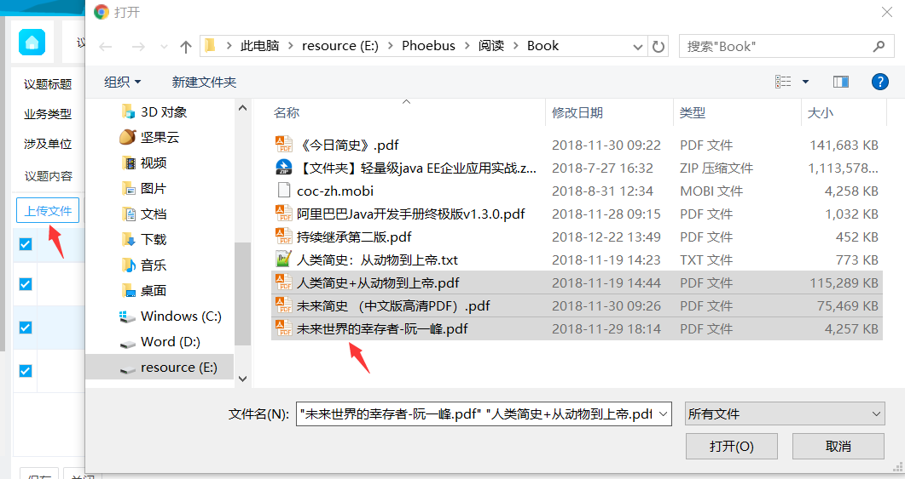
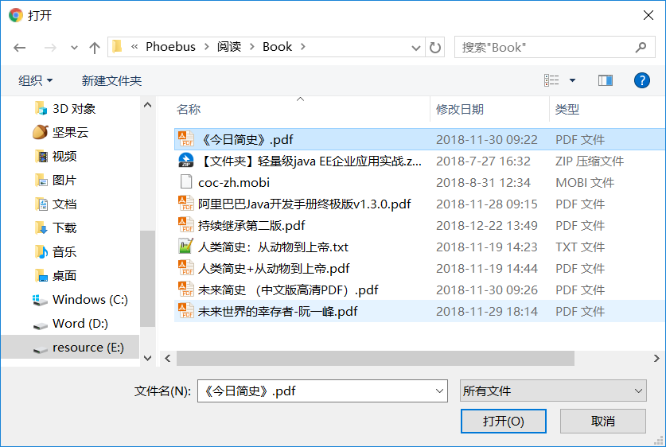

# 附件上传

<div style="float:right">
 
|作者|日期|
|----|---|
|郑烨锟|2019年1月22日|

</div>
                         
### 上传附件

* 代码
    ```html
     <!-- 真实按钮：给用户点的 -->
     <a class="easyui-linkbutton confirm-button" data-options="iconCls:'icon-import1'" onclick="uploadFunc.uploadFile('upload')">上传文件</a>
     <!-- 选择文件弹框 -->
     <input id="mFile_upload" name="mFile" type="file" style="display:none;" multiple="multiple" onChange="uploadFunc['uploadFileOnchange']('upload','upload')"/>
     <input id="upload" name="upload" data-widget="filebox" multiple="multiple" style="display:none;" onchange="loadDataChange(this.value,true,'upload','upload')"/>
    ```
    ```javascript
    // 判断上传操作
    uploadFile: function (suffix) {
        var sufid = suffix.replace(/\./g, "-").replace(/\$/g, "-");
        return $('#mFile_' + sufid).click();
    },
    // 判断上传文件状态，并保存文件
    uploadFileOnchange: function (fname, prefix) {
        var keyName = topicDetail.keyName;
        if (!keyName) {
            showError("无法上传附件！");
            return;
        }
        uploadPermit = false;
        var sufid = fname.replace(/\./g, "-").replace(/\$/g, "-");
        var files = $(document.getElementById("mFile_" + sufid))[0].files;
        var fileDataGrid = $('#attachmentList');
        for (var i = 0; i < files.length; i++) {
            fileDataGrid.datagrid('appendRow', {
                fileName: files[i].name,
                uploadState: ''
            });
        }
        // 获取所有添加行的行号
        var data = fileDataGrid.datagrid('getData');
        var arr = [];
        var total = data.total;
        for (var i = files.length; i > 0; i--) {
            arr.push(total - i);
        }
        // 处理ajaxupload特殊符号$无法解析
        $.ajaxFileUpload({
            url: '/formengineWebService/uploadFiles?jid=' + keyName,
            fileElementId: 'mFile_' + sufid,
            type: 'POST',
            dataType: 'json',
            secureuri: false,
            success: function (filePaths, status) {
                if (filePaths === undefined) {
                    console.log("result 不正  确", filePaths);
                }
                if (filePaths == null || filePaths === '') {
                    showError("上传附件失败");
                    uploadPermit = true;
                    document.getElementById("mFile_" + sufid).value = "";
                    return;
                }
                for (var i = 0; i < files.length; i++) {
                    var fileName = files[i].name;
                    // 获取文件类型
                    var lastIndex = fileName.lastIndexOf(".");
                    var fileType;
                    if (lastIndex < fileName.length - 1) {
                        fileType = fileName.substring(lastIndex).toLowerCase();
                    } else {
                        fileType = "";
                    }
                    var result = $(document.getElementById(fname)).val();
                    $(document.getElementById(fname)).val(uploadFunc.removeSpace(fileName) + "|" + filePaths[i] + "::" + result);
                    // 根据文件类型设置状态栏的内容，如果不支持预览提示用户“文件不支持预览”，否则提示“图片转化中”
                    var content;
                    if ($.inArray(fileType, previewImgTypes) >= 0) {
                        content = -2;// -2 正在上传
                    } else {
                        content = -3;// -3 不支持预览
                    }
                    // 修改附件状态
                    fileDataGrid.datagrid('updateRow', {
                        index: arr[i],
                        row: {
                            filePath: filePaths[i],
                            uploadState: content
                        }
                    })
                }
                // 去除隐藏input的value值得最后一个 | 符号
                var str = $(document.getElementById(fname)).val();
                if (str.substr(str.length - 2, 2) === "::") {
                $(document.getElementById(fname)).val(str.substring(0, str.length - 2));
                }
                var newVal = $(document.getElementById(fname)).val().split("::");
                var FJSL = fname.split(".")[0] + ".FSL";
                // $.F.setFieldValue(FJSL,newVal.length);
                document.getElementById("mFile_" + sufid).value = "";
                uploadPermit = true;
                uploadFunc.startGetFileConvertState($('#attachmentList'));
                // 上传成功后刷新datagrid
                $('#attachmentList').datagrid('reload');
            },
            error: function (xhr, status, e) {
                flag = false;
                uploadPermit = true;
                showAjaxError(xhr, status, e, "上传附件失败!");
                document.getElementById("mFile_" + sufid).value = "";
            }
    });
    ```
    * 实现思路
        * 1、选择文件
            * 用户点击上传文件，触发打开选择上传文件弹框事件，
                ```html
                <a class="easyui-linkbutton confirm-button" data-options="iconCls:'icon-import1'" onclick="uploadFunc.uploadFile('upload')">上传文件</a>
                ```
                ```javascript
                // 判断上传操作
                uploadFile: function (suffix) {
                var sufid = suffix.replace(/\./g, "-").replace(/\$/g, "-");
                // 此时拼接出来的是mFile_upload，触发这个input事件：uploadFileOnchange方法
                return $('#mFile_' + sufid).click();
                },
                ```
                * // 此处HTML代码表示
                ```html
                <input id="mFile_upload" name="mFile" type="file" style="display:none;" multiple="multiple" onChange="uploadFunc['uploadFileOnchange']('upload','upload')"/>
                ```                    
                * // 用户点击按钮后到这个方法中
                * uploadFileOnchange: function (fname, prefix) {
                    * 当双击文件或选中文件打开确定上传（可多选）
                        
                        
                        
                * }
        * 2、文件上传
            * uploadFileOnchange: function (fname, prefix) {
                * 将指定ID域的文件上传（也就是将选中的文件上传到指定接口）
                    ```javascript
                    $.ajaxFileUpload({
                        url: '/formengineWebService/uploadFiles?jid=' + keyName,
                        fileElementId: 'mFile_' + sufid,
                        type: 'POST',
                        dataType: 'json',
                        secureuri: false,
                        success: function (filePaths, status) {
                            // 上传成功后执行（根据接口返回值判断文件上传状态）
                            // 正常会显示上传附件成功
                        },
                        error: function (xhr, status, e) {
                            flag = false;
                            uploadPermit = true;
                            showAjaxError(xhr, status, e, "上传附件失败!");
                            document.getElementById("mFile_" + sufid).value = "";
                        }
                    });
                    ```
            * }
            > 接口处收到文件后会解析处理，将文件存入某个文件路径，并返回对应的状态值


* 插件
    * 使用插件
        * ajaxfileupload.min.js
    * 插件详情
        * 文件上传
            * ajaxfileupload.min.js
            * 下载
                * [https://github.com/carlcarl/AjaxFileUpload](https://github.com/carlcarl/AjaxFileUpload) 
                * [http://files.cnblogs.com/files/kissdodog/ajaxfileupload\_JS\_File.rar](http://files.cnblogs.com/files/kissdodog/ajaxfileupload_JS_File.rar)
            * ajaxfileupload
                * 简介
                    * ajaxFileUpload是一个异步上传文件的jQuery插件
                * 语法
                    * $.ajaxFileUpload(\[options\])
                    * options参数说明：
                        * 1、url：上传处理程序地址
                        * 2、fileElementId：文件选择框的id属性，即<input type="file">的id
                        * 3、secureuri：是否启用安全协议提交，默认为false
                        * 4、dataType：服务器返回的数据类型。可以为xml,script,json,html。如果不填写，jQuery会自动判断
                        * 5、success：服务器响应成功后的处理函数 ，参数data就是服务器返回的数据
                        * 6、error：服务器响应失败后的处理函数
                        * 7、data：自定义参数，当有数据要和上传的文件一起传到后台处理的时候会用到。这里注意，数据格式比较严格{param:\[{'param1':'value1','param2':'value2' },{'param1':'value3','param2':'value4' }\]}, 其中单引号不能改为双引号
                        * 8、type：提交数据的方式，一般为post
                    * 错误提示:
                        * 1，SyntaxError: missing ; before statement错误
                            * 如果出现这个错误就需要检查url路径是否可以访问
                        * 2，SyntaxError: syntax error错误
                            * 如果出现这个错误就需要检查处理提交操作的服务器后台处理程序是否存在语法错误
                        * 3，SyntaxError: invalid property id错误
                            * 如果出现这个错误就需要检查文本域属性ID是否存在
                        * 4，SyntaxError: missing } in XML expression错误
                            * 如果出现这个错误就需要检查文件name是否一致或不存在
                        * 5，其它自定义错误
                            * 大家可使用变量$error直接打印的方法检查各参数是否正确，比起上面这些无效的错误提示还是方便很多。
                * 使用方法
                    * 第一步：先引入jquery和ajaxFileUpload插件，注意先后顺序
                    ```html
                    <script type="text/javascript" src='/public/js/jquery-1.11.3.min.js'></script>
                    <script type="text/javascript" src="/public/js/ajaxfileupload.min.js"></script>
                    ```
                    * 第二步：HTML代码
                        * 原始的`<input type="file">`
                            * 展示效果
                                
                                
                                
                        * 因为原始控件的样式无法改变，所以我们一般会让这个标签隐藏，然后点击别的标签来触发上传控件
                            * demo
                                * HTML
                                ```html
                                <input type ="file" id="ImportPicInput" name= "myfile" style=" display: none" />
                                <div class ="input-append">
                                    <label for ="importPicName"> 上传原始图片：</label >
                                    <input type ="text" class="input-large" id= "importPicName" />
                                    <a class ="btn btn-default" onclick= "$('#ImportPicInput').click();" > 打开</ a>
                                </div >
                                ``` 
                                * js
                                    * 在用户选择完上传图片后，需要把图片名称显示到输入框中，还需要在js文件中加入代码
                                    ```javascript
                                    $(document).ready(function(e) {
                                        $('body').on('change',$('#ImportPicInput'),function(){
                                            $( "#importPicName").val($( "#ImportPicInput").val());
                                        });
                                    });
                                    ```
                                    * 上传文件的js代码
                                    ```javascript
                                    $.ajaxFileUpload({
                                        type: "POST",
                                        url: "/toolkit/importPicFile.do",
                                        data:{picParams:text},//要传到后台的参数，没有可以不写
                                        secureuri : false,//是否启用安全提交，默认为false
                                        fileElementId:'ImportPicInput',//文件选择框的id属性
                                        dataType: 'json',//服务器返回的格式
                                        async : false,
                                        success: function(data){
                                            if(data.result=='success'){
                                                //coding
                                            }else{
                                                //coding
                                            }
                                        },
                                        error: function (data, status, e){
                                            //coding
                                        }
                                    });
                                    ```
                                * Java
                                ```java
                                @RequestMapping(value="/importPicFile.do" ,produces="text/html;charset=utf-8" )
                                public @ResponseBody String importPicFile1(@RequestParam("picParams") String picParams, @RequestParam MultipartFile myfile,HttpServletRequest request){
                                    Map<String,Object> map= new HashMap<String,Object>();
                                    if(myfile.isEmpty()){
                                        map.put( "result", "error");
                                        map.put( "msg", "上传文件不能为空" );
                                    } else{
                                        String originalFilename=myfile.getOriginalFilename();
                                        String fileBaseName=FilenameUtils.getBaseName(originalFilename);
                                        String floderName=fileBaseName+"_" +DateUtil.getNowTimeData();
                                        try{
                                            String genePicPath=request.getSession().getServletContext().getRealPath("/upload/" +floderName);
                                            //把上传的图片放到服务器的文件夹下
                                            FileUtils. copyInputStreamToFile(myfile.getInputStream(), new File(genePicPath,originalFilename));
                                            //coding
                                            map.put( "result", "success");
                                        } catch (Exception e) {
                                            map.put( "result", "error");
                                            map.put( "msg",e.getMessage());
                                        }
                                    }
                                    String result=String. valueOf(JSONObject.fromObject (map));
                                    return result;
                                }
                                ```
                            * 展现的页面效果
                                
                                
                                
                        * 参考公司项目实现
                            * HTML代码
                            ```html
                            <a class="easyui-linkbutton confirm-button" data-options="iconCls:'icon-import1'" onclick="uploadFunc.uploadFile('upload')">上传文件</a>
                            <input id="mFile_upload" name="mFile" type="file" style="display:none;" multiple="multiple" onChange="uploadFunc\['uploadFileOnchange'\]('upload','upload')"/>
                            <input id="upload" name="upload" data-widget="filebox" multiple="multiple" style="display:none;" onchange="loadDataChange(this.value,true,'upload','upload')"/>
                            ```
                            * 展示效果图：默认任何类型文件
                                
                                
                                
                            >注：此处上传后接收是后端的任务，然后后端接口返回状态值，前端根据接口返回信息：包括文件路径、id等信息，至于展示是另一回事（看要啥效果）
