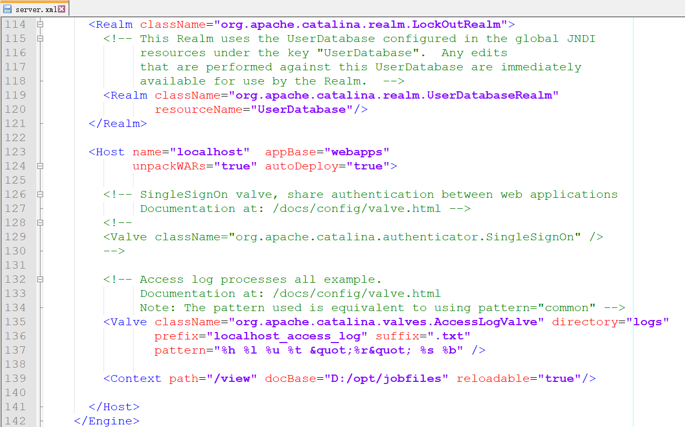
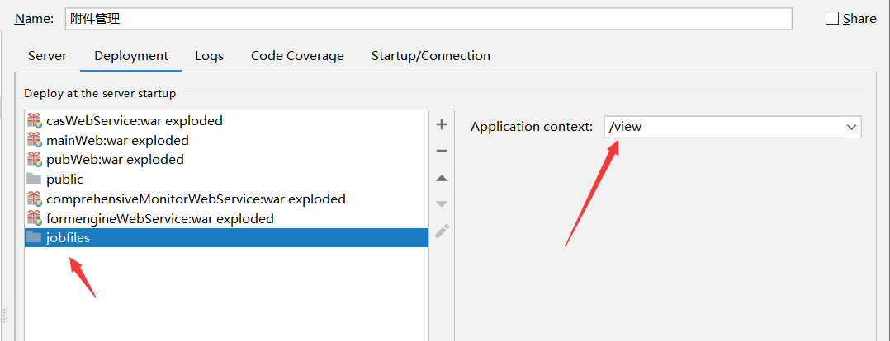
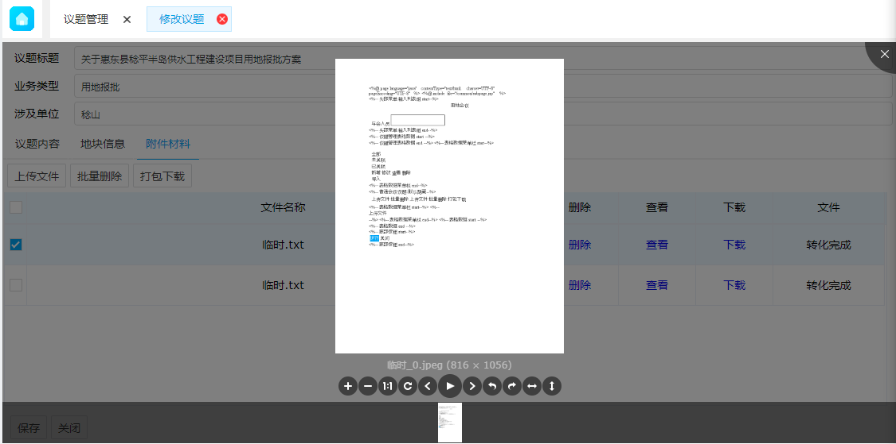

# 图片预览

<div style="float:right">
 
|作者|日期|
|----|---|
|郑烨锟|2019年1月22日|

</div>

### 上传配置

- 预览配置
    - 本地配置
        - 1、配置保存的文件路径
            - D:\\opt\\jobfiles
                1. 预览图片保存在：D:\\opt\\jobfiles\\preview
                2. 如果直接是由外置tomcat运行项目（模块），则在所用的tomcat文件配置映射路径
                    - tomcat：conf文件下server.xml
                        - D:\\develop\\tool\\apps\\tomcat\\conf\\server.xml
                        - <Context path="/view" docBase="D:/opt/jobfiles" reloadable="true"/>
                    - 直接在最后添加这行配置

                    
                            
                3. 如果像IDEA IntelliJ使用内置tomcat(虚拟)运行模块
                    - 添加模块文件（在添加模块处）
                        1. 添加模块D:\\opt\\jobfiles
                        2. 模块名为：view
                        3. 意思是遇到/view路径访问时映射到这里（到这里路径下找）

                    

### 预览实现

* 预览js
    ```javascript
    // 预览图片
    previewImage: function (filePath) {
            if (!filePath) {
                showError("文件正在上传，请稍后处理", "提示");
                return;
            }
            var filePaths = [];
            filePaths.push(filePath);
            if (!filePaths || filePaths.length === 0) {
                showError("预览传入的参数为空");
                return;
            }
            var imgPaths = [];
            for (var i = 0; i < filePaths.length; i++) {
                var filePath = filePaths[i];
                var sExt = filePath.substr(filePath.lastIndexOf(".")).toLowerCase();
                // 判断文件是否支持预览
                var index = $.inArray(sExt, previewImgTypes);
                if (index >= 0) {
                    imgPaths.push(filePath);
                }
            }
            if (imgPaths.length === 0) {
                showError("这类文件不支持预览", '提示');
                return;
            }
            //预览开始位置
            var preIndex = 0;
            $.ajax({
                url: '/formengineWebService/getImagesByFilePaths',
                type: 'post',
                dataType: 'json',
                data: {
                    macroPaths: imgPaths
                },
                success: function (data) {
                    //渲染预览页面
                    var renderPage = function (previewHtml) {
                        $('#unittab').tabs('close', 3);
                        $('#unittab').tabs('add', {
                            title: '图片预览',
                            selected: true,
                            closable: true,
                            id: 'previewImgTab',
                            width: '100%',
                            height: '100%',
                            content: previewHtml
                        });
                    };
                    if (sExt === ".pdf") {
                        var pdfHtml = '<div style="width: 100%;height: 100%;overflow: hidden;"><iframe src="/pubWeb/static/web/viewer.html?file=' + encodeURIComponent(data['result'][0]) + '" id="pdfContainer" name="pdfContainer" style="width:100%;height:100%;box-sizing:border-box;"></iframe></div>';
                        renderPage(pdfHtml); //渲染pdf预览页面
                    } else {
                        if (data.result.length === 0) {
                            showError("预览图片还未生成或预览图丢失！", "提示");
                            return;
                        }
                        var html = [];
                        var content = "";
                        if (data.msg) {
                            content = "(" + data.msg + ")";
                        }
                        for (var i = 0; i < data.result.length; i++) {
                            var index = data.result[i].lastIndexOf('/');
                            var filename = data.result[i].substring(index + 1);
                            var prefix = data.result[i].substring(0, index + 1);
                            html.push("<li>")
                            html.push('');
                            html.push("</li>");
                        }
                        var otherHtml = '<ul id="previewImg" class="previewimg"></ul>';
                        renderPage(otherHtml);
                        //清空预览插件中的图片
                        $("#previewImg").empty();
                        $("#previewImg").viewer('destroy');
                        $("#previewImg").append(html.join(''));
                        $("#previewImg").viewer({
                            // inline: true,
                            shown: function () {
                                $("#previewImg").viewer('view', preIndex);
                            }
                        });
                        $("#previewImg").viewer('show');
                        // $('#unitdialog')[0].parentElement.style.overflow = 'unset';
                    }
                },
                error: function (xhr, stat, exmsg) {
                    showAjaxError(xhr, stat, exmsg, "获取预览图片失败");
                }
            });
        },
    ```
       
* 图片预览
    * HTML
        ```html
        <!-- 图片预览 -->
        <div>
            <ul class="images" id="previewImg" style="display:none;"></ul>
        </div>
        ```
    * 预览思路
        * 查看按钮中存在图片路径
        * 根据图片路径去让这个接口去找到图片返回
            * url: '/formengineWebService/getImagesByFilePaths',
        * 然后使用viewer这个插件展示
            ```javascript
            //清空预览插件中的图片
            $("#previewImg").empty();
            $("#previewImg").viewer('destroy');
            $("#previewImg").append(html.join(''));
            $("#previewImg").viewer({
                // inline: true,
                shown: function () {
                    $("#previewImg").viewer('view', preIndex);
                }
            });
            $("#previewImg").viewer('show');
            ```

* 插件
    * 使用插件
        * viewer.js
    * 插件详情
        * viewer.js
            * [http://fengyuanchen.github.io/viewer/](http://fengyuanchen.github.io/viewer/)
            * viewer.css
            * viewer.js
            * [https://github.com/fengyuanchen/viewer](https://github.com/fengyuanchen/viewer)
        * 语法
            * Methods
                * View
                    * 查看预览
                * Zoom
                    * 指定倍数放大
                * Zoom In
                    * 指定倍数放大
                * Zoom To
                    * 放大指定倍数
                * Zoom Out
                    * 缩小指定倍数
                * Rotate
                    * 指定度数旋转
                * Rotate To
                    * 旋转到指定度数
                * Rotate Left
                    * 逆时针向左旋转90°
                * Rotate Rigft
                    * 顺时针向右旋转90°
                * Flip horizontal
                    * 图片上下180°翻转（图片内容向上转为向下，向下转为向上）
                * Flip vertical
                    * 图片对翻180°（图片原在左边向左变为在右边向右）
                * 移动图片
                    * Left
                        * 向左移动图片
                    * Right
                        * 向右移动图片
                    * Up
                        * 向上移动图片
                    * Down
                        * 向右移动图片
                * prev
                    * View previous image
                    * 还原到图片默认大小
                * Next
                    * 查看下个图片
                * Play
                    * 动画幻灯片播放
                * Stop
                    * 停止幻灯片播放
                * Show
                    * 显示图片后执行的方法（回调）
                    * $("#previewImg").viewer({
                        * //inline: true,
                        * shown: function () {
                            * // 默认显示下标为preIndex的预览图片
                            * $("#previewImg").viewer('view', preIndex);
                        * }
                    * });
                    * // 启动预览
                    * $("#previewImg").viewer('show');
                * Hide
                    * 隐藏图片后执行的方法（回调）
                    * $("#previewImg").viewer({
                        * //inline: true,
                        * hide: function () {
                            * // 图片隐藏后执行回调
                        * }
                    * });
                * Full
                    * 全屏预览
                * Exit
                    * 取消全屏预览
                * Reset
                    * 重置原先大小（或说上次保存的大小）
                * Tooltip
                    * 提示信息
                * Destroy
                    * // 清空预览插件中的图片
        * 使用
            * HTML代码
            ```html
            <!-- 图片预览 -->
            <!-- ul表示每次预览可以有多张预览图片li -->
            <div>
                <ul class="images" id="previewImg" style="display:none;"></ul>
            </div>
            ```
            * 参考代码
            ```javascript
            // 预览开始位置
            var preIndex = 0;
            $.ajax({
                url: '/formengineWebService/getImagesByFilePaths',
                type: 'post',
                dataType: 'json',
                data: {macroPaths: imgPaths},
                success: function (data) {
                    if (data === undefined) {
                        console.log("result 不正确", data);
                        return;
                    }
                    if(sExt === '.pdf'){
                        $('#previewDiv')[0].style.display = 'block';
                        $('#pdfContainer')[0].src = "/pubWeb/static/web/viewer.html?file=" + encodeURIComponent(data['result'][0]);
                    }else{
                        if (data.result.length === 0) {
                            showError("预览图片还未生成或预览图丢失！", "提示");
                            return;
                        }
                        var html = [];
                        var content = "";
                        if (data.msg) {
                            content = "(" + data.msg + ")";
                        }
                        for (var i = 0; i < data.result.length; i++) {
                            var index = data.result[i].lastIndexOf('/');
                            var filename = data.result[i].substring(index + 1);
                            var prefix = data.result[i].substring(0, index + 1);
                            html.push("<li>");
                            html.push('');
                            html.push("</li>");
                        }
                        // 清空预览插件中的图片 $("#previewImg").empty();
                        $("#previewImg").viewer('destroy');
                        $("#previewImg").append(html.join(''));
                        $("#previewImg").viewer({
                            // inline: true,
                            shown: function () {
                                $("#previewImg").viewer('view', preIndex);
                            }
                        });
                        $("#previewImg").viewer('show');
                        // $('#unitdialog')[0].parentElement.style.overflow = 'unset';
                    }
                },
                error: function (xhr, stat, exmsg) {
                    showAjaxError(xhr, stat, exmsg, "获取预览图片失败");
                }
            });
            ```
            * 图片预览
            ```html
            var html = [];
            var content = "";
            if (data.msg) {
                content = "(" + data.msg + ")";
            }
            for (var i = 0; i < data.result.length; i++) {
                var index = data.result[i].lastIndexOf('/');
                var filename = data.result[i].substring(index + 1);
                var prefix = data.result[i].substring(0, index + 1);
                html.push("<li>");
                // 拼接图片地址
                html.push('');
                html.push("</li>");
            }
            // 清空预览插件中的图片
            $("#previewImg").empty();
            $("#previewImg").viewer('destroy');
            $("#previewImg").append(html.join(''));
            // 设置第一张预览图片
            $("#previewImg").viewer({
                //inline: true,
                shown: function () {
                    // 默认显示下标为preIndex的预览图片
                    $("#previewImg").viewer('view', preIndex);
                }
            });
            // 启动预览
            $("#previewImg").viewer('show');
            ```
* 预览效果
    * 图片预览
        * 保存txt、doc等文件生成的图片预览
                
        