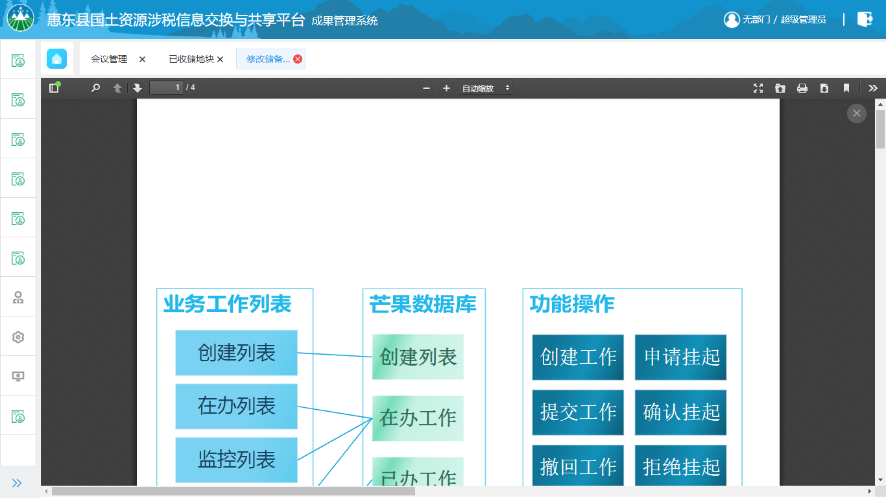
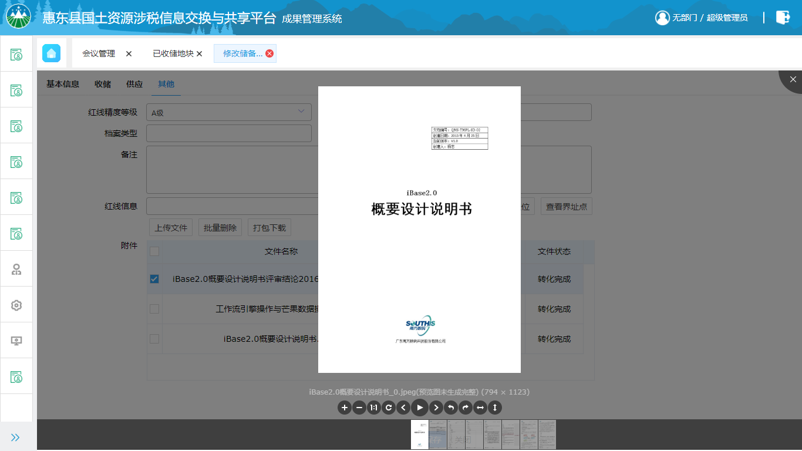

<center><h1>附件预览概述</h1></center>

<div style="float:right">
 
|作者|日期|
|----|---|
|鄢新疆|2019年1月22日|

</div>

一、图片预览
---

**1、viewer.js 下载**

下载地址：
```
https://github.com/fengyuanchen/viewerjs/archive/master.zip
```

预览地址：
```
http://fengyuanchen.github.io/viewer/
```

**2、引入viewer.js和viewer.css**

```
<link  href="/path/to/viewer.css" rel="stylesheet">
<script src="/path/to/viewer.js"></script>
```

**3、HTML代码部分**

在jsp或是HTML页面中添加一个图片预览所需要的容器。
```html
<div>
  <ul id="previewImg">
    <li></li>
    <li></li>
    <li></li>
    <li></li>
  </ul>
</div>
```

**`注意：`**`插件默认会取图片的src地址。如果想要放大之后换一张大图的话，可以把大图的路径写在data-original属性中，然后设置url : "data-original" 。`

**4、js代码部分**

实例化预览控件。

```js
$("#previewImg").empty(); //清空previewImg容器
$("#previewImg").viewer('destroy'); //删除上一个图片预览控件
$("#previewImg").append(html.join('')); //将要预览的图片放入图片预览的容器内
//实例化一个新的图片预览控件
$("#previewImg").viewer({
    inline: true,
    shown: function () {
        $("#previewImg").viewer('view', preIndex); //preIndex为初始显示图片的序号
    }
});
$("#previewImg").viewer('show'); //预览图片
```

**5、viewer的属性配置和方法**

|名称|类型|默认值|说明|
|---|---|---|---|
|inline|布尔值|false|启用 inline 模式button布尔值true显示右上角关闭按钮（jQuery 版本无效）|
|navbar|布尔值/整型|true|显示缩略图导航|
|title|布尔值/整型|true|显示当前图片的标题（现实 alt 属性及图片尺寸）|
|toolbar|布尔值/整型|true|显示工具栏tooltip布尔值true显示缩放百分比|
|movable|布尔值|true|图片是否可移动|
|zoomable|布尔值|true|图片是否可缩放|
|rotatable|布尔值|true|图片是否可旋转|
|scalable|布尔值|true|图片是否可翻转|
|transition|布尔值|true|使用 CSS3 过度|
|fullscreen|布尔值|true|播放时是否全屏|
|keyboard|布尔值|true|是否支持键盘|
|interval|整型|5000|播放间隔，单位为毫秒|
|zoomRatio|浮点型|0.1|鼠标滚动时的缩放比例|
|minZoomRatio|浮点型|0.01|最小缩放比例|
|maxZoomRatio|数字|100|最大缩放比例|
|zIndex|数字|2015|设置图片查看器 modal 模式时的 z-indexz|
|IndexInline|数字|0|设置图片查看器 inline 模式时的 z-index|
|url|字符串/函数|src|设置大图片的 url|
|build|函数|null|回调函数，具体查看演示|
|built|函数|null|回调函数，具体查看演示|
|show|函数|null|回调函数，具体查看演示|
|shown|函数|null|回调函数，具体查看演示|
|hide|函数|null|回调函数，具体查看演示|
|hidden|函数|null|回调函数，具体查看演示|
|view|函数|null|回调函数，具体查看演示|
|viewed|函数|null|回调函数，具体查看演示|

eg：
```js
viewer = new Viewer(pictureDiv,{
       inline: true, //inline模式，该模式是限制在一个固定大小的容器中；modal模式默认是全屏
       url: 'data-original', //默认路径为data-original中配置的路径
       navbar: false, //导航栏
       zoomRatio: 0.4, //
       button: true,
       title: false,
       keyboard: false,
       toolbar: {
           zoomIn: 1, //放大
           zoomOut: 1, //缩小
           oneToOne: 1, //1:1（原始大小）
           reset: 1, //还原
           prev: 0, //上一张
           play: 0, //播放幻灯片
           next: 0, //下一张
           rotateLeft: 1, //向左旋转
           rotateRight: 1, //向右旋转
           flipHorizontal: 1, //水平翻转
           flipVertical: 1, //垂直翻转
       },
       viewed: function () {
           viewer.view(0);
       }
   });
```

  
二、PDF预览
---
**1、pdf.js 下载**

下载地址：
```
https://github.com/mozilla/pdf.js/releases/download/v2.0.943/pdfjs-2.0.943-dist.zip
```
预览地址：
```
https://mozilla.github.io/pdf.js/web/viewer.html
```

**2、解压下载的PDF预览文件**


文件结构图：
```
├── build/
│   ├── pdf.js                             - display layer
│   ├── pdf.js.map                         - display layer's source map
│   ├── pdf.worker.js                      - core layer
│   └── pdf.worker.js.map                  - core layer's source map
├── web/
│   ├── cmaps/                             - character maps (required by core)
│   ├── compressed.tracemonkey-pldi-09.pdf - PDF file for testing purposes
│   ├── debugger.js                        - helpful debugging features
│   ├── images/                            - images for the viewer and annotation icons
│   ├── locale/                            - translation files
│   ├── viewer.css                         - viewer style sheet
│   ├── viewer.html                        - viewer layout
│   ├── viewer.js                          - viewer layer
│   └── viewer.js.map                      - viewer layer's source map
└── LICENSE
```
`将build和web文件夹中的文件放在项目的webapp目录下。`

**3、HTML代码部分**

添加一个iframe用来显示要预览的pdf。

```js
<!-- 先将div设为隐藏（display:none;）-->
<div id="previewDiv" class="preview-div">
    <a class="close-btn" onclick="uploadFunc.closePdf()">×</a><!-- PDF预览时默认没有关闭按钮，需手动添加一个关闭按钮 -->
    <iframe src="" frameborder="0" class="pdf-container" id="pdfContainer" name="pdfContainer"></iframe>
</div>
```

**4、js代码部分**

通过以下的方式就可以实现pdf预览：
```
viewer.html的路径?file=要预览的pdf文件路径
```
将iframe的路径改为“viewer.html的路径?file=要预览的pdf文件路径”：
```js
$('#previewDiv')[0].style.display = 'block'; //显示要预览的div
$('#pdfContainer')[0].src = "/pubWeb/static/web/viewer.html?file=" + encodeURIComponent(data['result'][0]); //修改iframe路径

<!-- 关闭pdf预览 -->
$('#previewDiv')[0].style.display = 'none';
```

三、运用模块及其效果
---

**1、iBase2.0所用到的模块**

|模块名称|模块路径|
|---|---|
|用户管理模块|/pubWeb/system/userManage|
|土地储备模块 —— 拟收储|/comprehensiveMonitor/purchase/prePurchasePage|
|土地储备模块 —— 已收储|/comprehensiveMonitor/purchase/purchasePage|
|领导决策系统 —— 会议管理|/comprehensiveMonitor/conference/conferenceManage|
|领导决策系统 —— 议题管理|/comprehensiveMonitor/conference/topicManage|


**2、pdf预览**



**3、图片预览**


