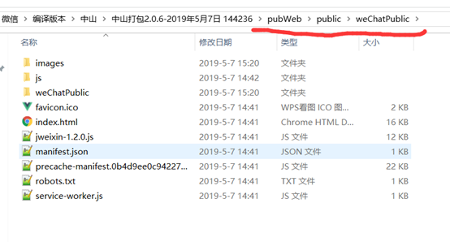
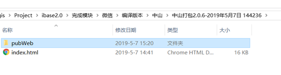
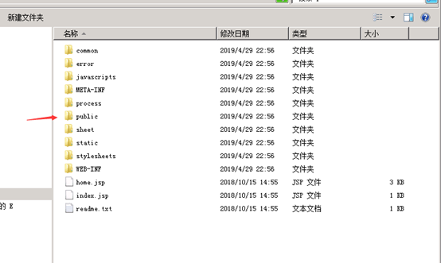
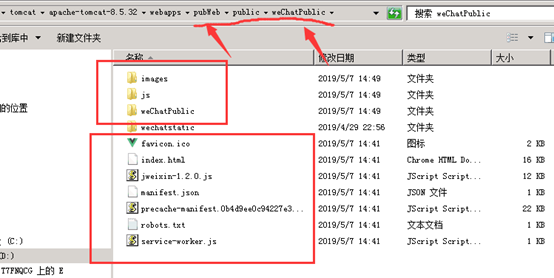
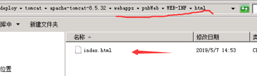

# 微信项目打包部署说明

|作者|日期|
|----|---|
|郑烨锟|2019年7月3日|

## 一、编译打包

#### 1、直接拉取最新代码

	git clone git@192.168.10.85:landdevlopmentserver/wechatproject.git

#### 2、保证本地环境有node，可以运行npm命令

	执行命令下载依赖：npm install

#### 3、编译版本

	npm run build

#### 4、打包结构

	pubWeb/public/weChatPublic
 

> 注：如果的发送给实施，可以把`index.html`复制到打包文件`pubWeb`同级目录

## 二、服务部署

#### 1、当前cli3版本的项目结构

#### 2、替换weChatPublic

###### 方法1

1. 找到服务器地址：tomcat/webapps/

2. 直接将打包的pubWeb文件夹粘贴进去（替换）
 

> 建议执行方法2比较保险

###### 方法2

1. 找到服务器地址：tomcat/webapps/pubWeb/public
 

2. 将打包文件夹weChatPublic粘贴进去（替换）

 
####　3、参考结果

	注意文件路径

#### 4、替换index.html文件

1. 方法1或方法2执行完（选择其中一种）

2. 找到服务器位置：tomcat/webapps/pubWeb/WEB-INF/html/
 
3. 把打包的index.html文件粘贴进去，替换原来的index.html文件

> 注：如果出现页面空白或静态资源(js、css)404，说明index.html没有替换好

!> 其中：不需要重启服务器，直接替换后就能实现更新，等一下打开页面或刷新一下就能看到效果

