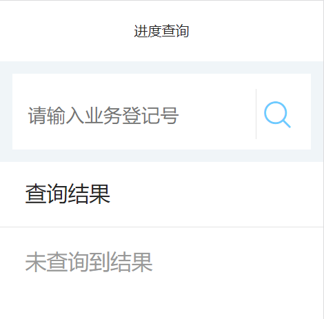
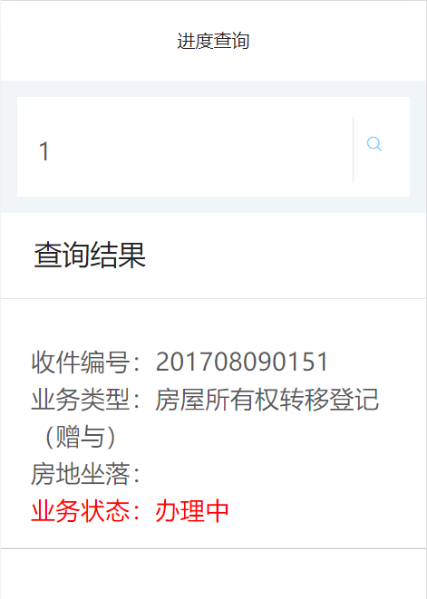
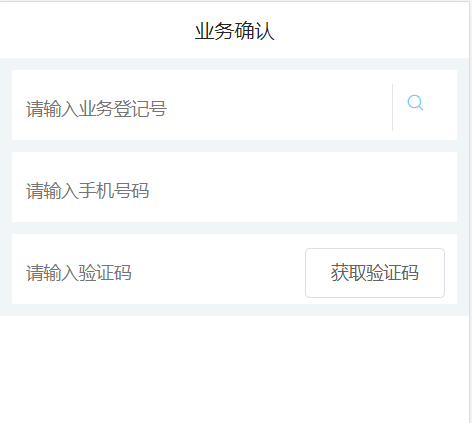
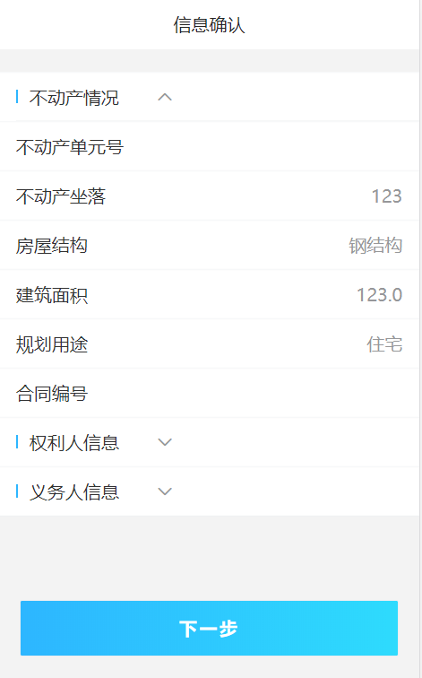

# 业务确认和进度查询接口说明文档

<div style="float:right">

|作者|日期|
|----|---|
|郑烨锟|2019年3月27日|

</div>

## 进度查询页面

    这个页面是供用户根据业务登记号查询相关业务进度信息

####  接口1：查询内网业务的办理进度--GetYWJD
    
    用户输入业务登记号查询某个业务办理进度

> http://192.168.10.91:8071/WSYY/GetYWJD （string strJson）

*传入参数*

```json
{"strJson": '{ 
    "DJBH":"201708090151" ,
    "password": "b7OmrnAjfyi42sOKCi3jtw1I1mw",
    "username": "WSYYUSER"
}'}
```

> 此处为接口请求参数，参数主要是业务登记号：DJBH。

*返回参数*

```json
{
  "resultcode": "1",
  "resultmsg": "",
  "result": [{
    "jid": "201708090151",
    "jtitle": "房屋所有权转移登记（赠与）",
    "ffdzl": "云浮市市区城中路1号第七层",
    "ywjd": "办理中"
  }]
}
```

> 此接口返回数据表示，当resultcode=="1"时，存在业务进度数据。
    此页面是直接现在该业务进度数据。

## 业务查询页面

    根据业务号查询确认业务

#### 接口1：发送短信接口

> /pubWeb/system/public/jidSmsCode?jid='+?+'&number='+?

*请求方式*：`GET请求`

*传入参数*
```json
{
    "jid": "2019022800036",  // 业务登记号
    "number": "13006613754"  // 用户绑定业务的手机号码
}
```

> 此接口是根据用户输入的业务登记号和绑定的手机号码，进行短信发送

*返回参数*
```js
true / false
```

> 如果返回true，则说明短信发送成功；否则说明用户输入不匹配或不正确

#### 接口2：查询业务

> '/formengineWebService/public/getConfigDataByJid?jid='+?+'&number='+?+'&code='+?

*请求方式*：`GET请求`

*传入参数*
```json
{
    "jid": "2019022800036",  // 业务登记号
    "number": "13006613754",  // 用户绑定业务的手机号码
    "code": "9527"  // 短信验证码
}
```

> 此接口是根据用户输入的业务登记号、绑定的手机号码以及发送的短信验证码，进行业务查询

*返回参数*
```json
{
  "不动产情况": [{
      "不动产单元号": ""
    },
    {
      "不动产坐落": "123"
    },
    {
      "房屋结构": "钢结构"
    },
    {
      "建筑面积": "123.0"
    },
    {
      "规划用途": "住宅"
    },
    {
      "合同编号": ""
    }
  ],
  "权利人信息": [{
    "权利人": [{
        "姓名": "456",
        "代理人名称": "p",
        "证件号码": "1234567890",
        "联系电话": "t",
        "共有情况": "单独所有",
        "代理人证件号码": "a",
        "证件种类": "身份证",
        "通讯地址": "w",
        "单位性质": "个人"
      },
      {
        "姓名": "123",
        "代理人名称": null,
        "证件号码": null,
        "联系电话": null,
        "共有情况": null,
        "代理人证件号码": null,
        "证件种类": null,
        "通讯地址": null,
        "单位性质": "个人"
      }
    ]
  }],
  "义务人信息": [{
    "义务人": [{
        "姓名": "qwe",
        "代理人名称": null,
        "证件号码": null,
        "法人代表名称": null,
        "联系电话": null,
        "代理人证件号码": null,
        "证件种类": null,
        "通讯地址": null,
        "单位性质": null
      },
      {
        "姓名": "asd",
        "代理人名称": "o",
        "证件号码": "asdfdgfdgd",
        "法人代表名称": "u",
        "联系电话": "r",
        "代理人证件号码": "p",
        "证件种类": "身份证",
        "通讯地址": "w",
        "单位性质": "个人"
      }
    ]
  }]
}
```

> 该接口返回业务json数据，不动产情况、权利人信息等

## 实现图

#### 进度查询页面


#### 进度查询结果


#### 业务确认页面


#### 信息确认页面

