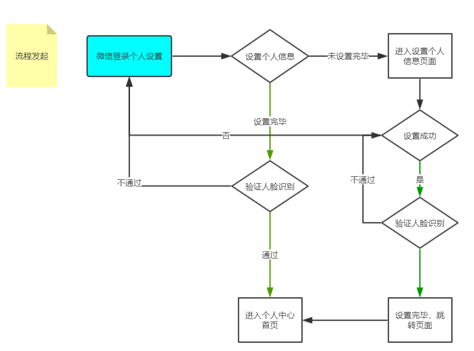

# 个人中心流程相关接口文档

<div style="float:right">

|作者|日期|
|----|---|
|郑烨锟|2019年4月19日|

</div>

## 个人中心流程

    用户进入个人中心，如果没有验证过，则进入个人中心验证流程；如果已验证通过则直接进入个人中心。
    
1. 进入人脸识别验证（正常流程）；
2. 人脸识别通过后，保存姓名和身份证号，并跳转到选择账号页面，选择已有的ibase账号；
3. 如果没有账号，则直接跳转至注册页面注册；
4. 在注册页面创建ibase账号并关联微信号，关联成功返回ibaseId保存，并跳转至个人中心页面



## 人脸核身--人脸识别

1、如果人脸核身判断出用户是要前往个人中心，经过正常流程传参告诉人脸识别页面
2、按照正常人脸识别流程，人脸识别成功后，如果是要前往个人中心页面则保存姓名和身份证号，并跳转至选择账号页面

## 选择账号页面

    关联用户的某个ibase账户

#### 获取用户所有的ibase账户

> /pubWeb/public/faceRecognition/getLinkedAccounts

请求类型：GET、POST

*传入参数*
```json
{ 
    "cardName":"cardName" ,
    "cardNumber": "cardNumber"
}
```

> 根据姓名和身份证号获取所有ibase账号

*返回参数*
```json
[
    {
       "userId": "账号ID",
       "loginName": "账号名"
    },
    {
       "userId": "账号ID",
       "loginName": "账号名"
    }
]
```

> 获取账户区分为0、大于等于1：如果是0个账户就跳转至注册页面；如果拥有账户，则在选择账户页面让用户选择

#### 关联ibase账号

> /pubWeb/public/faceRecognition/updateAccountWxOpenId

请求类型：POST

*传入参数*
```json
{ 
    "userId":"userId",
    "openId": "openId"
}
```

> 根据ibase账号ID：userId；openId微信Id

*返回参数*
```json
true/false
```

## 注册账号页面

    注册ibase账号并关联

#### 获取省市区数据

> /mainWeb/public/system/register/getsuCitysOrArea?type=code

请求类型：GET

*传入参数*
```json
省：type=provinces
市：44
区：4451
```

> 注：根据type=provinces获取中国所有省级信息；市编码根据省数据获取；区编码根据市数据获取；其中不传type数据获取的是当前省的所有市级数据

*返回参数*
```json
// 省级数据
[
    {
      "children": [],
      "code": "14",
      "lclass": 1,
      "sortValue": 1,
      "lno": null,
      "lname": "山西省",
      "lsname": null,
      "lcname": null
    }, {
      "children": [],
      "code": "65",
      "lclass": 1,
      "sortValue": 1,
      "lno": null,
      "lname": "新疆维吾尔自治区",
      "lsname": null,
      "lcname": null
    }
]

// 市级数据
[{
  "children": [],
  "sortValue": 1,
  "code": "4401",
  "lname": "广州市",
  "lsname": null,
  "lclass": 2,
  "lcname": null,
  "lno": null
}, {
  "children": [],
  "sortValue": 1,
  "code": "4453",
  "lname": "云浮市",
  "lsname": null,
  "lclass": 2,
  "lcname": null,
  "lno": null
}]
```

#### 验证ibase注册账号名是否唯一

> /mainWeb/public/system/register/verifyUserName?loginName=注册账号名

请求类型：GET

*传入参数*
```json
loginName=注册账号名
```

*返回参数*

```js
true / false
```

> 如果注册账户名可用，则返回true

#### 发送短信验证码

> /pubWeb/system/public/smsCode?number=手机号码

请求类型：GET

*传入参数*

*返回参数*

```json
true / false
```

> 如果短信发送成功，则返回true

#### 注册并关联微信

> /pubWeb/public/faceRecognition/weChatOnlineRegister

*请求类型*：`POST`

*请求头*：`{ headers: { 'Content-Type': 'multipart/form-data' } }`

*传入参数*
```js
let formData = new FormData();	// 使用formData请求
formData.append('wxOpenId', openId);	// 微信ID
formData.append('loginName', _this.loginName);	// 注册账户名
formData.append('password', sha1(_this.password).toUpperCase());	// 加密密码

formData.append('realName', _this.username);	// 用户真实姓名
formData.append('typeNumb', '身份证,' + _this.cerNumber);	// 用户身份证号
formData.append('cardAddress', idAddress);	// 身份证地址
formData.append('address', _this.mAddress);	// 用户联系地址
formData.append('sex', _this.sex);

formData.append('phone', _this.sendSmsNumber);	// 注册手机号码
formData.append('code', _this.smsCode);	// 短信验证码
```

> 注：cardAddress身份证地址省市区之间需要使用`::`隔开，例如：省::市::区

*返回参数*

```json
{
  "code": 0, //（0、-1、-2，0表示成功，负数表示失败）
  "msg": "（成功或者失败原因，或者为空）",
  "result": "14561435123545315（成功的时候返回用户id，否则为''）"
}
```

## 个人中心页面

    用户经过人脸核身和ibase账号关联，进入个人中心页面

#### 住房证明查询

    获取个人住房证明，即打开或下载PDF

> /FirstHouseQuery（string strJson）

请求类型：

*传入参数*
```json
{"strJson": '{ 
    "username": "WSYYUSER", 
    "password": "b7OmrnAjfyi42sOKCi3jtw1I1mw", 
    "qlr": "袁*凤", 
    "zjhm": "43**********227"
}'}
```

*返回参数*
```json
{
    "resultcode":"1",
    "resultmsg":"",
    "cqxx":"BASE64编码PDF文件流"
}
```

> 注：返回的JSON串，JSON串里面包含返回的查档证明的文件流。result节点是经过base64编码的二进制流数据，用base64解码，可变成二进制数据流，再转成PDF格式的文件就可以。resultcode：返回代码：1成功，0失败；resultmsg：错误信息；cqxx：查档结果PDF文件流，需要BASE64编码。


#### 我的不动产

    个人不动产权信息查询

> /GetPersonDataInfo（string strJson）

请求类型：POST

*传入参数*
```json
{"strJson": '{ 
    "username": "WSYYUSER", 
    "password": "b7OmrnAjfyi42sOKCi3jtw1I1mw", 
    "qlr": "袁*凤", 
    "zjhm": "43**********227"
}'}
```
> 获取用户的姓名的身份证号进行个人产权查询

*返回参数*
```json
{
  "resultcode": "1",
  "resultmsg": "",
  "result": [{
    "qlrmc": "黎卓荣、黎燕",
    "zjhm": "442827196801011231、441227197002041224",
    "gyfs": "单独所有",
    "zl": "云浮市市区育华路与龙华路交汇处第七层701号房",
    "bdcdyh": "44530200125358550304000778",
    "cqzh": "云0000027232",
    "mj": "130.12平方米",
    "yt": "住宅",
    "fwzt": "抵押",
    "mark": "肇庆市高要区不动产登记"
  }]
}
```

#### 我的业务

    根据微信openId查询用户所有正在进行的业务

> /formengineWebService/public/getBusinessDataByJid?openId=' + openId

请求类型：GET

*传入参数*
```json
```

*返回参数*
```json
[{
    "openId": "微信号",
    "ywh": "11411",
    "startTime": "2019年4月8日14:59:04",
    "endTime": "",
    "ywContent": "资讯类信息文案可以打满多行资讯类信息文案可以打满多行资讯类信息文案可以打满多行。资讯类信息文案可以打满多行资讯类信息文案可以打满多行资讯类信息文案可以打满多行。资讯类信息文案可以打满多行资讯类信息文案可以打满多行资讯类信息文案可以打满多行。资讯类信息文案可以打满多行资讯类信息文案可以打满多行资讯类信息文案可以打满多行。"
  },
  {
    "openId": "微信号",
    "ywh": "51315",
    "startTime": "2019年4月8日14:59:04",
    "endTime": "",
    "ywContent": "资讯类信息文案可以打满多行资讯类信息文案可以打满多行资讯类信息文案可以打满多行。资讯类信息文案可以打满多行资讯类信息文案可以打满多行资讯类信息文案可以打满多行。资讯类信息文案可以打满多行资讯类信息文案可以打满多行资讯类信息文案可以打满多行。资讯类信息文案可以打满多行资讯类信息文案可以打满多行资讯类信息文案可以打满多行。"
  },
  {
    "openId": "微信号",
    "ywh": "24242",
    "startTime": "2019年4月8日14:59:04",
    "endTime": "",
    "ywContent": "资讯类信息文案可以打满多行资讯类信息文案可以打满多行资讯类信息文案可以打满多行。资讯类信息文案可以打满多行资讯类信息文案可以打满多行资讯类信息文案可以打满多行。资讯类信息文案可以打满多行资讯类信息文案可以打满多行资讯类信息文案可以打满多行。资讯类信息文案可以打满多行资讯类信息文案可以打满多行资讯类信息文案可以打满多行。"
  }
]
```

#### 个人信息

###### 接口1：获取个人ibase账户信息

    根据微信关联的当前ibase的账号ID：userId（注：这个Id在关联成功的时候已保存在本地）获取个人ibase信息

> /pubWeb/public/faceRecognition/getAuthenticatedUserInfo?userId=userId

请求类型：GET、POST

*传入参数*
```json
{
	userId: userId
}
```

*返回参数*
```json
{
  "id": "445281199507305555",
  "name": "ZYK",
  "phone": "13169962222",
  "sex": "男"
}
```

###### 接口2：解除账号绑定

    根据微信关联的当前ibaseId解除该账号与微信的绑定

> /pubWeb/public/faceRecognition/updateAccountWxOpenId

请求类型：POST

*传入参数*
```json
{
	userId: userId,
	openId: ""
}
```

*返回参数*
```js
true / false
```
