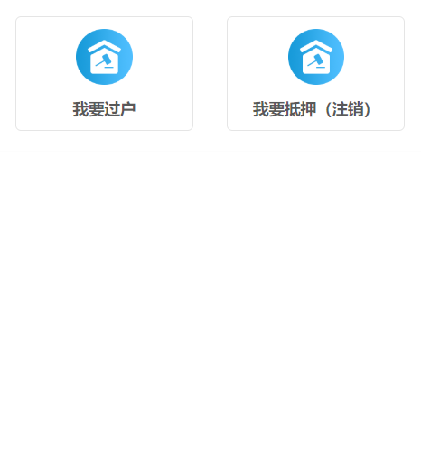
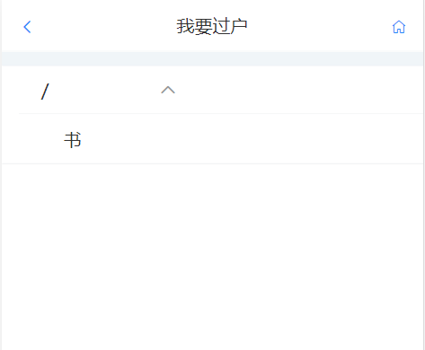
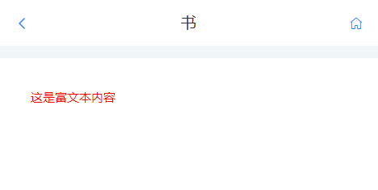

# 导航功能接口文档

<div style="float:right">

|作者|日期|
|----|---|
|郑烨锟|2019年3月28日|

</div>

## 微信导航首页

#### 接口1：获取微信端网页导航菜单接口--wechatRouterList

> /pubWeb/public/wechatRouterList

*请求方式*：`POST请求`

*传入参数*

> 无请求参数

*返回参数*
```json
[{
    "id": "c82a28d0-2f32-4ecb-b574-83f77580bad3",
    "text": "我要过户",
    "iconUrl": "public/wxicon/ad.gif"
  },
  {
    "id": "3e5f1980-e786-441a-ae93-4c3c6056d3dc",
    "text": "我要抵押（注销）",
    "iconUrl": "public/wxicon/ad.gif"
  }
]
```

## 微信导航列表页面

#### 接口1：递归获取节点子节点数据接口--wechatRouterListById

> /pubWeb/public/wechatRouterListById

*请求方式*：`POST请求`

*传入参数*
```json
{
  "parentId": "0"
}
```

> 该接口请求参数是用户点击节点的ID，根据id获取子节点信息

*返回参数*
```json
[{
  "id": "0",
  "text": "/",
  "attributes": {
    "iconUrl": "null",
    "nodeType": "null",
    "parentId": "-1",
    "sort": "0",
    "visible": "1",
    "data": {
      "type": "",
      "text": ""
    }
  },
  "children": [{
    "id": "1",
    "text": "书",
    "attributes": {
      "iconUrl": "public/wxicon/ad.gif",
      "nodeType": "0",
      "parentId": "0",
      "sort": "0",
      "visible": "1",
      "data": {
        "type": "",
        "text": ""
      }
    }
  }]
}]
```

> 该接口返回数据参考easyui-tree数据结构

## 微信导航叶子节点详情页面

#### 接口1：递归获取叶子节点数据接口--getDetailHtmlById

> /pubWeb/public/getDetailHtmlById

*请求方式*：`POST请求`

*传入参数*
```json
{
  "itemId": "1"
}
```

> 该接口请求参数是用户点击节点的ID，根据id获取该节点的详情数据

*返回参数*
```json
{
   "rid": "66fb7b80-7695-4c4b-8ad4-1e1465736738",
   "type": "html",
   "detailHTML": "<div style='width:130px;color:red;'>这是富文本内容</div>"
}
```

> 该接口返回数据参考easyui-tree数据结构

## 实现图

#### 导航首页参考图


#### 我要过户子节点参考页面


#### 叶子节点详情信息


