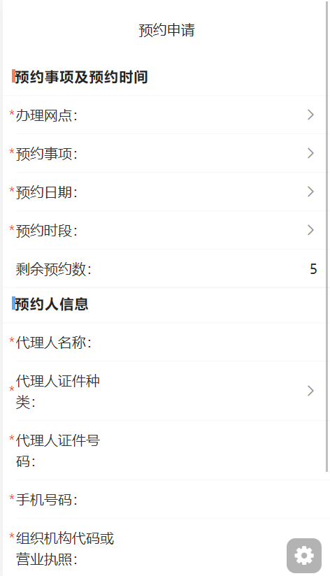
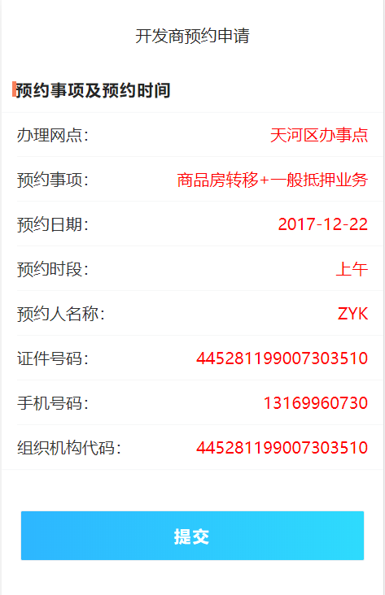
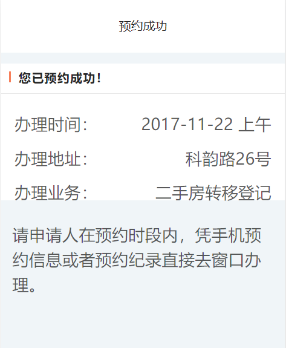

# 开发商预约申请接口说明文档

<div style="float:right">

|作者|日期|
|----|---|
|郑烨锟|2019年3月27日|

</div>

## 开发商预约申请页面

    区别于普通个人的业务预约申请，是专属于开发商的业务预约申请

#### 接口1：获取办事网点--GetYYBSWD

> http://192.168.10.91:8071/WSYY/GetYYBSWD （string strJson）

*请求方式*：`POST请求`

*传入参数*
```json
{"strJson": '{ 
    "username": " WSYYUSER", 
    "password": " b7OmrnAjfyi42sOKCi3jtw1I1mw"
 }'}
```

> 此处为通用请求参数，参数username和password由ibase2.0添加

*返回参数*

```json
{
  "szwdinfo": [{
    "szwd": "天河区办事点"
  }]
}
```

> 此处为接口返回数据，表示可选择办理网点

####  接口2：获取开发商预约网点取号信息--GetTSYYRQSD
    
    本预约业务为特殊业务，用户要求为
    1、三个业务，每天上午每种业务可以预约一个号，每天下午每种业务可以预约一个号。
    2、每个单位，一种业务半个月内只能预约一次
    3、用户预约完不用跟叫号机对接，凭手机预约信息或者预约纪录直接去窗口办理。
    
    最终考虑实现方式为
    1：前端预约采用单独的页面，在原填写信息的基础上增加一个必填字段，预约单位的组织机构代码号或者营业执照号。
    2：数据返回格式为： 某某业务+预约日期+上午/下午+true/false（是否已经被预约）

> http://192.168.10.91:8071/WSYY/GetTSYYRQSD （string strJson）

*请求方式*：`POST请求`

*传入参数*

```json
{"strJson": '{ 
    "username": " WSYYUSER", 
    "password": " b7OmrnAjfyi42sOKCi3jtw1I1mw"
 }'}
```

> 此处为通用接口请求参数，参数username和password由ibase2.0添加

*返回参数*

```json
{
  "yyxxinfo": [{
    "ZYYS": 10,
    "YYYS": 5,
    "YYSX": "商品房转移+一般抵押业务",
    "YYRQ": "2017-12-22",
    "YYSD": "上午",
    "SFYY": false
  }]
}
```
 
> 此接口返回数据判断是否可预约，如果不可预约，则提示用户当前时段不可预约，禁止用户点击；
    如果有预约时段数据，则计算剩余可预约数：总可预约数ZYYS - 已被预约数YYYS

## 排队进度页面
    
    此页面给予已取号用户查询当前排队情况，显示当前受理号以及排队等候人数。

#### 接口3：获取预约事项和预约日期--GetTSYYRQSD

> http://192.168.10.91:8071/WSYY/GetTSYYRQSD （string  strJson）

*请求方式*：`POST请求`

*传入参数*

```json
{"strJson": '{ 
    "username": " WSYYUSER", 
    "password": " b7OmrnAjfyi42sOKCi3jtw1I1mw"
 }'}
```

> 此处为通用接口请求参数，参数username和password由ibase2.0添加

*返回参数*

```json
{
  "yyxxinfo": [{
    "ZYYS": 10,
    "YYYS": 5,
    "YYSX": "商品房转移+一般抵押业务",
    "YYRQ": "2017-12-22",
    "YYSD": "上午",
    "SFYY": false
  }]
}
```

> 若是可预约时段，则可通过此接口获取预约事项列表、预约日期和可预约时段

#### 接口4：校验证书--CheckYYRInfo

> http://192.168.10.91:8071/WSYY/GetYYSD （string  strJson）

*请求方式*：`POST请求`

*传入参数*

```json
{"strJson": '{ 
    "szwd": "天河区办事点",  //办理网点
    "yysx": "商品房转移",  //预约事项
    "yyrq": "2018-12-22",  //预约日期
    "yysd": "上午",  //预约时段
    "yyfs": "2",           //预约方式
    "yyr": "zyk",           //预约人名称
    "zjlx": "身份证",  //预约人证件种类
    "zjhm": "445281******",     //预约人证件号码
    "sjhm": "1316996****",     //预约人手机号码
    "dwzjjgdm": "445281******", //机构代码或者营业执照
    "yysl": "1",             //预约数量
    "zmh": "",                  //zmh未明字段
    "openid": "",
    "password": "b7OmrnAjfyi42sOKCi3jtw1I1mw", 
    "username": "WSYYUSER"
}'}
```

> 此处传入预约人身份信息，用于校验用户身份证书是否过期。

*返回参数*
```json
{
  "resultcode": "1",
  "resultmsg": ""
}
```

> 此处是接口返回验证结果，当resultcode=="1"时，表示验证成功。
    若验证成功，则跳转到开发商预约信息提交页面。

## 实现图

#### 开发商预约页面


#### 开发商预约申请提交页面


#### 开发商预约成功图



