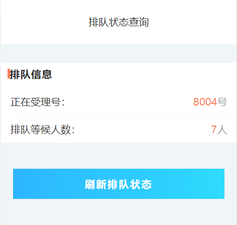

# 排队取号页面接口说明文档

<div style="float:right">

|作者|日期|
|----|---|
|郑烨锟|2019年3月27日|

</div>

## 排队取号页面

    这个页面是供已预约人根据身份证号在线排队取号

####  接口1：在线取号--SubmitQHInfo
    
    预约人输入身份证获取号码排队

> http://192.168.10.91:8071/WSYY/SearchYYInfo （string strJson）

*请求方式*：`POST请求`

*传入参数*
```json
{"strJson": '{ 
    "wxh": "zhangsan", 
    "sfzh": "430421198709238393",
    "password": "b7OmrnAjfyi42sOKCi3jtw1I1mw", 
    "username": "WSYYUSER"
}'}
```

> 此处为接口请求参数，参数主要是微信号：wxh；身份证号：sfzh。

*返回参数*
```json
{
  "resultcode": "1",
  "resultmsg": "",
  "noInfo": [{
    "deal_no": "A016",
    "getno_date": "2017-10-12 12:51:18",
    "name": "zhangsan",
    "id_number": "440104199905243645",
    "mobile": "",
    "state": "等待处理",
    "ywlx": "个人业务"
  }]
}
```
 
> 此接口返回数据为取号成功与否信息，当resultcode=="1"则表示取号成功。
    并且可以通过查看进度按钮跳转到排队进度页面

####  接口2：微信端通过openid查询当天的预约纪录 --SearchYYInfoByOpenId

> http://192.168.10.91:8071/WSYY/SearchYYInfoByOpenId （string strJson）

*请求方式*：`POST请求`

*传入参数*
```json
{"strJson": '{ 
    "openid": " xxxxxxx",
    "password": "b7OmrnAjfyi42sOKCi3jtw1I1mw", 
    "username": "WSYYUSER"
}'}
```

> 此处为接口请求参数，直接根据用户微信openid查询当天的预约数据

*返回参数*
```json
{
  "resultcode": "1",
  "resultmsg": "",
  "noInfo": [{
    "deal_no": "A016",
    "getno_date": "2017-10-12 12:51:18",
    "name": "zhangsan",
    "id_number": "440104199905243645",
    "mobile": "",
    "state": "等待处理",
    "ywlx": "个人业务"
  }]
}
/*
// 没有预约信息
{ 
     "resultcode": "0", 
     "resultmsg": "未查询到当天的预约信息!", 
     "yyinfo": ""
}
*/
```

## 排队进度页面
    
    此页面给予已取号用户查询当前排队情况，显示当前受理号以及排队等候人数。

#### 接口1：获取所有排队数据--GetAllNo

> http://192.168.10.91:8071/WSYY/GetAllNo （string  strJson）

*请求方式*：`POST请求`

*传入参数*
```json
{"strJson": '{ 
    "password": "b7OmrnAjfyi42sOKCi3jtw1I1mw", 
    "username": "WSYYUSER"
}'}
```

> 此处接口请求参数为通用参数请求，直接获取所有排队列表数据。

*返回参数*
```json
{
  "resultcode": "1",
  "resultmsg": "",
  "noInfo": [{
      "deal_no": "B004",
      "getno_date": "2017-10-11 08:30:00",
      "openid": "zhangsan",
      "id_number": "",
      "mobile": "13537747040",
      "state": "正在处理"
    },
    {
      "deal_no": "B005",
      "getno_date": "2017-10-11 08:30:00",
      "openid": "zhangsan",
      "id_number": "",
      "mobile": "13537747040",
      "state": "等待处理"
    },
    {
      "deal_no": "B006",
      "getno_date": "2017-10-11 08:30:00",
      "openid": "zhangsan",
      "id_number": "",
      "mobile": "13537747040",
      "state": "等待处理"
    },
    {
      "deal_no": "B007",
      "getno_date": "2017-10-11 08:30:00",
      "openid": "zhangsan",
      "id_number": "",
      "mobile": "13537747040",
      "state": "等待处理"
    },
    {
      "deal_no": "B008",
      "getno_date": "2017-10-11 08:30:00",
      "openid": "zhangsan",
      "id_number": "",
      "mobile": "13537747040",
      "state": "等待处理"
    },
    {
      "deal_no": "B009",
      "getno_date": "2017-10-11 08:30:00",
      "openid": "zhangsan",
      "id_number": "",
      "mobile": "13537747040",
      "state": "等待处理"
    },
    {
      "deal_no": "B011",
      "getno_date": "2017-10-11 08:30:00",
      "openid": "zhangsan",
      "id_number": "430421198709238393",
      "mobile": "13537747040",
      "state": "等待处理"
    },
    {
      "deal_no": "A010",
      "getno_date": "2017-10-11 11:05:59",
      "openid": "",
      "id_number": "",
      "mobile": "",
      "state": "等待处理"
    }
  ]
}
```

> 此接口返回数据当resultcode=="1"时，表示存在排队取号数据列表。

## 实现图

#### 排队状态查询页面


