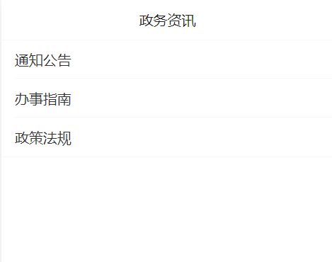
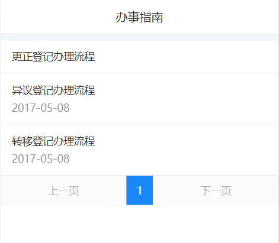
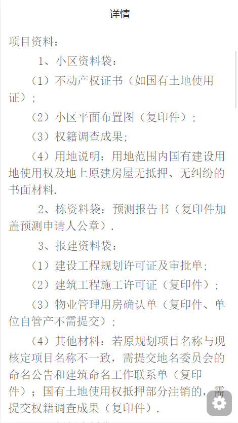

# 政务资讯接口文档

<div style="float:right">

|作者|日期|
|----|---|
|郑烨锟|2019年3月28日|

</div>

## 政务资讯列表页面

    之前还存在政务资讯页面，列有通知公告、办事指南、政策法规等资讯事项。
    用户点击这些资讯条目获取对应资讯列表。

#### 接口1：获取资讯列表--GetTitleList
    
    用户点击通知公告、办事指南、政策法规等资讯事项，
    该接口通过根据不同事项的判断获取不同资讯列表，显示对应资讯列表信息。

> http://192.168.10.91:8071/WSYY/GetTitleList （string strJson）

*请求方式*：`POST请求`

*传入参数*
```json
{"strJson": '{ 
    "bname": "办事指南",
    "password": "b7OmrnAjfyi42sOKCi3jtw1I1mw", 
    "username": "WSYYUSER"
}'}
```

> 此处传入用户点击的政务资讯条目，例如：通知公告、办事指南、政策法规。
    根据用户点击的资讯条目获取对应的办事指南数据，这些通用一个接口。

*返回参数*
```json
{
  "resultcode": "1",
  "resultmsg": "",
  "noInfo": [{
      "gid": "F8724B9516E44EF9A57F6AF9D84A5450",
      "title": "更正登记办理流程",
      "bname": "办事指南",
      "createtime": ""
    },
    {
      "gid": "51BBA27EB2994D6183F3B6138EFA36D0",
      "title": "异议登记办理流程",
      "bname": "办事指南",
      "createtime": "2017-05-08 15:17:21"
    },
    {
      "gid": "B293A4F3F0364676B7B53C67B295AD26",
      "title": "转移登记办理流程",
      "bname": "办事指南",
      "createtime": "2017-05-08 15:00:41"
    }
  ]
}
```

> 这是接口返回的办事指南数据，当用户点击选中资讯条目，该接口返回该条目对应的办事指南列表数据。
    每条办事指南都包括对应唯一ID：gid；每条标题名称：title；所属资讯条目：bname；还有该资讯文章创建的时间：createtime。
    其他资讯条目包括通知公告、政策法规等获取列表结构一样。

## 政务资讯详情页面

    这里显示政务资讯各事项文章的详情信息，包括通知公告、办事指南、政策法规等，通用接口。

#### 接口1：获取政策法规详情信息
    
    这是在资讯详情页面，用户点击通知公告、办事指南、政策法规等资讯条目中的某条资讯列，获取对应的资讯详情信息。

> http://192.168.10.91:8071/WSYY/GetRuleDetail （string strJson） 

*请求方式*：`POST请求`

*传入参数*
```json
{"strJson": '{ 
    "gid": "F8724B9516E44EF9A57F6AF9D84A5450", 
    "password": "b7OmrnAjfyi42sOKCi3jtw1I1mw", 
    "username": "WSYYUSER"
}'}
```

> 该接口传入某资讯文章的唯一ID：gid，获取对应的资讯详情内容。

*返回数据*
```json
{ 
    "resultcode": "1", 
    "resultmsg": "", 
    "gid": "F1DB391EC395483E9BC7B83DA3814F08", 
    "title": "在建建筑物抵押登记办理流程", 
    "bname": "办事指南", 
    "createtime": "2017-11-16 00:00:00"
    "content": "<p style="line-height: normal; text-indent: 0em;"><span style="font-family: 仿宋,Fang Sun; font-size: 20px;"></span></p><p style="line-height: normal; text-indent: 0em;"><span style="font-family: 仿宋,Fang Sun; font-size: 20px;">一、事项名称：不动产登记（在建建筑物抵押）</span></p><p style="margin: 1em 0px; line-height: normal;"><span style="font-family: 仿宋,Fang Sun; font-size: 20px;">二、事项类型：行政确认</span></p><p style="margin: 1em 0px; line-height: normal;"><span style="font-family: 仿宋,Fang Sun; font-size: 20px;">三、办理对象：抵押权人</span></p><p style="margin: 1em 0px; line-height: normal;"><span style="font-family: 仿宋,Fang Sun; font-size: 20px;">四、办理依据：《中华人民共和国物权法》</span></p><p style="margin: 1em 0px; line-height: normal;"><span style="font-family: 仿宋,Fang Sun; font-size: 20px;">&nbsp;&nbsp;&nbsp;&nbsp;&nbsp;&nbsp;&nbsp;&nbsp;&nbsp;&nbsp;&nbsp;&nbsp; 《中华人民共和国担保法》</span></p><p style="margin: 1em 0px; line-height: normal;"><span style="font-family: 仿宋,Fang Sun; font-size: 20px;">&nbsp;&nbsp;&nbsp;&nbsp;&nbsp;&nbsp;&nbsp;&nbsp;&nbsp;&nbsp;&nbsp;&nbsp; 《中华人民共和国城市房地产管理法》</span></p><p style="margin: 1em 0px; line-height: normal;"><span style="font-family: 仿宋,Fang Sun; font-size: 20px;">&nbsp;&nbsp;&nbsp;&nbsp;&nbsp;&nbsp;&nbsp;&nbsp;&nbsp;&nbsp;&nbsp;&nbsp; 《不动产登记暂行条例》</span></p><p style="margin: 1em 0px; line-height: normal;"><span style="font-family: 仿宋,Fang Sun; font-size: 20px;">&nbsp;&nbsp;&nbsp;&nbsp;&nbsp;&nbsp;&nbsp;&nbsp;&nbsp;&nbsp;&nbsp;&nbsp; 《不动产登记暂行条例实施细则》</span></p><p style="margin: 1em 0px; line-height: normal;"><span style="font-family: 仿宋,Fang Sun; font-size: 20px;">&nbsp;&nbsp;&nbsp;&nbsp;&nbsp;&nbsp;&nbsp;&nbsp;&nbsp;&nbsp;&nbsp;&nbsp; 《不动产登记操作规范（试行）》</span></p><p style="line-height: normal;"><span style="font-family: 仿宋,Fang Sun; font-size: 20px;"><span style="font-family: 微软雅黑,Microsoft YaHei; font-size: 16px;">五<span style="font-family: 微软雅黑,Microsoft YaHei; font-size: 19px;">、</span></span>法定期限<span style="font-family: 微软雅黑,Microsoft YaHei; font-size: 16px;">：</span><span style="font-family: 微软雅黑,Microsoft YaHei; font-size: 19px;"></span><span style="font-family: 宋体,SimSun; font-size: 16px;">30个工作日</span></span></p><p style="margin: 1em 0px; line-height: normal;"><span style="font-family: 仿宋,Fang Sun; font-size: 20px;">六、承诺期限<span style="font-family: 仿宋; font-size: 19px;">：</span>20个工作日</span></p><p style="margin: 1em 0px; line-height: normal;"><span style="font-family: 仿宋,Fang Sun; font-size: 20px;">七、办理条件：申请人提交的申请登记材料齐全，符合法定形式，申请内容不违反法律、法规的规定。</span></p><p style="margin: 1em 0px; line-height: normal;"><span style="font-family: 仿宋,Fang Sun; font-size: 20px;">八、申请材料：</span></p><p style="line-height: normal; text-indent: 28px;"><span style="font-family: 仿宋,Fang Sun; font-size: 20px;">（一）首次登记</span></p><p style="line-height: normal;"><span style="font-family: 仿宋,Fang Sun; font-size: 20px;">项目资料：</span></p><p style="line-height: normal; text-indent: 47px;"><span style="font-family: 仿宋,Fang Sun; font-size: 20px;">1、小区资料袋：</span></p><p style="line-height: normal; text-indent: 28px;"><span style="font-family: 仿宋,Fang Sun; font-size: 20px;"><span style="font-family: 仿宋; font-size: 19px;">（</span>1）不动产权证书（如国有土地使用证）;</span></p><p style="line-height: normal; text-indent: 28px;"><span style="font-family: 仿宋,Fang Sun; font-size: 20px;"><span style="font-family: 仿宋; font-size: 19px;">（</span>2）小区平面布置图（复印件）;</span></p><p style="line-height: normal; text-indent: 28px;"><span style="font-family: 仿宋,Fang Sun; font-size: 20px;"><span style="font-family: 仿宋; font-size: 19px;">（</span>3）权籍调查成果;</span></p><p style="line-height: normal; text-indent: 28px;"><span style="font-family: 仿宋,Fang Sun; font-size: 20px;"><span style="font-family: 仿宋; font-size: 19px;">（</span>4）用地说明：用地范围内国有建设用地使用权及地上原建房屋无抵押、无纠纷的书面材料.</span></p><p style="line-height: normal; text-indent: 47px;"><span style="font-family: 仿宋,Fang Sun; font-size: 20px;">2、栋资料袋：预测报告书（复印件加盖预测申请人公章）.</span></p><p style="line-height: normal; text-indent: 47px;"><span style="font-family: 仿宋,Fang Sun; font-size: 20px;">3、报建资料袋：</span></p><p style="line-height: normal; text-indent: 28px;"><span style="font-family: 仿宋,Fang Sun; font-size: 20px;"><span style="font-family: 仿宋; font-size: 19px;">（</span>1）建设工程规划许可证及审批单;</span></p><p style="line-height: normal; text-indent: 28px;"><span style="font-family: 仿宋,Fang Sun; font-size: 20px;"><span style="font-family: 仿宋; font-size: 19px;">（</span>2）建筑工程施工许可证（复印件）;</span></p><p style="line-height: normal; text-indent: 28px;"><span style="font-family: 仿宋,Fang Sun; font-size: 20px;"><span style="font-family: 仿宋; font-size: 19px;">（</span>3）物业管理用房确认单（复印件、单位自管产不需提交）;</span></p><p style="line-height: normal; text-indent: 28px;"><span style="font-family: 仿宋,Fang Sun; font-size: 20px;"><span style="font-family: 仿宋; font-size: 19px;">（</span>4）其他材料：若原规划项目名称与现核定项目名称不一致，需提交地名委员会的命名公告和建筑命名工作联系单（复印件）；国有土地使用权抵押部分注销的，需提交权籍调查成果（复印件）.</span></p><p style="line-height: normal; text-indent: 47px;"><span style="font-family: 仿宋,Fang Sun; font-size: 20px;">4、抵押资料袋：</span></p><p style="line-height: normal; text-indent: 28px;"><span style="font-family: 仿宋,Fang Sun; font-size: 20px;"><span style="font-family: 仿宋; font-size: 19px;">（</span>1）长沙市不动产登记申请书;</span></p><p style="line-height: normal; text-indent: 28px;"><span style="font-family: 仿宋,Fang Sun; font-size: 20px;"><span style="font-family: 仿宋; font-size: 19px;">（</span>2）申请人身份证明（验原件收复印件）：如法人或其他组织提交营业执照，或组织机构代码证等身份证明;自然人提交身份证等身份证明。申请人为法人或其他组织的还应收取授权委托书及受托人的身份证明;</span></p><p style="line-height: normal; text-indent: 28px;"><span style="font-family: 仿宋,Fang Sun; font-size: 20px;"><span style="font-family: 仿宋; font-size: 19px;">（</span>3）不动产权证书（如国有土地使用证）;</span></p><p style="line-height: normal; text-indent: 28px;"><span style="font-family: 仿宋,Fang Sun; font-size: 20px;"><span style="font-family: 仿宋; font-size: 19px;">（</span>4）抵押合同，最高额抵押的应提交最高额抵押合同;</span></p><p style="line-height: normal; text-indent: 28px;"><span style="font-family: 仿宋,Fang Sun; font-size: 20px;"><span style="font-family: 仿宋; font-size: 19px;">（</span>5）主债权合同，最高额抵押的，还应提交一定期间内将要连续发生债权的合同或者其他登记原因文件的材料;</span></p><p style="line-height: normal; text-indent: 28px;"><span style="font-family: 仿宋,Fang Sun; font-size: 20px;"><span style="font-family: 仿宋; font-size: 19px;">（</span>6）抵押人有权处分抵押物的资料：行政单位，须提交同级财政部门同意抵押的批复；事业单位，须提交上级主管部门和同级财政部门同意抵押的证明（上级主管部门在授权委托书上同意并加盖公章表示的，不再提交，下同）;全民所有制（国有）企业，须提交上级主管部门或国资委同意抵押的批复;集体企业，须提交上级主管部门或国资委同意抵押的批复和职代会或职工大会同意抵押的决议证明；有限公司须提交股东会或董事会同意抵押的决议的证明；</span></p><p style="line-height: normal; text-indent: 28px;"><span style="font-family: 仿宋,Fang Sun; font-size: 20px;"><span style="font-family: 仿宋; font-size: 19px;">（</span>7）其他材料：</span></p><p style="line-height: normal; text-indent: 47px;"><span style="font-family: 仿宋,Fang Sun; font-size: 20px;">{1}、开发企业还需提交房地产开发企业资质证书;</span></p><p style="line-height: normal; text-indent: 47px;"><span style="font-family: 仿宋,Fang Sun; font-size: 20px;">{2}、同意将最高额抵押权设立前已经存在的债权转入最高额抵押担保的债权范围的，应提交已存在的债权合同及抵押双方同意将债权纳入最高额抵押担保范围的材料（抵押合同含此内容的不需另提交）;</span></p><p style="line-height: normal; text-indent: 47px;"><span style="font-family: 仿宋,Fang Sun; font-size: 20px;">{3}、抵押人承诺书（单位自管产抵押不需提交）;</span></p><p style="line-height: normal; text-indent: 47px;"><span style="font-family: 仿宋,Fang Sun; font-size: 20px;">{4}、抵押权人承诺书（单位自管产抵押不需提交）.</span></p><p style="line-height: normal; text-indent: 28px;"><span style="font-family: 仿宋,Fang Sun; font-size: 20px;">（二）变更登记</span></p><p style="line-height: normal; text-indent: 47px;"><span style="font-family: 仿宋,Fang Sun; font-size: 20px;">1、长沙市不动产登记申请书；</span></p><p style="line-height: normal; text-indent: 47px;"><span style="font-family: 仿宋,Fang Sun; font-size: 20px;">2、申请人身份证明（验原件收复印件）：如法人或其他组织提交营业执照，或组织机构代码证等身份证明;自然人提交身份证等身份证明。申请人为法人或其他组织的还应收取授权委托书及受托人的身份证明；</span></p><p style="line-height: normal; text-indent: 47px;"><span style="font-family: 仿宋,Fang Sun; font-size: 20px;">3、不动产权证书和不动产登记证明（如国有土地使用证、在建建筑物抵押登记证明）；</span></p><p style="line-height: normal; text-indent: 47px;"><span style="font-family: 仿宋,Fang Sun; font-size: 20px;">4、抵押权变更的材料；</span></p><p style="line-height: normal; text-indent: 47px;"><span style="font-family: 仿宋,Fang Sun; font-size: 20px;">5、其他材料。</span></p><p style="line-height: normal; text-indent: 28px;"><span style="font-family: 仿宋,Fang Sun; font-size: 20px;">（三）转移登记</span></p><p style="line-height: normal; text-indent: 47px;"><span style="font-family: 仿宋,Fang Sun; font-size: 20px;">1、长沙市不动产登记申请书；</span></p><p style="line-height: normal; text-indent: 47px;"><span style="font-family: 仿宋,Fang Sun; font-size: 20px;">2、申请人身份证明（验原件收复印件）：如法人或其他组织提交营业执照，或组织机构代码证等身份证明;自然人提交身份证等身份证明。申请人为法人或其他组织的还应收取授权委托书及受托人的身份证明；</span></p><p style="line-height: normal; text-indent: 47px;"><span style="font-family: 仿宋,Fang Sun; font-size: 20px;">3、不动产权证书和不动产登记证明（如国有土地使用证、在建建筑物抵押登记证明）；</span></p><p style="line-height: normal; text-indent: 47px;"><span style="font-family: 仿宋,Fang Sun; font-size: 20px;">4、抵押权发生转移的材料，包括：申请一般抵押权转移登记的，还应当提交被担保主债权的转移协议；申请最高额抵押权转移登记的，还应当提交部分债权转移的材料、当事人约定最高额抵押权随同部分债权的转让而转移的材料；债权人已经通知债务人的材料；</span></p><p style="line-height: normal; text-indent: 47px;"><span style="font-family: 仿宋,Fang Sun; font-size: 20px;">5、其他材料。</span></p><p style="line-height: normal;"><span style="font-family: 仿宋,Fang Sun; font-size: 20px;">九、办理程序<span style="font-family: 宋体,SimSun; font-size: 16px;">:</span></span></p><p style="line-height: normal; text-indent: 28px;"><span style="font-family: 仿宋,Fang Sun; font-size: 20px;">（一）受理</span></p><p style="line-height: normal; text-indent: 47px;"><span style="font-family: 仿宋,Fang Sun; font-size: 20px;">1、岗位责任人：长沙市不动产登记中心窗口工作人员。</span></p><p style="line-height: normal; text-indent: 47px;"><span style="font-family: 仿宋,Fang Sun; font-size: 20px;">2、岗位职责与权限：</span></p><p style="line-height: normal; text-indent: 28px;"><span style="font-family: 仿宋,Fang Sun; font-size: 20px;"><span style="font-family: 仿宋; font-size: 19px;">（</span>1）申请登记材料齐全，符合法定形式，且申请内容不违反法律、法规规定的，予以受理，并出具受理凭证。</span></p><p style="line-height: normal; text-indent: 28px;"><span style="font-family: 仿宋,Fang Sun; font-size: 20px;"><span style="font-family: 仿宋; font-size: 19px;">（</span>2）申请登记材料不齐全，不符合法定形式或申请内容违反法律、法规规定的，不予受理，并 一次性告知申请人需要补正的材料或不予受理的原因。</span></p><p style="line-height: normal; text-indent: 28px;"><span style="font-family: 仿宋,Fang Sun; font-size: 20px;"><span style="font-family: 仿宋; font-size: 19px;">（</span>3）时限：2个工作日。</span></p><p style="line-height: normal; text-indent: 28px;"><span style="font-family: 仿宋,Fang Sun; font-size: 20px;">（二）审查</span></p><p style="line-height: normal; text-indent: 47px;"><span style="font-family: 仿宋,Fang Sun; font-size: 20px;">1、岗位责任人：长沙市不动产登记中心审核人员。</span></p><p style="line-height: normal; text-indent: 47px;"><span style="font-family: 仿宋,Fang Sun; font-size: 20px;">2、岗位职责与权限：对申请登记材料齐全，符合法定形式，且申请内容不违反法律、法规规定的申请予以审核 ，并派予审批环节。</span></p><p style="line-height: normal; text-indent: 47px;"><span style="font-family: 仿宋,Fang Sun; font-size: 20px;">3、时限：8个工作日。</span></p><p style="line-height: normal; text-indent: 37px;"><span style="font-family: 仿宋,Fang Sun; font-size: 20px;">(三)审核并记载于登记簿</span></p><p style="line-height: normal; text-indent: 47px;"><span style="font-family: 仿宋,Fang Sun; font-size: 20px;">1、岗位责任人：长沙市不动产登记中心审核科科长。</span></p><p style="line-height: normal; text-indent: 47px;"><span style="font-family: 仿宋,Fang Sun; font-size: 20px;">2、岗位职责与权限：对申请登记材料齐全，符合法定形式，且申请内容不违反法律、法规规定的申请予以审批并记载于登记簿。</span></p><p style="line-height: normal; text-indent: 47px;"><span style="font-family: 仿宋,Fang Sun; font-size: 20px;">3、时限：8个工作日。</span></p><p style="line-height: normal; text-indent: 28px;"><span style="font-family: 仿宋,Fang Sun; font-size: 20px;">（四）缮证</span></p><p style="line-height: normal; text-indent: 47px;"><span style="font-family: 仿宋,Fang Sun; font-size: 20px;">1、岗位责任人：长沙市不动产登记中心缮证人员。</span></p><p style="line-height: normal; text-indent: 47px;"><span style="font-family: 仿宋,Fang Sun; font-size: 20px;">2、岗位职责与权限 ：根据不动产登记簿的记载，缮写登记证明。</span></p><p style="line-height: normal; text-indent: 37px;"><span style="font-family: 仿宋,Fang Sun; font-size: 20px;">3、时限：2个工作日。</span></p><p style="line-height: normal; text-indent: 28px;"><span style="font-family: 仿宋,Fang Sun; font-size: 20px;">（五）发证</span></p><p style="line-height: normal; text-indent: 47px;"><span style="font-family: 仿宋,Fang Sun; font-size: 20px;">1、岗位责任人：长沙市不动产登记中心发证人员。</span></p><p style="line-height: normal; text-indent: 47px;"><span style="font-family: 仿宋,Fang Sun; font-size: 20px;">2、岗位职责与权限：发放不动产登记证。</span></p><p style="line-height: normal; text-indent: 47px;"><span style="font-family: 仿宋,Fang Sun; font-size: 20px;">3、时限：即来即领。</span></p><p style="line-height: normal;"><span style="font-family: 仿宋,Fang Sun; font-size: 20px;">十、是否收费：是</span></p><p style="line-height: normal;"><span style="font-family: 仿宋,Fang Sun; font-size: 20px;">十一、<span style="font-family: 宋体,SimSun; font-size: 16px;">收费依据：发改价格（2008）924号文件、湘发改价服（2015）1119号文件、湘发改价费（2016）211号文件。</span></span></p><p style="line-height: normal;"><span style="font-family: 仿宋,Fang Sun; font-size: 20px;">十二、收费标准：登记费：住房35元/套，非住房260元/件，注销登记免收登记费。</span></p><p style="line-height: normal;"><span style="font-family: 仿宋,Fang Sun; font-size: 20px;">十三、申请地点 ：</span></p><p style="line-height: normal; text-indent: 56px;"><span style="font-family: 仿宋,Fang Sun; font-size: 20px;">河西市政务服务中心一楼不动产登记中心窗口</span></p><p style="line-height: normal;"><span style="font-family: 仿宋,Fang Sun; font-size: 20px;">&nbsp;&nbsp;&nbsp;&nbsp;&nbsp;&nbsp; 马王堆中路196号房产交易大楼三楼不动产登记中心窗口</span></p><p style="line-height: normal;"><span style="font-family: 仿宋,Fang Sun; font-size: 20px;">&nbsp;&nbsp;&nbsp;&nbsp;&nbsp;&nbsp; 晚报大道150号不动产登记中心窗口</span></p><p style="line-height: normal;"><span style="font-family: 仿宋,Fang Sun; font-size: 20px;">十四、办理时间：周一至周五（法定节假日除外）夏季作<span style="font-family: 微软雅黑,Microsoft YaHei; font-size: 16px;"><span style="font-family: 微软雅黑,Microsoft YaHei; font-size: 19px;">息时间（</span>7月</span>1日-9月30日）：上午9:00-12:00，下午13:30-17:30；冬季作息时间（10月1日-次年6月30日）：上午9:00-12:00，下午13:00-17:00。</span></p><p style="line-height: normal;"><span style="font-family: 仿宋,Fang Sun; font-size: 20px;">十五、</span><span style="font-family: 仿宋,;">办理流程图 ：</span></p><p style="text-align: center; line-height: normal;"><br/></p><p style="line-height: normal;"><span style="font-family: 仿宋,Fang Sun; font-size: 20px;"><strong><span style="font-family: 宋体; font-size: 19px; font-weight: bold;">&nbsp;</span></strong></span></p>"
}
```

> 此处是接口返回的资讯文章的详情内容，具体内容content是富文本数据，直接页面显示对应格式。

## 实现页面

#### 政务资讯首页


#### 政务资讯事项列表页面


#### 政务资讯文章页面


