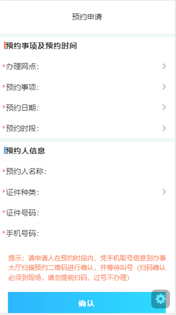
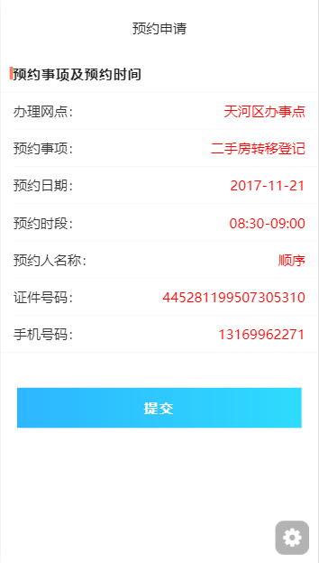
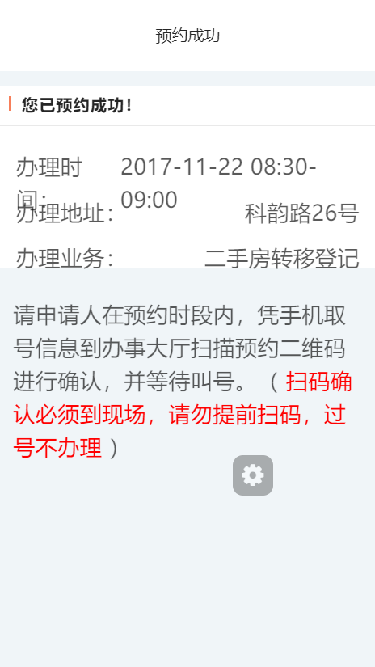
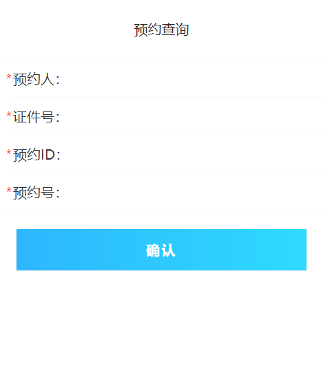
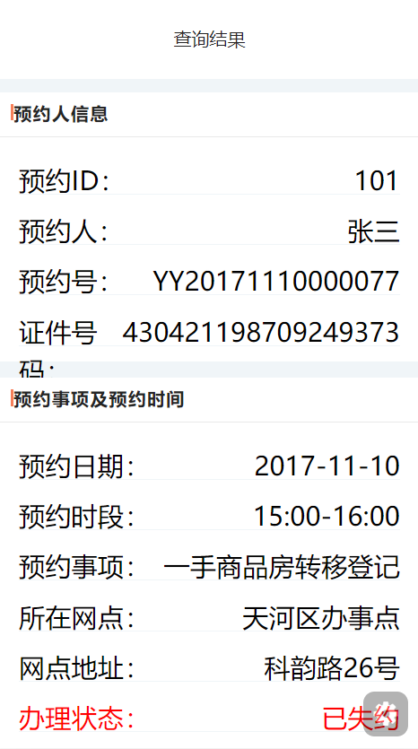
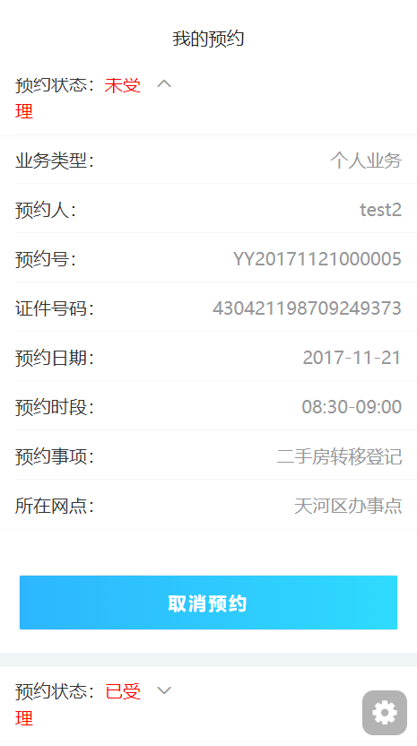
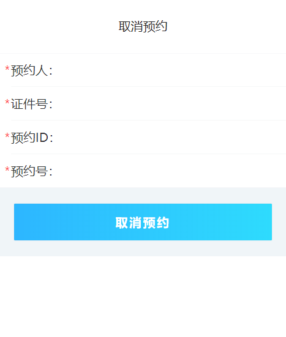
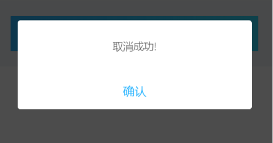

# 在线预约接口说明文档

<div style="float:right">

|作者|日期|
|----|---|
|郑烨锟|2019年3月27日|

</div>

预约申请 | 预约确认

> 参考测试接口： http://118.24.70.239:7300/mock/5c9af379365f9600200deb72/WSYY

## 预约申请页面接口
    
    这个页面是供以个人在线预约申请，办理各项事务

#### 接口1：获取办事网点--GetYYBSWD

> http://192.168.10.91:8071/WSYY/GetYYBSWD （string strJson）

*请求方式*：`POST请求`

*传入参数*

```json
{"strJson": '{ 
    "password": "b7OmrnAjfyi42sOKCi3jtw1I1mw", 
    "username": "WSYYUSER"
}'}
```

> 此处为通用请求参数，直接读取用户身份信息

*返回参数*

```json
{
  "szwdinfo": [{
    "szwd": "天河区办事点"
  }]
}
```

> 此处为接口返回数据，表示可选择办理网点

#### 接口2：获取预约事项--GetYYSX

> http://192.168.10.91:8071/WSYY/GetYYSX （string strJson）

*请求方式*：`POST请求`

*传入参数*

```json
{"strJson": '{ 
    "username": " WSYYUSER", 
    "password": " b7OmrnAjfyi42sOKCi3jtw1I1mw", 
    "szwd": "天河区办事点", 
    "yyfs": " 2"
}'}
```
> 此处为接口请求参数，szwd为选中的办事网店；yyfs为预约方式

*返回参数*
```json
{
  "yysxinfo": [{
      "yysx": "二手房转移登记"
    },
    {
      "yysx": "抵押权首次登记"
    },
    {
      "yysx": "一手商品房转移登记"
    },
    {
      "yysx": "预告登记"
    }
  ]
}
```

> 此处为接口返回数据，表示可选择的预约事项yysx

#### 接口3：获取预约时间--GetYYRQ

> http://192.168.10.91:8071/WSYY/GetYYRQ （string  strJson）

*请求方式*：`POST请求`

*传入参数*

```json
{"strJson": '{ 
    "username": " WSYYUSER", 
    "password": " b7OmrnAjfyi42sOKCi3jtw1I1mw", 
    "szwd": "天河区办事点", 
    "yyfs": " 2"
}'}
```

*返回参数*

```json
{
  "yyrqinfo": [{
      "yyrq": "2017-11-21"
    },
    {
      "yyrq": "2017-11-22"
    },
    {
      "yyrq": "2017-11-23"
    },
    {
      "yyrq": "2017-11-24"
    }
  ]
}
```

> 此处为接口返回数据，继选择预约事项后，选择要预约的时间段yyrq

#### 接口4：获取预约时段--GetYYSD

> http://192.168.10.91:8071/WSYY/GetYYSD （string  strJson）

*请求方式*：`POST请求`

*传入参数*

```json
{"strJson": '{ 
    " username": " WSYYUSER", 
    " password": " b7OmrnAjfyi42sOKCi3jtw1I1mw", 
    " szwd": "天河区办事点", 
    " yysx": "二手房转移登记",
    " yyrq": "2017-11-21",
    " yyfs": " 2"
}'}
```

> 此处为接口请求参数，szwd为选中的办事网点；yysx是选择的预约事项；
    yyrq为选中的预约日期；yyfs为预约方式。

*返回参数*

```json
{
  "yysdinfo": [{
      "yysd": "08:30-09:00",
      "zhs": "2",
      "yyys": "0"
    },
    {
      "yysd": "09:00-10:00",
      "zhs": "5",
      "yyys": "0"
    },
    {
      "yysd": "10:00-11:00",
      "zhs": "5",
      "yyys": "0"
    },
    {
      "yysd": "11:00-12:00",
      "zhs": "5",
      "yyys": "0"
    },
    {
      "yysd": "14:30-15:00",
      "zhs": "2",
      "yyys": "0"
    },
    {
      "yysd": "15:00-16:00",
      "zhs": "5",
      "yyys": "0"
    },
    {
      "yysd": "16:00-17:00",
      "zhs": "5",
      "yyys": "0"
    },
    {
      "yysd": "17:00-17:30",
      "zhs": "2",
      "yyys": "0"
    }
  ]
}
```

> 此处为接口返回数据，继选择预约日期后，表示可选择的预约时段yysd；
    可预约总数zhs；已被预约数量yyys（用于计算剩余可预约数）。

#### 接口5：校验证书--CheckYYRInfo

> http://192.168.10.91:8071/WSYY/GetYYSD （string  strJson）

*请求方式*：`POST请求`

*传入参数*

```json
{"strJson": '{ 
    "yyr": "张三", 
    "zjhm": "430421*****", 
    "zmh": "xxxxxxx", 
    "sjhm": "13800138000", 
    "yyfs": "2", 
    "password": "b7OmrnAjfyi42sOKCi3jtw1I1mw", 
    "username": "WSYYUSER"
}'}
```

> 此处传入预约人身份信息，用于校验用户身份证书是否过期。
    yyr为预约人名称；zjhm为预约人证件信息；zmh未明字段；sjhm为预约人手机号码；yyfs为预约方式。

*返回参数*

```json
{
  "resultcode": "1",
  "resultmsg": ""
}
```

> 此处是接口返回验证结果，当resultcode=="1"时，表示验证成功（跳转到预览页面/信息确认页面）。

## 预约信息提交页面接口

    这个页面是供以预约人确认预约的页面，相当一个预览确认缓冲页面

#### 接口1：预约信息提交--SubmitYYInfo

> http://192.168.10.91:8071/WSYY/SubmitYYInfo（string  strJson）

*请求方式*：`POST请求`

*传入参数*

```json
{"strJson": '{ 
    "yyr": "张三", 
    "zjhm": "430421*****", 
    "zmh": "xxxxxxx", 
    "sjhm": "13800138000", 
    "yyfs": "2", 
    "password": "b7OmrnAjfyi42sOKCi3jtw1I1mw", 
    "username": "WSYYUSER"
}'}
{ 
    "bdczl": "", 
    "szwd": "天河区办事点", 
    "zjlx": "身份证", 
    "openid": "xxxxxxx", 
    "yyrq": "2017-11-21", 
    "sjhm": "13800138000", 
    "yysd": "08:30-09:00", 
    "zjhm": "430421198709249373", 
    "password": "b7OmrnAjfyi42sOKCi3jtw1I1mw", 
    "yyr": "test2", 
    "zmh": null, 
    "yyfs": "2", 
    "yysx": "二手房转移登记", 
    "username": "WSYYUSER"
}
```

> 此处为接口请求参数，将预约的信息以及预约人的信息提交确认。

*返回参数*

```json
{
  "resultcode": "1",
  "resultmsg": "YY20171122000005,5,2017-11-22,08:30-09:00,科韵路26号,test2,二手房转移登记",
  "yyinfo": [{
    "YYH": "YY20171122000005",
    "SXH": "5",
    "YYRQ": "2017-11-22",
    "YYSD": "08:30-09:00",
    "WDDZ": "科韵路26号",
    "YYR": "test2",
    "YYSX": "二手房转移登记"
  }]
}
```
> 此处返回预约成功的信息，将跳转到预约成功页面，展示预约成功信息页面。

    resultcode 为0代表预约失败，returnmsg为失败原因
    rerultcode 为1代表预约成功
    returnmsg返回的是当前预约的信息，这个是之前沿用下来的，用逗号拼起来，
    因为有的地方已经再用了协调其他人改微信程序比较麻烦，就没改。
    后续新增JSON格式返回值，原格式暂时保留

## 预约查询页面

    这个页面是供已预约人查询个人预约事项相关信息

####  接口1：预约信息查询--SearchYYInfo
    
    预约人输入姓名、证件号、预约ID和预约号查询已预约详情信息。
    一般情况可直接使用预约人姓名，身份证号码查询，
    如果传入YYID预约ID字段，则优先使用YYID查询。

> http://192.168.10.91:8071/WSYY/SearchYYInfo （string strJson）

*请求方式*：`POST请求`

*传入参数*

```json
{"strJson": '{ 
    "yyid":"101",
    "yyr": "张三", 
    "zjhm": "430421198709249373", 
    "qzhm": "", 
    "yyh": "", 
    "password": "b7OmrnAjfyi42sOKCi3jtw1I1mw", 
    "username": "WSYYUSER"
}'}
```

> 此处为接口请求参数，参数主要是预约ID：yyid；预约人名称：yyr；
    预约证件号码：zjhm；预约号：yyh。

*返回参数*

```json
{
  "resultcode": "1",
  "resultmsg": "查询成功!",
  "yyinfo": [{
    "id": "101",
    "yyr": "张三",
    "zjhm": "430421198709249373",
    "yysx": "一手商品房转移登记",
    "szwd": "天河区办事点",
    "bdczl": "",
    "zmh": "123",
    "yyrq": "2017-11-10",
    "yysd": "15:00-16:00",
    "yyh": "YY20171110000077",
    "zt": "已失约",
    "ph": "",
    "wddz": "科韵路26号"
  }]
}
```
 
> 此处为预约查询结果，通过跳转到查询结果页面显示已预约详细信息

## 我的预约页面

    这个页面直接根据微信ID查询用户所有预约信息：包括已受理预约和未受理预约

####  接口1：微信端通过openid查询所有的预约纪录--SearchYYInfoListByOpenId
    
    当进入这个页面，接口直接获取用户微信ID请求用户所有预约信息，如果有预约信息，则列表显示。

> http://192.168.10.91:8071/WSYY/SearchYYInfoListByOpenId （string strJson）

*请求方式*：`POST请求`

*传入参数*

```json
{"strJson": '{ 
    "openid": " xxxxxxx", 
    "password": "b7OmrnAjfyi42sOKCi3jtw1I1mw", 
    "username": "WSYYUSER"
}'}
```

> 此处为接口请求参数，参数主要是预约ID：yyid；预约人名称：yyr；
    预约证件号码：zjhm；预约号：yyh。

*返回参数*

```json
{
  "resultcode": "1",
  "resultmsg": "查询成功!",
  "yyinfo": [{
    "id": "121",
    "yyr": "test2",
    "zjhm": "430421198709249373",
    "yysx": "二手房转移登记",
    "szwd": "天河区办事点",
    "bdczl": "",
    "zmh": "",
    "yyrq": "2017-11-21",
    "yysd": "08:30-09:00",
    "yyh": "YY20171121000005",
    "zt": "未受理",
    "ph": "",
    "openid": "xxxxxxx"
  }, {
    "id": "121",
    "yyr": "test2",
    "zjhm": "430421198709249373",
    "yysx": "二手房转移登记",
    "szwd": "天河区办事点",
    "bdczl": "",
    "zmh": "",
    "yyrq": "2017-11-21",
    "yysd": "08:30-09:00",
    "yyh": "",
    "zt": "已受理",
    "ph": "",
    "openid": "xxxxxxx"
  }]
}
```

> 此接口返回数据表示，当resultcode=="1"时，存在预约信息，可列表显示。
    其中，zt字段判断该预约是否已受理；
    yyh预约号如果存在，则是个人业务，否则是开发商业务。

####  接口2：通过预约ID取消预约--CancelYYInfoByID
    
    同下

## 取消预约页面

    这个页面是供已预约人取消预约业务

####  接口1：通过预约ID取消预约--CancelYYInfoByID
    
    预约人输入姓名、证件号、预约ID和预约号取消已预约业务

> http://192.168.10.91:8071/WSYY/CancelYYInfoByID （string strJson）

*请求方式*：`POST请求`

*传入参数*

```json
{"strJson": '{ 
    "yyid":"101",
    "yyr": "张三", 
    "zjhm": "430421198709249373", 
    "qzhm": "", 
    "yyh": "", 
    "password": "b7OmrnAjfyi42sOKCi3jtw1I1mw", 
    "username": "WSYYUSER"
}'}
```

> 此处为接口请求参数，参数主要是预约ID：yyid；预约人名称：yyr；
    预约证件号码：zjhm；预约号：yyh。

*返回参数*

```json
{
    "resultcode": "1", 
    "resultmsg": "取消成功!"
}
```
 
> 此处为预约取消结果，如果验证通过，则弹框提示取消成功。

## 实现图

#### 参考预约申请页面


#### 参考预约确认页面


#### 预约成功页面


#### 预约查询页面


#### 预约查询结果页面


#### 我的预约页面


#### 取消预约页面


#### 取消成功弹框

