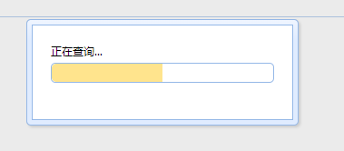
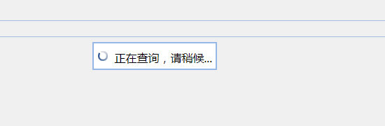
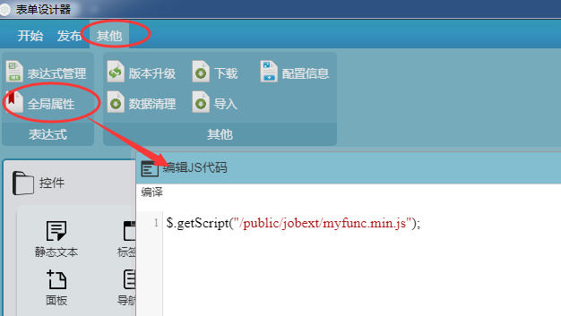

项目编号： 项目名称：**iBase** 版 本：**V2.0**

**编号公式管理**

**详细设计**

| 模块编号 | 模块目录标识 | 责任开发 |
|----------|--------------|----------|
| M0213    | snbuilder    | 黄科天   |

**文件建立/修改记录**

|序号|版本|建立或修改|建立/修改人日期|审核人日期|备注|
|------|------|------------------|------------------|---------------|----------------------------------|
|1|V1.0|建立|黄科天2016-8-31|邓赟2016/9/7|修正含糊内容|
|2|V1.1|添加表单对象说明|邓赟2017/7/18||获取子表单字段值；设置字段值说明|
|3|V1.2|改版格式为markdown在线文档|吴云龙2019年1月22日||内容无修改（仅修改样式）|


1.  说明

SnBuilderController实现对SnBuilderService进行简单的封装，对外提供We服务的API。

* 本模块以独立的Web服务(rest)对外提供功能。
* SnBuilderService实现了ISnBuilderService接口具体的业务逻辑功能，并通过注入的方式提供给SnBuilderController或其他模块调用；
* SnBuilderController对SnBuilderService进行简单的封装，对外提供We服务的API。

模块的包信息如下：

|          | 包文件名                      | 主类名                                                      |
|----------|-------------------------------|-------------------------------------------------------------|
| 接口     | snbuilderServiceInterface.jar | com.southgis.ibase.codedict. service. ISnBuilderService     |
| 功能实现 | snbuilderService.jar          | com.southgis.ibase. codedict. service. SnBuilderService     |
| 服务实现 | snbuilderWebService.war       | com.southgis.ibase.codedict.webservice. SnBuilderController |

模块的主要功能是定义系统内所用到的编号公式，可添加、修改、删除编号公式。

包含表达式引擎相关说明。

交互图
======

参见《M000示例服务设计.doc》典型调用图。

界面设计
========

无

1.  功能设计

    1.  公式定义

公式生成使用Java8最新的Nashorn引擎,由服务器端执行JavaScript脚本。
本模块向JavaScript中注入了宿主对象\$（模仿jquery的设计，使用\$作为变量名）。
* [官方参考文档](http://www.oracle.com/technetwork/articles/java/jf14-nashorn-2126515.html?ssSourceSiteId=ocomen)
* [简单使用说明](http://www.jb51.net/article/92138.htm)


编号生成将分两个阶段，第一阶段用于生成分类值，第二阶段用于生成最终编号。除N方法外，其它方法不区分所处阶段。

**由于服务端使用JavaScript表达式语法，因此表达式可以兼容服务端与客户端。**

##  2. <a name='-1'></a>$对象封装

----------------------------------------------
###  2.1. <a name='.printmsg'>$.print(msg)</a>        
<a name='.printmsg'>$.print(msg)</a>                                                

* 类型：void                                            

将消息内容输出到控制台
* 浏览器使用`console.log`，
* 服务器使用`System.out.println`并写入到\<日志根目录\>/scriptLog/{yyyy-MM-dd}.log文件                                                                                                                                                                                                                                                                                                                                                                                                                                                                                                                                                                                                                                                                                                                                                                                                                                                                                                                                                                                                                                                                                                 

----------------------------------------------
###  2.2. <a name='.messager'></a>$.messager                                                            
* 类型：void                                            

简单消息框封装类。仅前端表达式有效                                                                                                                                                                                                                                                                                                                                                                                                                                                                                                                                                                                                                                                                                                                                                                                                                                                                                                                                                                                                                                                                                                                                                                                                 

----------------------------------------------
###  2.3. <a name='.messager.progressparam'></a>$.messager.progress(param)                                            
* 类型：当param为"bar"时返回进度条控件； 其它情况返回空      

显示一个进度提示框（进度可控制）



!> 【仅前端表达式有效，当前实现需要easyui支持】。
 
param:取值有： 
1. 初始化信息
```js
param = {
	title:'显示在标题栏的文字',
	msg:'提示文字',
	text:'在进度条上的文字',
	interval:'进度条推进时间间隔(ms)'
} 
```
	* title 默认为空，空表示不显示标题栏；
	* text 默认为undefined，如果指定为undefined，则进度条上显示百分比文字；
	* interval 默认为300，设为0，则不自动推进进度条。
2. "close"，关闭此进度提示框
3. "bar"，获得progressbar（进度条控件，可通过返回控件使用getValue/setValue控制进度）： var bar=\$.messager.progress("bar"); bar.progressbar("setValue",30); //也可重新设置进度条高度： bar.progressbar({height:4});                                                                                                                                                                                                                                                                                                                                                                                                                                                                                                                                                                                                        

----------------------------------------------
###  2.4. <a name='.messager.maskparam'></a>$.messager.mask(param)                                                
* 类型：                                                

显示遮罩提示框。

!> 【仅前端表达式有效，当前实现需要easyui支持】
 
param，显示的提示信息（支持html格式），如果为空或不传参数，则表过关闭遮罩提示框。


如： 
```js
$.messager.mask("正在查询，请稍候...");
//在查询完成后调用 
$.messager.mask();
```
                                                                                                                                                                                                                                                                                                                                                                                                                                                                                                                                                                                                                                                                                                                                                                                                                                                                                                                                                                                                 

----------------------------------------------
###  2.5. <a name='.messager.confirmtitlemsgfn'></a>$.messager.confirm(title, msg, fn)                                    
* 类型：                                                

显示一个包含“确定”和“取消”按钮的确认消息窗口。
参数： 
title：在头部面板显示的标题文本。 
msg：显示的消息文本。 
fn(b): 确认结果回调方法。当用户点击“确定”按钮的时侯将传递一个true值给回调函数，否则传递一个false值。 


代码示例： 
```js
$.messager.confirm('确认对话框', '您想要退出该系统吗？', function(r){ 
		 if (r){
            // 退出操作; 
	    }
	});
	
```


----------------------------------------------
###  2.6. <a name='.Y'></a>$.Y                                                                   
* 类型：字符串                                          

当前时间的年份，四位有效数字。                                                                                                                                                                                                                                                                                                                                                                                                                                                                                                                                                                                                                                                                                                                                                                                                                                                                                                                                                                                                                                                                                                                                                                                                     

----------------------------------------------
###  2.7. <a name='.y'></a>$.y                                                                   
* 类型：字符串                                          

当前时间的年份，两位有效数字。                                                                                                                                                                                                                                                                                                                                                                                                                                                                                                                                                                                                                                                                                                                                                                                                                                                                                                                                                                                                                                                                                                                                                                                                     

----------------------------------------------
###  2.8. <a name='.M'></a>$.M                                                                   
* 类型：字符串                                          

当前时间的月份，固定两位有效数字，不足高位补零。                                                                                                                                                                                                                                                                                                                                                                                                                                                                                                                                                                                                                                                                                                                                                                                                                                                                                                                                                                                                                                                                                                                                                                                   

----------------------------------------------
###  2.9. <a name='.m'></a>$.m                                                                   
* 类型：字符串                                          

当前时间的月份，如果是一月到九月，高位不会补零。                                                                                                                                                                                                                                                                                                                                                                                                                                                                                                                                                                                                                                                                                                                                                                                                                                                                                                                                                                                                                                                                                                                                                                                   

----------------------------------------------
###  2.10. <a name='.D'></a>$.D                                                                   
* 类型：字符串                                          

当前月份的日号值，固定两位有效数字，不足高位补零。                                                                                                                                                                                                                                                                                                                                                                                                                                                                                                                                                                                                                                                                                                                                                                                                                                                                                                                                                                                                                                                                                                                                                                                 

----------------------------------------------
###  2.11. <a name='.d'></a>$.d                                                                   
* 类型：字符串                                          

当前月份的日号值，如果是一号到九号，高位不会补零。                                                                                                                                                                                                                                                                                                                                                                                                                                                                                                                                                                                                                                                                                                                                                                                                                                                                                                                                                                                                                                                                                                                                                                                 

----------------------------------------------
###  2.12. <a name='.nowStr'></a>$.nowStr()                                                            
* 类型：字符串                                          

当前时间，格式：yyyy-MM-dd HH:mm:ss。                                                                                                                                                                                                                                                                                                                                                                                                                                                                                                                                                                                                                                                                                                                                                                                                                                                                                                                                                                                                                                                                                                                                                                                              

----------------------------------------------
###  2.13. <a name='.parseDatestrDate'></a>$.parseDate(strDate)                                                  
* 类型：日期                                            

将日期格式的值转换成日期值对象。
识别timestmap的整数、
yyyy-MM-dd HH:mm:ss（包括/分隔符）、
yyyy年MM月dd日 
HH时mm分ss秒、
Mon Jul 25 2017 04:05:23 GMT+0800、
yyyyMMdd、
yyyyMMddHHmmss                                                                                                                                                                                                                                                                                                                                                                                                                                                                                                                                                                                                                                                                                                                                                                                                                                                                                                                                                                                                                                                  

----------------------------------------------
###  2.14. <a name='.NnumberLengthtype'></a>$.N(numberLength, type)                                               
* 类型：字符串                                          

!> 仅在编号公式表达式中使用

获得指定分类的最大流水号值。
其它表达式内，调用此方法将返回指定长度的0值。 

参数： 
 * numberLength【必须】：数字，指定生成编号的长度。 
 * type【可选】：字符串，用于生成最终编号前替换流水号的类型值。 
 * 返回值：【第一阶段】“替换流水号值”的分类值；【第二阶段】当前分类下的最大流水号。                                                                                                                                                                                                                                                                                                                                                                                                                                                                                                                                                                                                                                                                                                                                                                                                                                                                                                                          

----------------------------------------------
###  2.15. <a name='.UID'></a>$.UID                                                                 
* 类型：字符串                                          

当前用户ID                                                                                                                                                                                                                                                                                                                                                                                                                                                                                                                                                                                                                                                                                                                                                                                                                                                                                                                                                                                                                                                                                                                                                                                                                         

----------------------------------------------
###  2.16. <a name='.Data'></a>$.Data                                                                
* 类型：Map                                             

调用环境传入的自定义数据，依据运行场景解释所传入的内容。                                                                                                                                                                                                                                                                                                                                                                                                                                                                                                                                                                                                                                                                                                                                                                                                                                                                                                                                                                                                                                                                                                                                                                           

----------------------------------------------
###  2.17. <a name='.loadfunction'></a>$.load(function)                                                      
* 类型：                                                

!> 此方法仅适用于前端表达式，且仅在vue架构的表单全局属性中调用有效（如果是freemarker架构，可以使用\$(function)）。

在表单加载完成后执行的代码。（表单加载完成，不保证子表单控件内的数据加载完成）                                                                                                                                                                                                                                                                                                                                                                                                                                                                                                                                                                                                                                                                                                                                                                                                                                                                                                                                                                                                                                      

----------------------------------------------
###  2.18. <a name='.F'></a>$.F                                                                   
* 类型：对象                                            

表单对象，用于访问表单数据。对应表单引擎接口“IFormService”（详细说明参见《iBase2.0[M0211]表单处理引擎.doc》）                                                                                                                                                                                                                                                                                                                                                                                                                                                                                                                                                                                                                                                                                                                                                                                                                                                                                                                                                                                                                                                                                                                      

----------------------------------------------
###  2.19. <a name='.F.getFieldValueStringformDomainName'></a>$.F.getFieldValue(String formDomainName)                              
* 类型：具体值类型                                      

获取某个字段值（可获取按钮或静态文本[innerText]的显示文本内容）。

类型：Object，根据字段类型返回不同值类型，一般有：字符串、整数、小数、日期等。
* 如果匹配到多个字段（主要是没有传入rid的子表单），则返回数组，
	每个元素是形如{id:xxx,value:yyy}的对象（id指所取数据的记录mrid，value为所取字段值）；
* 如果获取的是子表单控件（未指定子表单内的字段时），则返回记录数组，每个元素是一条子表单数据，是表字段值对，

形如
```json
{
	"JOB_SA.SYS_MRID":"xxx",
	"JOB_SA.F1":"yyy", 
	"JOB_SA$GA.F2":"zzz",
	.............
}
```
 
参数： formDomainName，字段唯一名。

格式：`库表名\$组名\@RID.字段名\>子表单字段`

如：
* JOB_A.FMJ
* JOB_A\$old.FMJ
* JOB_A\@1df809ae-8a81-dc23-132038ae.F1\>JOB_B.SJ
* JOB_A.F1\>JOB_B.SJ 

其中SYS_MRID的表名可以是子表单关联的任何一个表名（以后改进，也可省略表名）。                                                                                                                                                                                                                                                                                                                                                                                                                                                                                        

----------------------------------------------
###  2.20. <a name='.F.getFieldDicTextStringformDomainName'></a>$.F.getFieldDicText(String formDomainName)                            
* 类型：字符串                                          

获取字典项控件的显示值（可获取按钮或静态文本的显示文本内容[innerHtml]），否则返回字段值。                                                                                                                                                                                                                                                                                                                                                                                                                                                                                                                                                                                                                                                                                                                                                                                                                                                                                                                                                                                                                                                                                                                                          

----------------------------------------------
###  2.21. <a name='.F.getFieldDicValueStringformDomainName'></a>$.F.getFieldDicValue(String formDomainName)                           
* 类型：字符串                                          

获取字典项控件的内部值，否则返回字段值 。                                                                                                                                                                                                                                                                                                                                                                                                                                                                                                                                                                                                                                                                                                                                                                                                                                                                                                                                                                                                                                                                                                                                                                                          

----------------------------------------------
###  2.22. <a name='.F.setFieldValueStringformDomainNameObjectfieldValueintsType'></a>$.F.setFieldValue(String formDomainName, Object fieldValue, int sType)
* 类型：                                                
* formDomainName ???
* fieldValue 
	为指定字段设置值（可改变按钮或静态文本的显示文本内容[innerText]）。

1. 如果通过字段名匹配到多个字段，依具fieldValue值类型分三种处理：
	1. 如果是基本类型（不包含id/value属性），则所有匹配字段设置相同的值；
	2. 如果是自定义**Object类型**，再分为
		1. `记录对象`
		形如：
		{JOB_A.SYS_MRID:"", JOB_A.F1:"", JOB_A\$old.F2:"", JOB_B.F11:""}）
		，
		2. `数组`
		则匹配字段的记录mrid与此对象mrid相同的对象属性值赋给匹配字段，如果此时mrid未找到，或为空，则添加一条记录；
		
		3. `{id:"",value:""}的Object对象或其数组`，则匹配字段的记录mrid与此对象id相同的对象属性值赋给匹配字段，
		* 如果此时mrid未找到，或为空，则添加一条记录。 
		* 如果子表单内的某个字段也是子表单，
		赋值格式如下： 
		```js
		{ JOB_A.SYS_MRID:"", JOB_A.F1:"sadf", JOB_B.F11:[ {JOB_SS.SYS_MRID:"",JOB_SS.FAA:"11",JOB_SS.FBB:"22"}, {JOB_SS.SYS_MRID:"",JOB_SS.FAA:"\#\#",JOB_SS.FBB:"\*\*"}, {JOB_SS.SYS_MRID:"",JOB_SS.FAA:"aa",JOB_SS.FBB:"bb"} ] }
		``` 
		* 如果是为下拉控件赋值，
		类型如下：
		```js
			{text:"",id:"",parentid"",children:[]}
		```
		（text为下拉选项的显示文本，id为下拉选项的标识值，parentid为多级下拉框时所结附的父级节点id，children为多级下拉框时所包含的子项节点），先向下拉框添加项，然后选中此项。 
* sType(可选)：要填充的批量子表单数据结构一致时，传入1可加快填充的速度，默认不传。 

----------------------------------------------
###  2.23. <a name='.F.setFieldDicTextStringformDomainNameStringtext'></a>$.F.setFieldDicText(String formDomainName, String text)               
* 类型：                                                

为指定字段设置对应的文本项（可改变按钮或静态文本的显示文本内容[innerHtml]），否则设置指定值。                                                                                                                                                                                                                                                                                                                                                                                                                                                                                                                                                                                                                                                                                                                                                                                                                                                                                                                                                                                                                                                                                                                                      

----------------------------------------------
###  2.24. <a name='.F.findSubFormStringformDomainNameMapfilter'></a>$.F.findSubForm(String formDomainName, Map filter)                    
* 类型：键值对数组                                      

返回找到的所有记录对象。

	* formDomainName，指定要查找内部记录的子表单控件的字段唯一名； 
	* filter，子表单内记录查找条件组（多个名值对以and组合）	
如：
```js
var filter = {
	'JOB_SS.FAA':"11", 
	'JOB_SS.FBB':"22"
}
```
> 暂不支持子表单内子表单数据的查找。 
                                                                                                                                                                                                                                                                                                                                                                                                                                                                                                                                                                                                                                                                                                                                                                                                                                                                                                                                                                                                            

----------------------------------------------
###  2.25. <a name='.F.getSelectedSubFormStringformDomainNameboolbChecked'></a>$.F.getSelectedSubForm(String formDomainName, bool bChecked)          
* 类型：键值对数组                                      
返回找到的所有记录对象。

* formDomainName，指定要查找内部记录的子表单控件的字段唯一名（支持\@\@前缀，指相对于当前打开子表单窗口）； 
* bChecked，是否获取勾选的记录（如果为true，则获取勾先的记录，false，则获取当前高亮选中记录）。 
 
!> 此方法仅适用于前端表达式。                                                                                                                                                                                                                                                                                                                                                                                                                                                                                                                                                                                                                                                                                                                                                                                                                                                                                                                                                                         

----------------------------------------------
###  2.26. <a name='.F.refreshSubFormStringformDomainName'></a>$.F.refreshSubForm(String formDomainName)                             
* 类型：                                                

重新加载子表单数据。 
* formDomainName，指定要刷新记录的子表单控件的字段唯一名 
!> 此方法仅适用于前端表达式。                                                                                                                                                                                                                                                                                                                                                                                                                                                                                                                                                                                                                                                                                                                                                                                                                                                                                                                                                                                                                                                                                                                             

----------------------------------------------
###  2.27. <a name='.F.isInitSubFormStringformDomainName'></a>$.F.isInitSubForm(String formDomainName)                              
* 类型：布尔值                                          

判断指定子表单控件是否正在初始化。 
返回：
	* true表示正在初始化，
	* false表示已初始化完成 子表单正在初始化，是指在控件从发出请求获取初始数据开始，到将返回的数据填充到控件并完成的过程。 
!> 此方法仅适用于前端表达式。                                                                                                                                                                                                                                                                                                                                                                                                                                                                                                                                                                                                                                                                                                                                                                                                                                                                                                                                                                                                                       

----------------------------------------------
###  2.28. <a name='.F.setCtrlHidefnametruefalse'></a>$.F.setCtrlHide(fname,true\|false)                                    
* 类型：                                                

设置控件是否隐藏 
!> 此方法仅适用于前端表达式。                                                                                                                                                                                                                                                                                                                                                                                                                                                                                                                                                                                                                                                                                                                                                                                                                                                                                                                                                                                                                                                                                                                                                                                        

----------------------------------------------
###  2.29. <a name='.F.setCtrlDisablefnametruefalse'></a>$.F.setCtrlDisable(fname,true\|false)                                 
* 类型：                                                

设置控件是否禁用 
!> 此方法仅适用于前端表达式。                                                                                                                                                                                                                                                                                                                                                                                                                                                                                                                                                                                                                                                                                                                                                                                                                                                                                                                                                                                                                                                                                                                                                                                        

----------------------------------------------
###  2.30. <a name='.F.setCtrlColorfnametruefalseclrVal'></a>$.F.setCtrlColor(fname,true\|false, clrVal)                           
* 类型：                                                

设置控件前景/背景色，如： \$.F.setCtrlColor("JOB_A.F1",true,"\#A02020") 
!> 此方法仅适用于前端表达式。                                                                                                                                                                                                                                                                                                                                                                                                                                                                                                                                                                                                                                                                                                                                                                                                                                                                                                                                                                                                                                                                                                                                 

----------------------------------------------
###  2.31. <a name='.F.getFormData'></a>$.F.getFormData()                                                     
* 类型：键值对                                          

获取表单所有字段名值对。

返回数据类型：Map\<String,Object\>。                                                                                                                                                                                                                                                                                                                                                                                                                                                                                                                                                                                                                                                                                                                                                                                                                                                                                                                                                                                                                                                                                                                                                                               

----------------------------------------------
###  2.32. <a name='.F.getBusinessno'></a>$.F.getBusinessno()                                                   
* 类型：字符串                                          

获取业务号                                                                                                                                                                                                                                                                                                                                                                                                                                                                                                                                                                                                                                                                                                                                                                                                                                                                                                                                                                                                                                                                                                                                                                                                                         

----------------------------------------------
###  2.33. <a name='.F.getFieldNames'></a>$.F.getFieldNames()                                                   
* 类型：字符串列表                                      

获取表单所有字段名。类型：List\<String\>。                                                                                                                                                                                                                                                                                                                                                                                                                                                                                                                                                                                                                                                                                                                                                                                                                                                                                                                                                                                                                                                                                                                                                                                         

----------------------------------------------
###  2.34. <a name='.W'></a>$.W                                                                   
* 类型：对象                                            

工作流引擎包装类                                                                                                                                                                                                                                                                                                                                                                                                                                                                                                                                                                                                                                                                                                                                                                                                                                                                                                                                                                                                                                                                                                                                                                                                                   

----------------------------------------------
###  2.35. <a name='.W.getTaskstepKey'></a>$.W.getTask(stepKey)                                                  
* 类型：                                                

获取当前流程指定环节的处理信息：传入“环节定义Key”，获取当前工作流的环节处理信息（包括：处理人，任务ID，环节名，办理时长等）。其中环节定义Key为空时，表示获取当前当前环节（任务）处理信息。（注4）                                                                                                                                                                                                                                                                                                                                                                                                                                                                                                                                                                                                                                                                                                                                                                                                                                                                                                                                                                                                                                  

----------------------------------------------
###  2.36. <a name='.W.save'></a>$.W.save()                                                            
* 类型：                                                

保存当前工作流及表单数据                                                                                                                                                                                                                                                                                                                                                                                                                                                                                                                                                                                                                                                                                                                                                                                                                                                                                                                                                                                                                                                                                                                                                                                                           

----------------------------------------------
###  2.37. <a name='.W.unwarp'></a>$.W.unwarp()                                                          
* 类型：对象                                            

真正的工作引擎对象。仅服务端有效                                                                                                                                                                                                                                                                                                                                                                                                                                                                                                                                                                                                                                                                                                                                                                                                                                                                                                                                                                                                                                                                                                                                                                                                   

----------------------------------------------
###  2.38. <a name='.O'></a>$.O                                                                   
* 类型：对象                                            

组织结构操作对象                                                                                                                                                                                                                                                                                                                                                                                                                                                                                                                                                                                                                                                                                                                                                                                                                                                                                                                                                                                                                                                                                                                                                                                                                   

----------------------------------------------
###  2.39. <a name='.O.getUserId'></a>$.O.getUserId()                                                       
* 类型：字符串                                          

获取登录用户ID                                                                                                                                                                                                                                                                                                                                                                                                                                                                                                                                                                                                                                                                                                                                                                                                                                                                                                                                                                                                                                                                                                                                                                                                                     

----------------------------------------------
###  2.40. <a name='.O.getUserName'></a>$.O.getUserName()                                                     
* 类型：字符串                                          

获取登录用户名。                                                                                                                                                                                                                                                                                                                                                                                                                                                                                                                                                                                                                                                                                                                                                                                                                                                                                                                                                                                                                                                                                                                                                                                                                   

----------------------------------------------
###  2.41. <a name='.O.getUserQuauidmark'></a>$.O.getUserQua(uid,mark)                                              
* 类型：用户身份值                                      

获取指定用户id的身份信息，如果不是用户id，则返回0。
 
参数：

* uid，用户id； 
* mark，掩码值（由于身份标识是按位组合，因此可以用于获取需要的位，1【B0】：部门负责人，2【B1】：部门联系人，4【B2】：部门管理员）。 
	* 比如：\$.O.getUserQua('aabb-dd',1)==1，表示要获取部门负责人位，返回1表示此位有效； 
	* 又如：\$.O.getUserQua('aabb-dd',5)==4，表示要获取部门负责人位和部门管理员位，返回4表示部门管理员位有效。 
	返回：整数（返回的值表示哪些位有效：0=无任何位有效，1=第0位有效，2=第1位有效，3=第0和1位有效，4=第2位有效，5=第0和2位有效，6=第1和2位有效，7=第0、1和2位有效。依此类推）                                                                                                                                                                                                                                                                                                                                                                                                                                                                                                                                                                                                                                                     

----------------------------------------------
###  2.42. <a name='.O.getFullNameuid'></a>$.O.getFullName(uid)                                                  
* 类型：字符串                                          

参数：uid，组织项ID。 获取层次名的字符串： 部门、岗位格式：XXX/YYY/ZZZ/\* 人员格式：XXX/YYY/ZZZ/NNN 角色格式：[RRR]                                                                                                                                                                                                                                                                                                                                                                                                                                                                                                                                                                                                                                                                                                                                                                                                                                                                                                                                                                                                                                                                                                                

----------------------------------------------
###  2.43. <a name='.O.getOrganInfouid'></a>$.O.getOrganInfo(uid)                                                 
* 类型：组织项对象                                      

获取指定id的组织项对象。 类型：OrganInfoLocal                                                                                                                                                                                                                                                                                                                                                                                                                                                                                                                                                                                                                                                                                                                                                                                                                                                                                                                                                                                                                                                                                                                                                                                      

----------------------------------------------
###  2.44. <a name='.O.getOrganInfoByCodecode'></a>$.O.getOrganInfoByCode(code)                                          
* 类型：组织项对象                                      

根据组织项的内部代码获取组织项对象                                                                                                                                                                                                                                                                                                                                                                                                                                                                                                                                                                                                                                                                                                                                                                                                                                                                                                                                                                                                                                                                                                                                                                                                 

----------------------------------------------
###  2.45. <a name='.O.getOrganInfoByNamefullName'></a>$.O.getOrganInfoByName(fullName)                                      
* 类型：组织项对象                                      

根据组织项的层次名获取组织项对象（从上向下找，如果层次中的名称找不到组织项，将返回空）
 
如：

* $.O.getOrganInfoByName("南方数码/研发中心/研发部/经理/") 获取的是部门或岗位、 
* $.O.getOrganInfoByName("[经理]") 获取的是角色、 
* $.O.getOrganInfoByName("南方数码/研发中心/研发部/工程师/张三") 获取的是人员                                                                                                                                                                                                                                                                                                                                                                                                                                                                                                                                                                                                                                                                                                                                                                                                                                                                                                                            

----------------------------------------------
###  2.46. <a name='.O.getOwnerDeptuid'></a>$.O.getOwnerDept(uid)                                                 
* 类型：组织项对象                                      

获取直接部门，如果是人员，获取首要岗位的直接部门。 类型：OrganInfoLocal                                                                                                                                                                                                                                                                                                                                                                                                                                                                                                                                                                                                                                                                                                                                                                                                                                                                                                                                                                                                                                                                                                                                                            

----------------------------------------------
###  2.47. <a name='.O.getClassDeptuidcls'></a>$.O.getClassDept(uid,cls)                                             
* 类型：组织项对象                                      

获取指定级别的上级部门（status字段描述级别）。 

**uid**：组织结构ID； 
**cls**：级别值，有效值如下（值越小级别越高）

|有效值|说明|
|---|---| 
|2|单位或公司节点| 
|11|一级部门节点| 
|12|二级部门节点| 
|13|三级部门节点|
|14|四级部门节点| 
|15|五级部门节点|	  
 获取的部门级别满足如下条件：
 
1. 组织项级别值（status）大于1，且小于等于指定级别值cls。 返回指定级别的部门对象。
2. 若uid是人员，获取的是首要岗位满足条件的上级部门。从直接部门向上查找，直到找到的部门级别等于或高于指定级别的部门。                                                                                                                                                                                                                                                                                                                                                                                                                                                                                                                                                                                                                                                                                                                                                                             

----------------------------------------------
###  2.48. <a name='.O.getFirstPostuid'></a>$.O.getFirstPost(uid)                                                 
* 类型：组织项对象                                      

获取首要岗位，如果不是人员ID，返回空。 类型：OrganInfoLocal                                                                                                                                                                                                                                                                                                                                                                                                                                                                                                                                                                                                                                                                                                                                                                                                                                                                                                                                                                                                                                                                                                                                                                        

----------------------------------------------
###  2.49. <a name='.O.getAllPostuid'></a>$.O.getAllPost(uid)                                                   
* 类型：组织项对象数组                                  

获取所有岗位，如果不是人员ID，返回长度为0的数组。 类型：OrganInfoLocal []。                                                                                                                                                                                                                                                                                                                                                                                                                                                                                                                                                                                                                                                                                                                                                                                                                                                                                                                                                                                                                                                                                                                                                        

----------------------------------------------
###  2.50. <a name='.O.isRoleuidroleName'></a>$.O.isRole(uid,roleName)                                              
* 类型：布尔值                                          

是否属于指定角色。uid，判断的组织项ID；roleName角色名(例如：“部门经理”)或角色代码(格式："\#"+代码，例如：“\#S1022”)。                                                                                                                                                                                                                                                                                                                                                                                                                                                                                                                                                                                                                                                                                                                                                                                                                                                                                                                                                                                                                                                                                                              

----------------------------------------------
###  2.51. <a name='.O.isIncludeuidpuids'></a>$.O.isInclude(uid,puids)                                              
* 类型：布尔值                                          

是否包含在指定的组织项或下级中。uid，判断的组织项ID；puids，包含组织项列表字符串（以,分隔）                                                                                                                                                                                                                                                                                                                                                                                                                                                                                                                                                                                                                                                                                                                                                                                                                                                                                                                                                                                                                                                                                                                                        

----------------------------------------------
###  2.52. <a name='.O.getAllUseruids'></a>$.O.getAllUser(uids)                                                  
* 类型：组织项对象数组                                  

获取指定组织项下包含的所有用户项。uids，需要展开的组织项列表字符串（以,分隔）                                                                                                                                                                                                                                                                                                                                                                                                                                                                                                                                                                                                                                                                                                                                                                                                                                                                                                                                                                                                                                                                                                                                                      

----------------------------------------------
###  2.53. <a name='.XadministratorCode'></a>$.X(administratorCode)                                                
* 类型：数组                                            

获取行政区划信息。类型：AdministrativeDivision[]。 
参数： 
* administratorCode【必须】：字符串，行政区划代码
* 返回值： 一个行政区划AdministrativeDivision的数组，
第一项为省，第二项为市、第三项为县、第四项为乡、第五项为村、第六项为组、第七项为小组直到administratorCode指定的行政区划级别（最多7项）。说明见表后（注1）。                                                                                                                                                                                                                                                                                                                                                                                                                                                                                                                                                                                                                                                                                                                                                                                                                                                                                                           

----------------------------------------------
###  2.54. <a name='.CcatalogCodeshowValue'></a>$.C(catalogCode, showValue)                                           
* 类型：字典对象数组                                    

获取字典项信息。
* CodeDict[] 参数 catalogCode【必须】：代码字典的分类码或显示文本， 
* showValue【必须】：字典项代码或显示文本。 
* 返回值：字典对象数组。如果未找到，返回长度为0的数组。说明见表后（注2）                                                                                                                                                                                                                                                                                                                                                                                                                                                                                                                                                                                                                                                                                                                                                                                                                                                                                                                                                                                                                           

----------------------------------------------
###  2.55. <a name='.Scatalogkey'></a>$.S(catalog,key)                                                      
* 类型：字符串                                          

获得指定分类的系统配置项内容。 
* catalog【必须】，分类名
* key【必须】，配置项。 
* 返回：配置值(如果未获取到，返回空。
 
此方法先用本系统ID关联的配置查找，如果找不到，再忽略系统ID查找（即找到任何一个同分类同名的配置）。 

如： 
>$.S("单位信息","所属行政区")                                                                                                                                                                                                                                                                                                                                                                                                                                                                                                                                                                                                                                                                                                                                                                                                                                                                                                                                                                             

----------------------------------------------
###  2.56. <a name='.buildNoexpFla'></a>$.buildNo(expFla)                                                     
* 类型：字符串                                          

通过指定的编号公式（使用编号公式定义模块定义需要的公式），生成唯一编号。 
* expFla【必须】，编号公式名 
* 返回：根据编号公式定义的格式生成的唯一编号值。 
如：
>查[2014]012号                                                                                                                                                                                                                                                                                                                                                                                                                                                                                                                                                                                                                                                                                                                                                                                                                                                                                                                                                                                                                                                               

----------------------------------------------
###  2.57. <a name='.execsqldsNamesql1param1sql2param2sql3param3'></a>$.execsql (dsName,sql1,param1,sql2,param2,sql3,param3)                
* 类型：Map                                             

条件执行sql语句：
1. 先执行sql1，成功且有返回值则执行sql2，
2. 否则(不出异常时)执行sql3。 

* dsName:数据源查询服务配置名，用于支持多数据源的查询（暂未使用） 
* sql1【必须】:语句命名（为了安全，不直接写sql语句，而是由单独模块定义sql并命名，通过命名找到sql语句内容） 
* param1:所执行语句的参数名值对的Map对象。依据命名所对应的sql语句中的参数定义方式，
	* 支持占位符参数 
		```js {"?1":"\#date\#","?2":1,"?3":"1-23-4"} ```
	* 命名参数 
		```js      {"regdate":"\#date\#","mj":1,"rid":"1-23-4"}``` 
* sql2/param2、sql3/param3：说明同上，

注：
> 如果没有执行语句，则设置为null。 返回每条sql语句的执行结果名值对的Map对象。key名分别为“sql1”，“sql2”，“sql3”，值为对应sql语句的结果： 如果是select语句，返回List\<Map\<String,Object\>\>格式的记录集（Map指一条记录结果，Key为字段名，Value为字段值）； 如果是insert、update、delete语句，返回影响的记录数。 若对应某条语句未执行，相应结果为null。                                                                                                                                                                                                                                                                                                                                                                  

----------------------------------------------
###  2.58. <a name='.execprocdsNameprocNameinParamoutParam'></a>$.execproc(dsName,procName,inParam,outParam)                          
* 类型：Map                                             

执行存贮过程。 
* dsName:数据源查询服务配置名，用于支持多数据源的查询（暂未使用） 
* procName【必须】：存贮过程名 
* inParam：输入参数，名值对的Map对象（但只支持命名参数的写法，不支持占位符参数） 
* outParam：输出参数，名值对的Map对象（也只支持命名参数的写法），每项参数的值为返回结果类型的描述字符串。

如：
* {"no":"int"} varchar（字符串）、
* clob（大文本内容）：将返回字符串值； 
* int（整数）：将返回整数值； 
double（浮点小数）、
* decimal（定点小数）：将返回小数值； 
* datetime（日期）：将返回日期值（时间戳）； 
* blob（大二进制块）：将返回base64编码的二进制值； 
* cursor（游标，只能一个）：将返回List\<Map\<String,Object\>\>格式的记录集（Map指一条记录结果，Key为字段名，Value为字段值）。 
> 注：为了兼容不同数据库存贮过程返回记录集的方式不同（Oracle通过输出参数返回，mysql/sqlserver通过查询语句返回），应统一按输出参数的方式调用（内部会正确处理通过查询语句返回的情况）。 返回存贮过程的输出参数名值对Map对象（Key为参数名）                                                                                                                                                                                                                                                                                                      

----------------------------------------------
###  2.59. <a name='.batchsqldsNamearrSqlInfo'></a>$.batchsql(dsName,arrSqlInfo)                                         
* 类型：List                                            

执行批量查询 
* dsName:数据源查询服务配置名，用于支持多数据源的查询（暂未使用） 
* arrSqlInfo【必须】：查询信息数组，每个元素是SqlInfo对象：{sql:语句命名,param:[参数名值对的Map对象列表]} （参见execsql相应参数说明） 返回每条sql语句返回的记录集数组：List\<List\<记录集\>\>。 

其中：
	1. 第一层数组元素是各条sql语句的返回值数组（与传入的sql语句顺序对应）； 
	2. 第二层数组元素是每条sql语句内不同组参数的返回的记录集结果（与param参数顺序对应，但一般只有一组参数） 
	3. 记录集返回List\<Map\<String,Object\>\>（Map指一条记录结果，Key为字段名，Value为字段值）                                                                                                                                                                                                                                                                                                                                                                                                                                                                                                                                                                                                                                                                                   

----------------------------------------------
###  2.60. <a name='.batchcuddsNamearrSqlInfo'></a>$.batchcud(dsName,arrSqlInfo)                                         
* 类型：List                                            

执行批量更新 
* dsName:数据源查询服务配置名，用于支持多数据源的查询（暂未使用） 
* arrSqlInfo【必须】：查询信息数组，每个元素是SqlInfo对象（参见batchsql相应参数说明） 
* 返回每条sql语句返回的受影响记录数：List\<int[]\>。 

其中
1. 第一层数组元素是各条sql语句的返回值数组（与传入的sql语句顺序对应）； 
2. 第二层数组元素是每条sql语句内不同组参数的返回结果（与param参数顺序对应，每一项的值表示此参数下执行导致的影响记录数）                                                                                                                                                                                                                                                                                                                                                                                                                                                                                                                                                                                                                                                                                                                                                                                                                  


###  2.1. <a name='1.XAdministrativeDivision'></a>（注1） $.X方法的返回值为一个数组，数组中的元素为AdministrativeDivision，

该对象支持以下字段：
`var ad = \$.X("440101")[0]`

| 字段                        | 类型   | 描述                 |
|-----------------------------|--------|----------------------|
| ad.C                        | 字符串 | 行政区划代码         |
| ad.A                        | 字符串 | 公文名（简称）       |
| ad.F                        | 字符串 | 行政区划名称（全称） |
| ad.L                        | 字符串 | 行政区划级别名       |
| ad.S                        | 字符串 | 内部标识码           |

指定的行政区划代码按如下格式区分级别：

?> XX  XX XX  XXX  XXX  XXX XXX

|前两位|两位|两位|三位|三位|三位或六位|
|---|---|---|---|---|---|
|XX|XX|XX|XXX|XXX|XXX XXX|
|省或直辖市|省下的地级市|地级市下的区或县|区县下的街道或乡镇|描述乡镇下的村|按业务所需定义（一般描述村下的生产组或自然村落、及生产组下的小组）|

###  2.2. <a name='2.CCodeDict'></a>（注2） $.C返回值为一个数组，数组中的元素为CodeDict，
该对象支持以下字段：
 `var cd = \$.C("土地分类","001")[0]`

| 字段                                | 类型   | 描述       |
|-------------------------------------|--------|------------|
| cd.rid                              | 字符串 | 字典项ID   |
| cd.catalogId                        | 字符串 | 所属分类ID |
| cd.code                             | 字符串 | 字典代码值 |
| cd.showValue                        | 字符串 | 显示文本   |
| cd.sortValue                        | 字符串 | 排序值     |

###  2.3. <a name='3.O.getXxx'></a>（注3） $.O.getXxx()
返回的组织项对象，为OrganInfoLocal类型。该对象支持以下字段：

 var cd = \$.O.getOwnerDept(‘89832874-8845-ad45-98ed-345734654623r54’);
  
|字段|类型|描述|
|------|--------|-----|
|cd.rid|字符串|组织项ID|
|cd.organType|整数|类型（0部门，1岗位，2自定义角色，3系统角色，10人员）|
|cd.organCode|字符串|内部代码值|
|cd.organName|字符串|组织项名|
|cd.organDescription|字符串|描述信息|
|cd.status|整数|状态：0不可用，-1审核中，1可用|
|cd.mdistrict|字符串|所属行政区划代码|
|cd.sortValue|整数|排序值|
|cd.parentId|字符串|所属父节点ID（部门/岗位，是上级部门ID；人员，是首要岗位ID，角色，是管理部门ID）|

###  2.4. <a name='4.W.getTaskLinkInstanceEntity'></a>（注4）\$.W.getTask返回环节信息对象，为LinkInstanceEntity类型

var tk = \$.W.getTask(‘task3223421454’);

| 字段                                     | 类型       | 描述                                                                                           |
|------------------------------------------|------------|------------------------------------------------------------------------------------------------|
| tk.id                                    | 字符串     | 环节实例ID                                                                                     |
| tk.linkDefinitionKey                     | 字符串     | 环节标识名                                                                                     |
| tk.eleName                               | 字符串     | 环节引用名                                                                                     |
| tk.processInstanceId                     | 字符串     | 所属流程实例ID                                                                                 |
| tk.executionId                           | 字符串     | 所属执行流ID                                                                                   |
| tk.formTemplateId                        | 字符串     | 环节可打开的表单ID                                                                             |
| tk.processDefinitionId                   | 字符串     | 流程定义ID                                                                                     |
| tk.signature                             | 字符串     | 签名字段列表（签名人，签名时间，签名意见）                                                     |
| tk.currentForm                           | 字符串     | 当前表页，多个表页以::分隔                                                                     |
| tk.relevanceForm                         | 字符串列表 | 需要显示的表页                                                                                 |
| tk.visibleForm                           | 布尔值     | 处理字段是否可见                                                                               |
| tk.visibleFormKey                        | 字符串列表 | 可见性处理字段列表                                                                             |
| tk.editableForm                          | 布尔值     | 处理字段是否可编辑                                                                             |
| tk.editableFormKey                       | 字符串列表 | 可编辑性处理字段列表                                                                           |
| tk.operationForm                         | 布尔值     | 是否执行生效操作                                                                               |
| tk.countersign                           | 布尔值     | 是否会签环节                                                                                   |
| tk.surplusDate                           | 小数       | 环节超时时长                                                                                   |
| tk.duDate                                | 时间戳     | 环节到期时间                                                                                   |
| tk.accumulateTime                        | 小数       | 环节处理积累时长                                                                               |
| tk.checkingBeforeCompleted               | 字符串     | 提交前检查表达式                                                                               |
| tk.visiableFollowWorkMen                 | 字符串列表 | 可查看后续处理情况的人员ID列表                                                                 |
| tk.automaticCommit                       | 布尔值     | 是否自动提交                                                                                   |
| tk.automaticClaim                        | 布尔值     | 是否自动接办                                                                                   |
| tk.completePartialSubmit                 | 布尔值     | 会签环节有效，是否可部分提交（如果是，则主要处理人处理完后可提交到后续环节）                   |
| tk.showingCompletingDialog               | 布尔值     | 是否显示提交对话框                                                                             |
| tk.processFinished                       | 布尔值     | 是否可结档                                                                                     |
| tk.processRefundable                     | 布尔值     | 是否可退件                                                                                     |
| tk.computingWorkload                     | 布尔值     | 是否需要计算处理人的工作量                                                                     |
| tk.winthdrad                             | 布尔值     | 是否可收回                                                                                     |
| tk.forceClaimPeoples                     | 字符串列表 | 会签环节有效，可被强制接办人员列表（在主要处理人处理完后，这些人可以将工作强制接办到后续环节） |
| tk.countersignIsPass                     | 布尔值     | 会签环节，是否已弹出过提交对话框（用于控制其它会签人提交时要不要弹出提交对话框）               |
| tk.createTime                            | 时间戳     | 环节实例创建时间                                                                               |
| tk.childProcess                          | 字符串列表 | 子流程ID列表                                                                                   |
| tk.maxTimelimit                          | 小数       | 最大允许办理时长                                                                               |
| tk.masterTaskCount                       | 整数       | 主要处理人对应的任务数                                                                         |
| tk.normalTaskCount                       | 整数       | 一般处理人对应的任务数                                                                         |
| tk.visiableMen                           | 字符串列表 | 当前环节可见人员ID列表                                                                         |
| tk.masterMen                             | 字符串列表 | 当前环节主要处理人ID列表                                                                       |
| tk.normalMen                             | 字符串列表 | 当前环节一般处理人ID列表                                                                       |
| tk.applaySuspended                       | 布尔值     | 是否在申请挂起                                                                                 |
| tk.autoCompleteDateTime                  | 时间戳     | 自动提交时间                                                                                   |
|                                          |            |                                                                                                |

**4.1.2 其它内置对象**

请参考官网文档

**4.1.3 服务端表达式支持**

1.服务端表达式与客户端不同的地方是，

-   可以通过Java.type引入系统内的类来使用系统功能：

```js
var expSql = Java.type("com.southgis.ibase.extend.service.SqlService");
//引入执行SQL的java类定义

var result = expSql.query('getResult',{"?1":"201701010001"},0); //调用静态方法

var obj=new expSql(); //调用构造方法

var result=obj.query(‘getAllTask’); //调用对象方法

var IntArray = Java.type("int[]"); //引入Java的整型数组定义

var array = new IntArray(5);

array[0] = 5;
```

-   或获取工作流引擎对象，调用引擎内的其它方法：

```js
var wfService=\$.W.unwarp(); //获取工作流引擎原始对象（仅服务端有效）

wfService.updateDataBaseByCondition("{\\"JOB_BASE.JID\\":\\"201807250001\\"}",

"{\\"JOB_BASE.STATUS\\":10}");
```

-   以及通过名字获取spring注入对象：

//使用注入的对象，调用其中的方法

```js
var appUtil =
Java.type("com.southgis.ibase.utils.webservice.ApplicationContextUtil");

var objProcess=appUtil.getBean("processInstanceService");

objProcess.modifyProcessInstanceName("processId","新名字",\$.O.getUserId());
```

2.表达式扩展支持

2.1 sql执行类

>   类名：com.southgis.ibase.extend.service.SqlService

该类提供对sql语句的原生执行具体方法如下：  
1，List<?> query(String sql,Integer type)

该方法，执行sql语句查询，参数sql标识要执行的sql语句，type 返回结果类型。
* type=0
	返回结果期望是List\<Object[]\>（其中列表中的每个元素是一条记录，记录字段值按sql语句的字段顺序排列）
* type=1
	返回结果期望是一个List\<Map\>（其中列表中的每个元素是一条Map描述的记录，Key为全大写的字段名，Value为字段值）。
2. int execute(String sql)
该方法用来，执行sql原生增，删，改，语句，返回结果大于0则是执行成功，其他情况失败。
3. Map\<String, Object\> procedure(String procName, Map\<String, Object\>
inputParamMap,Map\<String, String\> outParamsMap)

该方法用来执行存储过程，参数inputParamMap存储过程需要的参数。Key为参数名，Value为参数值。outParamsMap存储过程返回参数项，Key为参数名，Value为参数类型：

varchar（字符串）、clob（大文本内容）、int（整数）、double（浮点小数）、decimal（定点小数）、datetime（日期）、blob（大二进制块）、cursor（游标，此类型参数最多只能一个。用于提取记录集，对于不支持游标返回的数据库，参数名可随意定义）。

!> 注意：该方法在支持MySQL的游标没有问题，但是在支持oracle带游标参数返回时，会出现问题，待后续升级。

2.2 web服务URL请求类

>   类名：com.southgis.ibase.extend.service.RequestService

该类提供支持对Http请求的访问。

1.  String doRequest(String path){}

参数：path为你想访问的地址。

以字符串的形式返回整个页面。

**4.1.4 客户端表达式支持**

客户端需要有特殊对象：

1.可使用JQuery对象

使用\$访问，如：\$(“\#ctrlId”).val()

2.可以在表单全局属性内引入封装的js文件（这样可实现业务通用功能的按需加载）

```js
$.getScript("要加载的脚本文件.js");
```

注意：因为script文件加载到页面都是异步执行的，因此用此方法动态加载脚本文件时，不能在需要立即使用的场合。最佳加载位置是表单的“全局属性”中。



3.客户端运行时对象：

\$.client // 客户端环境对象，服务端脚本内为null。包含属性

.rootWindow // 框架文档（window对象，可以调用打开页功能），包含属性

.addTap(null,module) //打开窗口信息对象，

//module对象的属性至少包含：

//{

// moduleId: 唯一标识窗口（用于窗口定位）,

// name: 窗口标题名,

// pageUrl:窗口内容地址

//}

.ctx // 当前框架应用路径（如：/mainWeb）

.userId // 当前登录用户Id

.realName // 用户名称

.systemId // 当前登录子系统Id

.currentFieldName //
当前控件名，表单控件内表达式有效，其它地方为null。如果是子表单，则控件名还带有子表单前缀（比如：S-3-12-JOB_A.F1，其中“S-3-12-”表示当前子表单前缀，且父表单也是子表单，前缀为“S-3-”）

.currentValue // 当前控件值，表单控件内表达式有效，其它地方为null

.currentItem
//当前下拉框控件有效，为选中项（可以有多项）的名值对：[{text:显示值,id:内部值},{…}]

.currentParentField //
如果是子表单内的控件表达式，描述此子表单控件名及对应的记录Mrid，非子表单内为null，如果有嵌套，则包含所有层次的子表单控件名以\>分隔（比如：JOB_A\@123.F1\>JOB_S1\@2345.FN）。

*其中：*

*currentValue获取的是控件对应保存到数据库的值（当总为字符串，对于多选下拉框控件，值为所选中项的值以双冒号::分隔组合而成）。*

**4.1.5 子表单内的表达式特殊规则**

* 规则一、（前端）通过表单引擎，使用"\@\@"前缀（\@\@表示当前表单界面）获取当前子表单对话框内控件值，因此如果在主表单内也写有此前缀时，应忽略（就好象没有此前缀一样，因为此时当前表单界面就是主表单），这样可以保证表单单独使用时，控件的表达式运算不会出错。

比如对话框包括两个字段“JOB_S1.FA”、“JOB_S1.FB”，此时在FA字段内定义了验证表达式，需要获取FB的字段值时，使用如下方式取值：
``` js 
var fbVal=\$.F.getFieldValue("\@\@JOB_S1.FB");
```

* 规则二、在调用\$.F.setFieldValue保存子表单控件值时，需要对每条记录验证，通过\$.Data["currRecord"]传入当前表单数据。而\$.F.getFieldValue获取有\@\@前缀字段值时，从此属性所传入的记录对象中获取（如果此属性无效，则按规则一从表单界面获取值）。

但需要考虑子表单嵌套。

* 规则三（扩展）、前缀名为“\@n\@”（其中n为层次数）表示是当前子表单父表单引用。如果n已大于当前子表单的层次数，则总为主表单。比如：业务表单的JOB_A.F1是子表单控件，关联表单包含名为JOB_B.F11的子表单控件，其关联表单包含名为JOB_C.F111的输入控件，在此控件上定义计算表达式时：

//与当前控件（JOB_C.F111）同一表单内
```js
var x0=\$.F.getFieldValue("\@\@JOB_C.F112");
```
-------------------------

//当前控件所在表单的直接父表单
```js
var x1=\$.F.getFieldValue("\@1\@JOB_C.F12");
```
------------------------- 
//当前控件所在表单的上两层的父表单（这里是主表单）
```js
var x2=\$.F.getFieldValue("\@2\@JOB_C.F2");
```
-------------------------
//当前控件所在表单的上三层的父表单（因为这里没有三层，也是指主表）
```js
var x3=\$.F.getFieldValue("\@3\@JOB_C.F2");
```
-------------------------
**4.1.6 代码书写入门**

| 代码段                                                                                                                                                                                                                                                                                                                                           | 描述                                                                                                                                                                                                                                                                                            |
|--------------------------------------------------------------------------------------------------------------------------------------------------------------------------------------------------------------------------------------------------------------------------------------------------------------------------------------------------|-------------------------------------------------------------------------------------------------------------------------------------------------------------------------------------------------------------------------------------------------------------------------------------------------|
| function Func(v1,v2){ return v1+v2; }                                                                                                                                                                                                                                                                                                            | 定义一个函数                                                                                                                                                                                                                                                                                    |
| var data=[1,2,3,4,5];                                                                                                                                                                                                                                                                                                                            | 定义一个数组                                                                                                                                                                                                                                                                                    |
| typeof(obj);                                                                                                                                                                                                                                                                                                                                     | 获取对象类型的字符串描述。 通用类型： undefined、object、function 以及具体的值类型： string、number、boolean (注：值为null，类型为object)                                                                                                                                                       |
| var filtered=data.filter( function(i){return i%2==0;}, 0);                                                                                                                                                                                                                                                                                       | 调用对象方法，并传入函数对象（lambda表达式）                                                                                                                                                                                                                                                    |
| var data = { foo:"bar", time: new Date() };                                                                                                                                                                                                                                                                                                      | 构造一个对象，含foo、time属性                                                                                                                                                                                                                                                                   |
| try{ ... } catch(e){ ... }                                                                                                                                                                                                                                                                                                                       | 捕获异常                                                                                                                                                                                                                                                                                        |
| var abc = function(){ if(true){ return 'aaa'; }else{ return 'bb'; } } abc();                                                                                                                                                                                                                                                                     | 根据不同情况，当需要返回值时，应当将代码块，写在一个方法里。                                                                                                                                                                                                                                    |
| var HashMap = Java.type("java.util.HashMap"); var mapDef = new HashMap();                                                                                                                                                                                                                                                                        | **服务端脚本有效。**获取指定Java类型信息并用来构建对象                                                                                                                                                                                                                                          |
| var Vector = Packages.java.util.Vector;                                                                                                                                                                                                                                                                                                          | **服务端脚本有效。**通过Packages全局属性访问已预先导入的Java包或类                                                                                                                                                                                                                              |
| var CollectionsAndFiles = new JavaImporter(     java.util,     java.io,     java.nio); with (CollectionsAndFiles) {   var files = new LinkedHashSet();   files.add(new File("Plop"));   files.add(new File("Foo"));   files.add(new File("w00t.js")); }                                                                                          | **服务端脚本有效。**导入多个包，并通过 with 语句来限制导入的 Java 包和类的作用域，以防名字冲突。                                                                                                                                                                                                |
| // Load compatibility script load("nashorn:mozilla_compat.js"); // Import the java.awt package importPackage(java.awt); // Import the java.awt.Frame class importClass(java.awt.Frame); // Create a new Frame object var frame = new Frame("hello");                                                                                             | **服务端脚本有效。**加入JDK6.0的Rhino引擎兼容方法                                                                                                                                                                                                                                               |
| var ct=java.lang.System.currentTimeMillis(); var stack = new java.util.LinkedList();                                                                                                                                                                                                                                                             | **服务端脚本有效。**直接使用Java类的方法或构建对象（需要写完整的包名）                                                                                                                                                                                                                          |
| var o1 = {age: 15}; var o2 = {name: 'bar'}; Object.bindProperties(o1, o2); //绑定o2到o1上 print('对象的o1属性：' + o1.name + ', ' + o1.age); //输出：对象的o1属性：bar, 15 print('对象的o2属性：' + o2.name + ', ' + o2.age); //输出：对象的o2属性：bar, undefined o1.name = 'BAM'; print('对象的o2属性：' + o2.name); //输出：对象的o2属性：BAM | **服务端脚本有效。**把不同对象的属性绑定                                                                                                                                                                                                                                                        |
| var ret = load('http://cdnjs.cloudflare.com/ajax/libs/1.6.0/underscore-min.js'); print(ret); //所加载JS文件运行后最后一行语句的返回值。 var odds = \_.filter([1, 2, 3, 4, 5, 6], function (num) { return num % 2 == 1; }); print('underscore结果：' + odds); // 1, 3, 5                                                                          | **服务端脚本有效。**load外部JS文件。 如果加载的js文件中可能存在重名的变量，导致被覆盖时，可以使用oadWithNewGlobal('xx.js', arg1,arg2,...);方法加载到一个新的上下文中执行。其中的arg参数传入并通过新上下文的全局变量arguments访问(arguments[0]是arg1参数值，arguments[1]是arg2参数值，依次类推。 |
| var ret = loadWithNewGlobal('xx.js', arg1,arg2,...); //其中的arg参数列表在JS文件中 //可通过全局变量arguments访问 //arguments[0]是arg1参数值，arguments[1]是arg2参数值， //依次类推。 print(ret); //所加载JS文件运行后最后一行语句的返回值。                                                                                                      | **服务端脚本有效。**加载外部JS文件，并在新的上下文中执行。这样可以防止JS文件中定义的全局变量因重名导致覆盖问题。                                                                                                                                                                                |
| var IntArray = Java.type("int[]"); var iarr = new IntArray(10); iarr[1] = 5; iarr[2] = 3; iarr[3] = iarr[1] + iarr[2]; print('5 + 3 = ' + iarr[3]); print('iarr.length= ' + iarr.length); print(iarr[0]); for (var i in iarr) print(i); //取得索引下标 for each(var i in iarr) print(i); //取得值                                                | **服务端脚本有效。**Java数组                                                                                                                                                                                                                                                                    |
| var jsVals = ["a", "bc", "de"]; var JString = Java.type("java.lang.String[]"); var jVals = Java.to(jsVals, JString); //或直接写类型名： var jVals = Java.to(jsVals, "java.lang.String[]"); var jsVals=Java.from(jVals);                                                                                                                          | **服务端脚本有效。**Java.to实现javascript类型到java类型的转换； Java.from实现java类型到javascript类型转换。但大多数情况下，可以在脚本中使用 Java 对象而无需转换成 JavaScript 对象。                                                                                                             |
| var jsVals = ["a", "bc", "de"]; var JList = Java.type("java.util.ArrayList "); var jVals = Java.to(jsVals, JList); var sVals=JSON.stringify(jsVals);                                                                                                                                                                                             | **服务端脚本有效。**JS数组转为List； 或返回字符串形式。注1                                                                                                                                                                                                                                      |
| var Run = Java.type("java.lang.Runnable"); var MyRun = Java.extend(Run, { run: function() { print("I am running in separate thread"); } }); //构造 var Thread = Java.type("java.lang.Thread"); var th = new Thread(new MyRun()); th.run();                                                                                                       | **服务端脚本有效。**继承和扩展Java类                                                                                                                                                                                                                                                            |
| var SuperRunner = Java.type('java.lang.Thread'); var Runner = Java.extend(SuperRunner); var runner = new Runner() { run: function() { Java.super(runner).run(); print('on my run'); } } runner.run();                                                                                                                                            | **服务端脚本有效。**继承并通过Java.super调用父类方法                                                                                                                                                                                                                                            |
| function func() { print("I am func!"); }; var th = new java.lang.Thread(func); th.start(); th.join();                                                                                                                                                                                                                                            | **服务端脚本有效。**对于需要方法对象（只有一个方法的接口定义）的调用，可以传递一个脚本函数。                                                                                                                                                                                                    |
| //__LINE__显示当前代码位置信息，用于调试比较好 print(__FILE__, \__LINE__, \__DIR__);                                                                                                                                                                                                                                                             | **服务端脚本有效。**通过全局属性输出调试信息                                                                                                                                                                                                                                                    |

注1：javascript内非基本对象返回给java类时，都将封装为ScriptObjectMirror对象返回，而对于集合，将总是Map类型（即使javascript内部定义的是数组对象）。因此，如果java类需要的是数组或列表时，要么将JS数组转为Java的List对象；要么返回JSON字符串，由调用者再转换为List。

接口及功能实现
--------------

接口名：interface **ISnBuilderService**

类名：class **SnBuilderService**

1.  List\<SerialExpFla\> **findAll** ()

【描述】获取所有编号表达式

【参数】无

【返回】所有的编号表达式。

1.  SerialExpFla **findOne** (String rid)

【描述】根据rid获取编号表达式

【参数】

rid，编号表达式的唯一标识符。

【返回】指定的编号表达式对象，如果不存在，返回null。

1.  List\<SerialExpFla\> **findByName** (String name)

【描述】根据指定编号表达式名称查找编号

【参数】

name，编号表达式名称。

【返回】如果找到，返回指定的编号表达式，否则返回空集合。

1.  String **add**(SerialExpFla serialExpFla)

【描述】添加编号表达式

【参数】

serialExpFla，编号表达式对象。

【返回】新添加的编号表达式对象的标识码。

【实现】

注意，serialExpFla中rid不被使用，相反，程序会自动生成一个rid作为主键

1.  void **modify**(SerialExpFla serialExpFla)

【描述】修改指定编号表达式记录。

【参数】

serialExpFla，要修改的编号表达式对象。

【返回】无

1.  void **delete** (String rid)

【描述】根据标识码删除某一编号表达式

【参数】

rid，编号表达式标识码

【返回】无

1.  void **deleteByName** (String name)

【描述】根据指定编号表达式名称删除编号公式

【参数】

name，编号公式名称。

【返回】无

【实现】如果数据库中不存在这一条记录，这个方法会抛出异常

1.  String **eval**(String rid, IFormService formService)

【描述】计算表达式

【参数】

Rid，表达式对象标识符。

formService，表单对象

【返回】生成的编号公式。

服务实现
--------

###  2.5. <a name='-1'></a>4.2.1．通用说明

类名：class **SnBuilderController**

服务调用仅对功能实现类进行了简单封装，通用的处理都是：①从“请求”对象中获取需要的参数，②并进行转换以适合功能类的调用，③通过注入得到功能类对象，④调用其相应方法，⑤在得到结果后写入到“回应”对象中，⑥如果出错，向“回应”对象写入5xx错误信息。

服务方法定义格式如下：

void **MethodName**(String sParam1, String dtParam2, …,

>   HttpServletRequest request, HttpServletResponse response)

框架会自动做一些工作，从请求对象中得到需要的参数；**对于无法通过简单类型映射成参数的，可以在代码中直接操作request来得到需要的参数。**

调用对应注入对象的方法，并得到结果。**如果方法调用出错，会抛出异常。**

将结果写入到回应（response）对象中，**简单类型将直接返回，其它复杂类型（如自定义类）则序列化为json串返回。**

如果出现异常，返回5xx错误（错误内容可视情况设置）。

每个方法具有的参数及返回格式，参见第7节服务方式调用的说明。

数据库表设计
============

编号公式对象表

| **表 名**  | SERIALEXPFLA |                      |            |                         |
|------------|--------------|----------------------|------------|-------------------------|
| **字段名** | **类型**     | **约束**             | **中文名** | **描述**                |
| RID        | varchar(36)  | NOT NULL PRIMARY KEY | 标识码     | GUID，全小写，有-分隔符 |
| SNAME      | Varchar(255) | NOT NULL UNIQUE      | 表达式名称 | 表达式名称              |
| EXPFLA     | varchar(255) | NOT NULL             | 编号公式   |                         |
| FDESC      | varchar(100) |                      | 公式描述   |                         |
|            |              |                      |            |                         |

最大编号表

| **表 名**                                        | MAXSERIAL    |          |                |                                              |
|--------------------------------------------------|--------------|----------|----------------|----------------------------------------------|
| **字段名**                                       | **类型**     | **约束** | **中文名**     | **描述**                                     |
| SERIALEXPFLAID                                   | varchar(36)  | NOT NULL | 所属编号公式Id | GUID，全小写，有-分隔符                      |
| STYPE                                            | Varchar(255) | NOT NULL | 编号分类       | 编号分类名，通过编号公式生成（除去流水号值） |
| CODE                                             | INTEGER      | NOT NULL | 最大值         | 已经使用的最大值                             |
| SERIALEXPFLAID和STYPE组合成本表MAXSERIAL的主键。 |              |          |                |                                              |

模块依赖
========

无

配置及使用说明
==============

-   以接口方式调用的注入配置说明

方式一：在类实现中，以注解的方式定义了名为“snbuilderService”的注入对象。

方式二：引入“snbuilderService.jar”及“snbuilderServiceInterface.jar”包，构造类对象“com.southgis.ibase.
snbuilder.service. SnBuilderService”

-   以服务方式调用的地址说明
