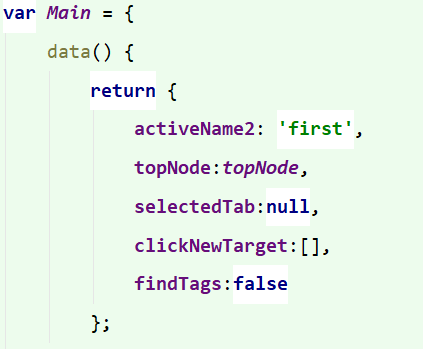
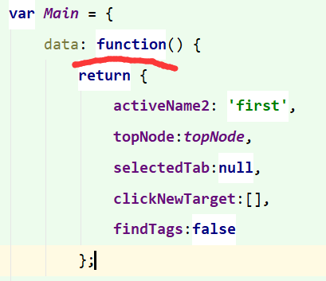

# IE11兼容问题

|作者|日期|
|----|---|
|郑烨锟|2019年3月25日|

## IE11兼容Vue语法问题

#### 简写与全称

> IE11不支持Vue的简写（或部分简写）

问题1：出现`SCRIPT1003":"`这种报错

发现原因，IE无法识别Vue方法的简写，需要添加`:function`全称书写

*简写：其他主流浏览器支持，IE11不支持*

 

*解决办法就是全称书写*

 

> 注：所有方法都要加上`:function`全称书写

