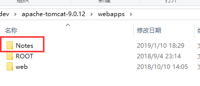
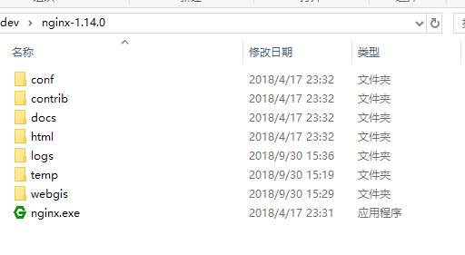

<center><h2>笔记说明</h2></center>

### 加入文档协作
	
加入协作文档 [访问gitlab项目地址](http://192.168.10.85:8081/landdevlopmentserver/noteonline)

?> 如果有疑问，请联系`吴云龙`
	
### 如何写作？ 
项目完全由markdown格式完成，目录结构如下：
```files
项目根目录--(Notes)
*   | \-\- 开发基础
*   |      | \-\- README.md               # README.md 为文件夹必须提供的封面说明
*   |      | \-\- SUMMARY.md              # 目录文件
*   |      | \-\- 文件1.md                # 文档文件
*   |      | \-\- 文件1.md                # 文档文件
*   |      | \-\- 文件1.md                # 文档文件
*   |      | \-\- 文件1.md                # 文档文件
```

!> 注意：README.md 不可为空，必须存在且拥有内容，否则会出现404
!> 注意：SUMMARY.md 不可为空，是目录首页

### 如何书写目录？

目录规范：
```markdown

-  目录需要空一行，加黑显示

  * [标题用你自己喜欢的标题即可](相对地址从当前文件所在目录开始)
  * [Index](笔记说明/markdown/index.md)
  
- [部署说明](笔记说明/部署说明/readme.md)

- [创建目录](笔记说明/创建目录.md)

```

## 本地启动
由于项目完全是静态页面，所以可以利用任意服务来响应网络请求即可。
1. 利用tomcat服务器
	* 直接把项目文件夹放置在 tomcat/webapps/目录下，并且启动tomcat即可。
	
	
	* tomcat启动后，访问`http://localhost:8080`即可
2. 利用nginx映射资源(推荐)
	* 下载nginx,并且安装，这里以windows平台为例：
	
	* 修改nginx映射你的文件 nginx/config/nginx.conf,找到nginx配置中的server选项,这里以3000端口为例
```nginx.conf
	server {
        listen       3000;
        server_name  localhost;

        #charset koi8-r;

        #access_log  logs/host.access.log  main;

        location / {
            root   c:/dev/Notes;
            index  index.html index.htm;
        }
        .................
        .................
        .................
	}
```
3. 利用npm docsify插件来启动
```cmd
npm install docsify-cli -g
```
```cmd
npm run start
```

